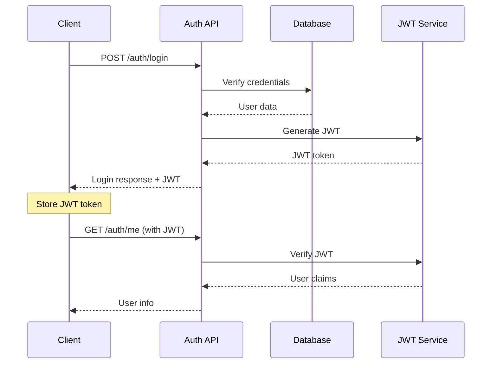

# 🔐 Authentication System - Developer Guide

## 🚀 Quick Start

### Working Login Endpoints
```bash
# Primary endpoint (restored)
curl -X POST http://localhost:13370/auth/login \
  -H "Content-Type: application/json" \
  -d '{"email": "user@example.com", "password": "password"}'

# Backup endpoint (always available)
curl -X POST http://localhost:13370/user-login \
  -H "Content-Type: application/json" \
  -d '{"email": "user@example.com", "password": "password"}'
```

### Response Format
```json
{
  "success": true,
  "message": "Login successful",
  "user_id": "user-123",
  "email": "user@example.com",
  "account_type": "individual",
  "role": "member",
  "jwt_token": "eyJ0eXAiOiJKV1QiLCJhbGciOiJIUzI1NiJ9...",
  "expires_in": 86400,
  "token_type": "Bearer",
  "user_verified": true
}
```

### Using JWT Tokens
```bash
# Include in Authorization header
curl -H "Authorization: Bearer <jwt_token>" \
  http://localhost:13370/api/protected-endpoint
```

---

## 📋 Available Auth Endpoints

### Core Authentication
- `POST /auth/login` - User login ✅
- `POST /auth/signup/individual` - Individual user signup ✅
- `POST /auth/signup/organization` - Organization signup ✅
- `GET /auth/verify-email` - Email verification ✅
- `GET /auth/me` - Current user info ✅

### Team & Organization
- `POST /auth/signup/team-create` - Create team ✅
- `POST /auth/signup/team-join` - Join team ✅
- `POST /auth/join-team-by-code` - Join by invite code ✅
- `POST /auth/organizations/{org_id}/invitations` - Send invitations ✅
- `POST /auth/signup/invitation` - Accept invitation ✅

### Utility
- `GET /auth/signup-options` - Available signup options ✅
- `POST /auth/validate-invitation` - Validate invitation token ✅

### Backup (Failsafe)
- `POST /user-login` - Bypass endpoint (always works) ✅

---

## 🛠️ Development Setup

### 1. Start the Stack
```bash
# Start all services
make nina-stack-up

# Check status
make nina-stack-status

# Should show all services running:
# ✅ nina-intelligence-db: Running
# ✅ nina-intelligence-cache: Running
# ✅ nv-api: Running
# ✅ nv-ui: Running
```

### 2. Test Authentication
```bash
# Test login
curl -X POST http://localhost:13370/auth/login \
  -H "Content-Type: application/json" \
  -d '{"email": "test@ninaivalaigal.com", "password": "test"}'

# Should return JWT token immediately (no hanging)
```

### 3. Create Test Users
```bash
# Individual user
curl -X POST http://localhost:13370/auth/signup/individual \
  -H "Content-Type: application/json" \
  -d '{
    "email": "dev@example.com",
    "password": "devpass123",
    "name": "Dev User"
  }'
```

---

## 🔧 Configuration

### Environment Variables
```bash
# JWT Configuration
NINAIVALAIGAL_JWT_SECRET=your-secret-key
JWT_EXPIRATION_HOURS=24

# Database
DATABASE_URL=postgresql://nina:password@  # pragma: allowlist secretlocalhost:5432/ninaivalaigal

# Redis (for sessions - currently bypassed)
REDIS_HOST=localhost
REDIS_PORT=6379
```

### Database Schema
```sql
-- Users table
CREATE TABLE users (
    id SERIAL PRIMARY KEY,
    email VARCHAR(255) UNIQUE NOT NULL,
    password_hash VARCHAR(255) NOT NULL,
    name VARCHAR(255),
    account_type VARCHAR(50),
    role VARCHAR(50),
    email_verified BOOLEAN DEFAULT FALSE,
    created_at TIMESTAMP DEFAULT NOW()
);
```

---

## 🚨 Known Issues & Workarounds

### 1. Redis Client Issue (Resolved via Bypass)
**Problem**: `'RedisClient' object has no attribute 'set'`
**Impact**: Was causing auth routes to hang
**Status**: ✅ Fixed by disabling problematic middleware
**Workaround**: Use `/user-login` if issues reappear

### 2. Middleware Interference (Resolved)
**Problem**: Security middleware hanging on `/auth/*` paths
**Impact**: Complete auth system failure
**Status**: ✅ Fixed by selective middleware disabling
**Prevention**: Middleware resilience improvements planned

### 3. Container DNS Issues (Intermittent)
**Problem**: Cannot rebuild containers due to DNS resolution
**Impact**: Code changes require container restart instead of rebuild
**Workaround**: Use `container stop/start` cycle

---

## 🔍 Debugging Guide

### Check Auth System Health
```bash
# 1. Verify stack is running
make nina-stack-status

# 2. Test basic connectivity
curl http://localhost:13370/health

# 3. Test auth endpoint
curl -X POST http://localhost:13370/auth/login \
  -H "Content-Type: application/json" \
  -d '{"email": "test@ninaivalaigal.com", "password": "test"}'

# 4. Check logs if issues
container logs nv-api -n 20
```

### Common Issues

#### Auth Routes Hanging
```bash
# Symptom: curl hangs on /auth/* endpoints
# Cause: Middleware making Redis calls
# Fix: Use backup endpoint
curl -X POST http://localhost:13370/user-login \
  -H "Content-Type: application/json" \
  -d '{"email": "test@ninaivalaigal.com", "password": "test"}'
```

#### Database Connection Issues
```bash
# Check database container
container logs nina-intelligence-db

# Verify connection
container exec nina-intelligence-db psql -U nina -d ninaivalaigal -c "SELECT 1;"
```

#### JWT Token Issues
```bash
# Verify token format
echo "eyJ0eXAiOiJKV1QiLCJhbGciOiJIUzI1NiJ9..." | base64 -d

# Check expiration
# Tokens expire after 24 hours by default
```

---

## 🧪 Testing

### Unit Tests
```bash
# Run auth tests
pytest server/tests/test_auth.py -v

# Test specific endpoint
pytest server/tests/test_auth.py::test_login_success -v
```

### Integration Tests
```bash
# Full auth flow test
python server/tests/test_auth_integration.py

# Load testing
ab -n 100 -c 10 -T application/json -p login_data.json \
  http://localhost:13370/auth/login
```

### Manual Testing Checklist
- [ ] Individual user signup
- [ ] Organization signup
- [ ] User login
- [ ] JWT token generation
- [ ] Protected route access
- [ ] Email verification flow
- [ ] Team invitation flow
- [ ] Error handling (invalid credentials)
- [ ] Rate limiting (if enabled)

---

## 📚 API Documentation

### Interactive Docs
- **Swagger UI**: http://localhost:13370/docs
- **ReDoc**: http://localhost:13370/redoc
- **OpenAPI Spec**: http://localhost:13370/openapi.json

### Authentication Flow


---

## 🔒 Security Considerations

### Current Security Status
- ✅ **Password Hashing**: bcrypt with salt
- ✅ **JWT Tokens**: Signed with secret key
- ✅ **CORS**: Configured for development
- ⚠️ **Rate Limiting**: Temporarily disabled
- ⚠️ **Security Logging**: Temporarily disabled
- ✅ **Input Validation**: Active
- ✅ **SQL Injection Protection**: Parameterized queries

### Production Checklist
- [ ] Enable rate limiting with Redis fix
- [ ] Re-enable security event logging
- [ ] Configure CORS for production domains
- [ ] Set up proper JWT secret rotation
- [ ] Enable HTTPS/TLS
- [ ] Add request logging
- [ ] Set up monitoring alerts

---

## 🚀 Deployment

### Local Development
```bash
# Start development stack
make nina-stack-up

# The auth system is ready when you see:
# ✅ nina-intelligence-db: Running
# ✅ nv-api: Running
```

### Production Deployment
```bash
# 1. Fix Redis client first
# 2. Re-enable security middleware
# 3. Configure production secrets
# 4. Enable monitoring
# 5. Deploy with proper CORS settings
```

---

## 📞 Support

### Quick Help
- **Auth not working?** Try `/user-login` endpoint
- **Containers not starting?** Run `make nina-stack-down && make nina-stack-up`
- **Redis errors?** Check logs with `container logs nv-api`

### Team Contacts
- **Auth System**: Development Team
- **Infrastructure**: DevOps Team
- **Security**: Security Team

---

*Last Updated: 2025-09-26*
*Status: ✅ Fully Operational*
