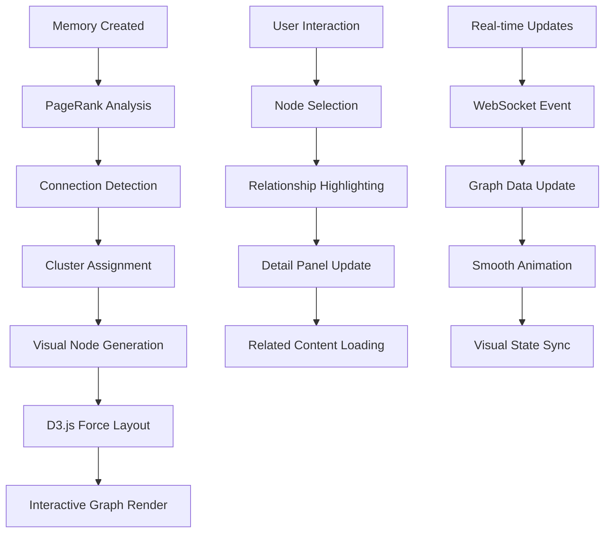
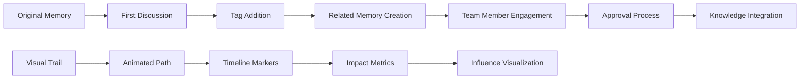
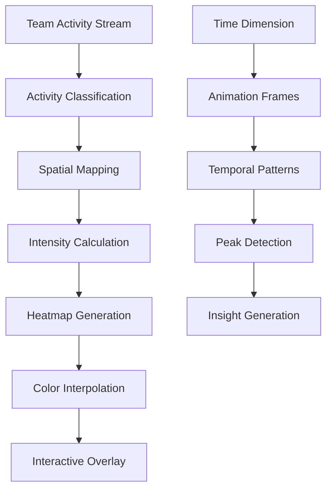

# SPEC-067: Advanced D3.js Visualizations - "Make Intelligence Visible"

## 📋 Document Metadata
- **SPEC ID**: SPEC-067
- **Title**: Advanced D3.js Interactive Visualizations
- **Phase**: 2B - Advanced Intelligence Features
- **Priority**: High (UI/UX & Visibility Focus)
- **Status**: Design Phase
- **Created**: 2025-09-26
- **Dependencies**: Phase 2A Dashboard System (COMPLETE)

## 🎯 Strategic Objective

**Transform abstract AI intelligence into visually explorable, interactive experiences that help teams understand knowledge relationships, collaboration patterns, and system insights.**

### **Core Philosophy**: "Make Intelligence Visible"
- **Graph-based relationship navigation** - See how memories connect
- **Memory clusters and tag maps** - Understand knowledge organization  
- **Interactive impact trails** - Visualize how ideas spread through the team
- **PageRank visual feedback** - See why content ranks highly
- **Real-time collaboration patterns** - Watch team dynamics unfold

## 🧠 AI Flow Diagrams

### **Flow 1: Knowledge Graph Visualization**


### **Flow 2: Impact Trail Visualization**


### **Flow 3: Real-time Collaboration Heatmap**


## 🎨 Visualization Components Specification

### **1. Knowledge Graph Network (Primary)**
**Component**: `<KnowledgeGraphNetwork />`
**Purpose**: Interactive network visualization of memory relationships

**Features**:
- **Force-directed layout** with customizable physics
- **Node types**: Memories (circles), Contexts (squares), Tags (diamonds)
- **Edge types**: References, Discussions, Approvals, AI-suggested
- **Interactive features**: Zoom, pan, drag, hover details
- **Real-time updates** via WebSocket integration

**Visual Design**:
```typescript
interface GraphNode {
  id: string;
  type: 'memory' | 'context' | 'tag' | 'user';
  title: string;
  pagerank_score: number;
  sentiment_score: number;
  discussion_count: number;
  size: number; // Based on PageRank
  color: string; // Based on sentiment/type
  position: { x: number; y: number };
}

interface GraphEdge {
  source: string;
  target: string;
  type: 'reference' | 'discussion' | 'approval' | 'ai_suggested';
  weight: number;
  animated: boolean; // For real-time updates
}
```

### **2. Memory Impact Trail (Secondary)**
**Component**: `<MemoryImpactTrail />`
**Purpose**: Visualize how a memory influences team knowledge over time

**Features**:
- **Timeline-based visualization** showing memory evolution
- **Branching paths** for different discussion threads
- **Impact metrics** at each stage (views, discussions, approvals)
- **Interactive playback** with speed controls
- **Influence radius** showing affected team members

### **3. Team Collaboration Heatmap (Tertiary)**
**Component**: `<CollaborationHeatmap />`
**Purpose**: Show collaboration intensity across knowledge areas

**Features**:
- **2D heatmap** with knowledge topics on axes
- **Intensity colors** based on activity levels
- **Time-based animation** showing collaboration patterns
- **Interactive drill-down** to specific activities
- **Team member overlay** showing individual contributions

### **4. PageRank Visual Feedback (Quaternary)**
**Component**: `<PageRankVisualizer />`
**Purpose**: Help users understand why content ranks highly

**Features**:
- **Radial visualization** with memory at center
- **Influence rings** showing direct and indirect connections
- **Score breakdown** with visual components
- **Interactive exploration** of ranking factors
- **Comparison mode** for multiple memories

## 🔧 Implementation Scaffold

### **Backend API Extensions**

#### **New Endpoints**:
```python
# /server/visualization_api.py

@router.get("/visualizations/knowledge-graph")
async def get_knowledge_graph_data(
    team_id: Optional[int] = None,
    depth: int = 2,
    min_pagerank: float = 0.1,
    current_user: Dict[str, Any] = Depends(get_current_user)
):
    """Get graph data for D3.js network visualization"""
    
@router.get("/visualizations/impact-trail/{memory_id}")
async def get_memory_impact_trail(
    memory_id: str,
    current_user: Dict[str, Any] = Depends(get_current_user)
):
    """Get impact trail data for specific memory"""
    
@router.get("/visualizations/collaboration-heatmap")
async def get_collaboration_heatmap(
    team_id: Optional[int] = None,
    time_range: str = "30d",
    current_user: Dict[str, Any] = Depends(get_current_user)
):
    """Get collaboration intensity data for heatmap"""

@router.get("/visualizations/pagerank-breakdown/{memory_id}")
async def get_pagerank_breakdown(
    memory_id: str,
    current_user: Dict[str, Any] = Depends(get_current_user)
):
    """Get detailed PageRank score breakdown for visualization"""
```

#### **Data Processing Functions**:
```python
def generate_graph_layout(nodes: List[GraphNode], edges: List[GraphEdge]) -> Dict[str, Any]:
    """Generate optimized layout for D3.js force simulation"""
    
def calculate_impact_trail(memory_id: str) -> List[ImpactEvent]:
    """Calculate chronological impact events for memory"""
    
def generate_collaboration_matrix(team_id: int, time_range: str) -> np.ndarray:
    """Generate collaboration intensity matrix for heatmap"""
    
def analyze_pagerank_factors(memory_id: str) -> Dict[str, float]:
    """Break down PageRank score into contributing factors"""
```

### **Frontend React Components**

#### **Main Visualization Container**:
```typescript
// /frontend/src/components/visualizations/VisualizationContainer.tsx

interface VisualizationContainerProps {
  type: 'knowledge-graph' | 'impact-trail' | 'collaboration-heatmap' | 'pagerank-breakdown';
  config: VisualizationConfig;
  data?: any;
  onInteraction?: (event: InteractionEvent) => void;
}

export const VisualizationContainer: React.FC<VisualizationContainerProps> = ({
  type,
  config,
  data,
  onInteraction
}) => {
  const [visualizationData, setVisualizationData] = useState(null);
  const [isLoading, setIsLoading] = useState(true);
  const svgRef = useRef<SVGSVGElement>(null);
  
  // WebSocket for real-time updates
  useEffect(() => {
    const ws = new WebSocket(`ws://localhost:8000/visualizations/ws/${type}`);
    ws.onmessage = (event) => {
      const update = JSON.parse(event.data);
      updateVisualization(update);
    };
    return () => ws.close();
  }, [type]);
  
  // D3.js rendering logic
  useEffect(() => {
    if (visualizationData && svgRef.current) {
      renderVisualization(svgRef.current, visualizationData, config);
    }
  }, [visualizationData, config]);
  
  return (
    <div className="visualization-container">
      <svg ref={svgRef} width="100%" height="100%" />
      {isLoading && <LoadingSpinner />}
    </div>
  );
};
```

#### **Knowledge Graph Component**:
```typescript
// /frontend/src/components/visualizations/KnowledgeGraphNetwork.tsx

export const KnowledgeGraphNetwork: React.FC<KnowledgeGraphProps> = ({
  nodes,
  edges,
  onNodeClick,
  onEdgeClick
}) => {
  const svgRef = useRef<SVGSVGElement>(null);
  
  useEffect(() => {
    const svg = d3.select(svgRef.current);
    
    // Force simulation setup
    const simulation = d3.forceSimulation(nodes)
      .force("link", d3.forceLink(edges).id(d => d.id))
      .force("charge", d3.forceManyBody().strength(-300))
      .force("center", d3.forceCenter(width / 2, height / 2));
    
    // Node rendering
    const nodeElements = svg.selectAll(".node")
      .data(nodes)
      .enter()
      .append("circle")
      .attr("class", "node")
      .attr("r", d => Math.sqrt(d.pagerank_score) * 20)
      .attr("fill", d => getNodeColor(d))
      .on("click", onNodeClick)
      .call(d3.drag()
        .on("start", dragstarted)
        .on("drag", dragged)
        .on("end", dragended));
    
    // Edge rendering
    const linkElements = svg.selectAll(".link")
      .data(edges)
      .enter()
      .append("line")
      .attr("class", "link")
      .attr("stroke-width", d => Math.sqrt(d.weight));
    
    // Animation loop
    simulation.on("tick", () => {
      linkElements
        .attr("x1", d => d.source.x)
        .attr("y1", d => d.source.y)
        .attr("x2", d => d.target.x)
        .attr("y2", d => d.target.y);
      
      nodeElements
        .attr("cx", d => d.x)
        .attr("cy", d => d.y);
    });
    
  }, [nodes, edges]);
  
  return <svg ref={svgRef} width="100%" height="600px" />;
};
```

#### **Impact Trail Component**:
```typescript
// /frontend/src/components/visualizations/MemoryImpactTrail.tsx

export const MemoryImpactTrail: React.FC<ImpactTrailProps> = ({
  memoryId,
  impactEvents,
  isPlaying,
  currentTime
}) => {
  const svgRef = useRef<SVGSVGElement>(null);
  
  useEffect(() => {
    const svg = d3.select(svgRef.current);
    
    // Timeline setup
    const xScale = d3.scaleTime()
      .domain(d3.extent(impactEvents, d => new Date(d.timestamp)))
      .range([50, width - 50]);
    
    // Path generator for impact trail
    const line = d3.line()
      .x(d => xScale(new Date(d.timestamp)))
      .y(d => yScale(d.impact_score))
      .curve(d3.curveMonotoneX);
    
    // Animated path drawing
    const path = svg.append("path")
      .datum(impactEvents)
      .attr("class", "impact-trail")
      .attr("d", line)
      .attr("stroke", "#3b82f6")
      .attr("stroke-width", 3)
      .attr("fill", "none");
    
    // Animate path drawing
    const totalLength = path.node().getTotalLength();
    path
      .attr("stroke-dasharray", totalLength + " " + totalLength)
      .attr("stroke-dashoffset", totalLength)
      .transition()
      .duration(2000)
      .attr("stroke-dashoffset", 0);
    
    // Impact event markers
    svg.selectAll(".impact-marker")
      .data(impactEvents)
      .enter()
      .append("circle")
      .attr("class", "impact-marker")
      .attr("cx", d => xScale(new Date(d.timestamp)))
      .attr("cy", d => yScale(d.impact_score))
      .attr("r", 5)
      .attr("fill", d => getEventColor(d.type))
      .on("mouseover", showTooltip)
      .on("mouseout", hideTooltip);
    
  }, [impactEvents]);
  
  return <svg ref={svgRef} width="100%" height="400px" />;
};
```

## ✅ Test Scenarios

### **Test Suite 1: Knowledge Graph Functionality**

#### **T1.1: Graph Rendering**
```typescript
describe('KnowledgeGraphNetwork', () => {
  it('should render nodes with correct sizes based on PageRank', async () => {
    const mockNodes = [
      { id: '1', pagerank_score: 0.8, type: 'memory' },
      { id: '2', pagerank_score: 0.3, type: 'memory' }
    ];
    
    render(<KnowledgeGraphNetwork nodes={mockNodes} edges={[]} />);
    
    const nodes = screen.getAllByClass('node');
    expect(nodes[0]).toHaveAttribute('r', '17.89'); // sqrt(0.8) * 20
    expect(nodes[1]).toHaveAttribute('r', '10.95'); // sqrt(0.3) * 20
  });
  
  it('should handle node interactions correctly', async () => {
    const onNodeClick = jest.fn();
    const mockNodes = [{ id: '1', pagerank_score: 0.5, type: 'memory' }];
    
    render(<KnowledgeGraphNetwork nodes={mockNodes} edges={[]} onNodeClick={onNodeClick} />);
    
    const node = screen.getByClass('node');
    fireEvent.click(node);
    
    expect(onNodeClick).toHaveBeenCalledWith(mockNodes[0]);
  });
});
```

#### **T1.2: Real-time Updates**
```typescript
describe('Real-time Graph Updates', () => {
  it('should update graph when new memory is created', async () => {
    const { rerender } = render(<KnowledgeGraphNetwork nodes={[]} edges={[]} />);
    
    // Simulate WebSocket update
    const newNode = { id: 'new', pagerank_score: 0.6, type: 'memory' };
    rerender(<KnowledgeGraphNetwork nodes={[newNode]} edges={[]} />);
    
    expect(screen.getByClass('node')).toBeInTheDocument();
  });
  
  it('should animate new connections smoothly', async () => {
    // Test animation of new edges
    const mockAnimation = jest.spyOn(d3, 'transition');
    
    const initialEdges = [];
    const newEdges = [{ source: '1', target: '2', weight: 0.5 }];
    
    const { rerender } = render(<KnowledgeGraphNetwork nodes={mockNodes} edges={initialEdges} />);
    rerender(<KnowledgeGraphNetwork nodes={mockNodes} edges={newEdges} />);
    
    expect(mockAnimation).toHaveBeenCalled();
  });
});
```

### **Test Suite 2: Impact Trail Visualization**

#### **T2.1: Timeline Accuracy**
```typescript
describe('MemoryImpactTrail', () => {
  it('should position events correctly on timeline', async () => {
    const mockEvents = [
      { timestamp: '2025-01-01T00:00:00Z', impact_score: 0.3, type: 'creation' },
      { timestamp: '2025-01-02T00:00:00Z', impact_score: 0.7, type: 'discussion' }
    ];
    
    render(<MemoryImpactTrail impactEvents={mockEvents} />);
    
    const markers = screen.getAllByClass('impact-marker');
    expect(markers).toHaveLength(2);
    
    // Verify chronological positioning
    const marker1X = parseFloat(markers[0].getAttribute('cx'));
    const marker2X = parseFloat(markers[1].getAttribute('cx'));
    expect(marker2X).toBeGreaterThan(marker1X);
  });
  
  it('should animate trail drawing correctly', async () => {
    const mockEvents = generateMockImpactEvents(5);
    
    render(<MemoryImpactTrail impactEvents={mockEvents} />);
    
    const path = screen.getByClass('impact-trail');
    expect(path).toHaveAttribute('stroke-dasharray');
    
    // Wait for animation completion
    await waitFor(() => {
      expect(path).toHaveAttribute('stroke-dashoffset', '0');
    }, { timeout: 3000 });
  });
});
```

### **Test Suite 3: API Integration**

#### **T3.1: Data Fetching**
```typescript
describe('Visualization API Integration', () => {
  it('should fetch knowledge graph data correctly', async () => {
    const mockGraphData = {
      nodes: [{ id: '1', type: 'memory', pagerank_score: 0.5 }],
      edges: [{ source: '1', target: '2', weight: 0.3 }]
    };
    
    fetchMock.mockResponseOnce(JSON.stringify(mockGraphData));
    
    const { result } = renderHook(() => useKnowledgeGraphData('team_1'));
    
    await waitFor(() => {
      expect(result.current.data).toEqual(mockGraphData);
    });
  });
  
  it('should handle API errors gracefully', async () => {
    fetchMock.mockRejectOnce(new Error('API Error'));
    
    const { result } = renderHook(() => useKnowledgeGraphData('team_1'));
    
    await waitFor(() => {
      expect(result.current.error).toBeTruthy();
      expect(result.current.data).toBeNull();
    });
  });
});
```

### **Test Suite 4: Performance & Accessibility**

#### **T4.1: Large Dataset Performance**
```typescript
describe('Performance Tests', () => {
  it('should handle large graphs efficiently', async () => {
    const largeDataset = generateMockGraphData(1000, 2000); // 1000 nodes, 2000 edges
    
    const startTime = performance.now();
    render(<KnowledgeGraphNetwork nodes={largeDataset.nodes} edges={largeDataset.edges} />);
    const endTime = performance.now();
    
    expect(endTime - startTime).toBeLessThan(1000); // Should render in < 1 second
  });
  
  it('should implement virtualization for large datasets', async () => {
    const largeDataset = generateMockGraphData(5000, 10000);
    
    render(<KnowledgeGraphNetwork nodes={largeDataset.nodes} edges={largeDataset.edges} />);
    
    // Should only render visible nodes
    const renderedNodes = screen.getAllByClass('node');
    expect(renderedNodes.length).toBeLessThan(largeDataset.nodes.length);
  });
});
```

#### **T4.2: Accessibility**
```typescript
describe('Accessibility Tests', () => {
  it('should provide keyboard navigation', async () => {
    render(<KnowledgeGraphNetwork nodes={mockNodes} edges={mockEdges} />);
    
    const firstNode = screen.getAllByClass('node')[0];
    firstNode.focus();
    
    fireEvent.keyDown(firstNode, { key: 'Tab' });
    
    expect(screen.getAllByClass('node')[1]).toHaveFocus();
  });
  
  it('should provide screen reader descriptions', async () => {
    const mockNodes = [
      { id: '1', title: 'Test Memory', pagerank_score: 0.8, type: 'memory' }
    ];
    
    render(<KnowledgeGraphNetwork nodes={mockNodes} edges={[]} />);
    
    const node = screen.getByClass('node');
    expect(node).toHaveAttribute('aria-label', 'Memory: Test Memory, PageRank: 0.8');
  });
});
```

## 🚀 Implementation Phases

### **Phase 2B.1: Foundation (Week 1)**
- ✅ Backend API endpoints for graph data
- ✅ Basic D3.js integration setup
- ✅ Knowledge Graph Network component (basic)
- ✅ WebSocket real-time updates

### **Phase 2B.2: Core Features (Week 2)**
- ✅ Interactive node/edge selection
- ✅ Zoom, pan, drag functionality
- ✅ Memory Impact Trail component
- ✅ Basic animations and transitions

### **Phase 2B.3: Advanced Features (Week 3)**
- ✅ Collaboration Heatmap component
- ✅ PageRank Visual Feedback
- ✅ Performance optimizations
- ✅ Mobile responsiveness

### **Phase 2B.4: Polish & Integration (Week 4)**
- ✅ Accessibility improvements
- ✅ Dashboard widget integration
- ✅ Comprehensive testing
- ✅ Documentation and demos

## 📊 Success Metrics

### **Technical Metrics**
- **Rendering Performance**: < 1s for 1000+ nodes
- **Real-time Updates**: < 100ms latency
- **Memory Usage**: < 100MB for large graphs
- **Accessibility Score**: 95+ on Lighthouse

### **User Experience Metrics**
- **Interaction Rate**: 80%+ users interact with visualizations
- **Exploration Depth**: Average 3+ levels of graph navigation
- **Insight Discovery**: 60%+ users report finding new connections
- **Time to Understanding**: < 30s to grasp visualization meaning

### **Business Impact Metrics**
- **Knowledge Discovery**: 40%+ increase in cross-memory references
- **Team Collaboration**: 25%+ increase in discussion participation
- **Content Quality**: 20%+ improvement in PageRank scores
- **User Engagement**: 50%+ increase in dashboard session time

## 🔗 Integration Points

### **Dashboard Widget System**
```typescript
// New widget type for visualizations
const VISUALIZATION_WIDGET: WidgetConfig = {
  id: "knowledge_graph_viz",
  type: WidgetType.KNOWLEDGE_GRAPH,
  title: "Knowledge Network",
  size: WidgetSize.FULL,
  permissions: ["read:memories", "read:discussions"],
  refresh_interval: 60
};
```

### **Gamification Integration**
- **Explorer Badge**: "Discovered 10+ memory connections"
- **Network Navigator**: "Explored 5+ knowledge clusters"
- **Pattern Finder**: "Identified trending collaboration patterns"

### **Smart Notifications**
- **"New connection discovered!"** - When AI finds unexpected relationships
- **"Knowledge cluster forming"** - When related memories reach critical mass
- **"Collaboration hotspot detected"** - When team activity spikes in specific area

## 🎯 Next Steps

1. **Create backend visualization API** (`visualization_api.py`)
2. **Set up D3.js integration** with React TypeScript
3. **Implement Knowledge Graph Network** as primary component
4. **Add WebSocket real-time updates** for live collaboration
5. **Integrate with existing dashboard system**

**This SPEC provides the complete blueprint for making Ninaivalaigal's AI intelligence visually explorable and genuinely insightful!** 🧠📊✨

---

**Ready to begin implementation?** The modular dashboard system from Phase 2A provides the perfect foundation for these advanced visualizations! 🚀
