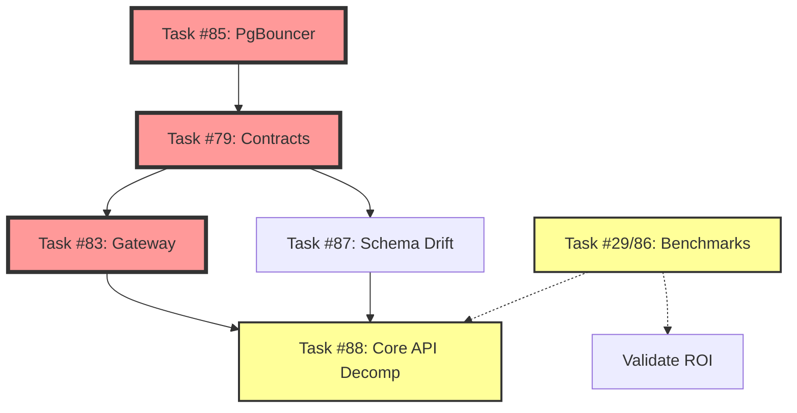

# 3-Month Execution Plan - SPEC-099/100 Implementation

**Timeline:** October 21, 2025 - January 19, 2026 (12 weeks)
**Goal:** Complete service decomposition and Rust migration foundation
**Status:** Assigned and tracked in Taiga ✅

---

## 🎯 Executive Summary

**Why 3 Months?**
We have 130+ specs to implement. Competitors are moving fast. We need high-quality execution in 3 months, not 1 year.

**What We're Building:**
- Fix architectural blockers (PgBouncer)
- Build shared contracts layer (microservices foundation)
- Deploy API Gateway (proper routing)
- Validate ROI claims (performance benchmarks)
- Begin Core API decomposition

**Team Assignments:**
- **Developer C (You):** P0 tasks #85, #79, #83 (architectural foundation)
- **Developer A:** P1 tasks #29/#86, #87, #88 (validation + decomposition)

---

## 📅 Week-by-Week Breakdown

### **MONTH 1: Foundation (Oct 21 - Nov 17, 2025)**

#### **Week 1-2 (Oct 21 - Nov 3): Fix Infrastructure**

**🔴 Task #85: Fix PgBouncer Bypass**
- **Owner:** Developer C
- **Priority:** P0 - DO THIS FIRST
- **Status:** Assigned ✅
- **Effort:** 2-3 weeks

**Deliverables:**
- [ ] Update PgBouncer to session mode
- [ ] Integrate Memory Service with PgBouncer
- [ ] Test prepared statements
- [ ] Verify connection pooling

**Cross-References:**
- 📋 SPEC-099: Section 6 (Risk Mitigation)
- 📋 SPEC-100: Infrastructure prerequisite
- 📋 Taiga: Task #85
- 📋 Doc: docs/TASK_85_PGBOUNCER_PREPARED_STATEMENTS.md

**Success Criteria:**
- ✅ Memory Service uses PgBouncer (port 6432)
- ✅ Prepared statements work
- ✅ Connection pooling operational
- ✅ All services healthy

---

#### **Week 3 (Nov 4 - Nov 10): Validate Performance**

**🟡 Task #29/#86: Performance Benchmarking CI**
- **Owner:** Developer A
- **Priority:** P1 (can run in parallel)
- **Status:** Assigned ✅
- **Effort:** 1 week

**Deliverables:**
- [ ] Run comprehensive benchmarks using Task #72 load tester
- [ ] Benchmark top 3 GraphOps queries
- [ ] Compare Python vs Rust metrics
- [ ] Measure throughput improvements
- [ ] Calculate cost savings
- [ ] Generate ROI validation report

**Cross-References:**
- 📋 SPEC-099: Section 1 (ROI Matrix - validate claims)
- 📋 Taiga: Task #29, #72 (Load Tester), #71 (GraphOps)
- 📋 Doc: docs/SPEC_099_100_GAP_ANALYSIS_OCT20.md

**Success Criteria:**
- ✅ Validate 50-90% latency reduction claim
- ✅ Validate 6-10x throughput improvement
- ✅ Quantify infrastructure cost savings
- ✅ Executive summary report complete

---

#### **Week 4 (Nov 11 - Nov 17): Distribute CLI + Planning**

**✅ Task #77: Distribute CLI Tools**
- **Owner:** Developer C (assist)
- **Priority:** P0
- **Status:** Ready for distribution
- **Effort:** 1 day

**Deliverables:**
- [ ] Upload tarballs to distribution target
- [ ] Notify Ops/Developer B
- [ ] Verify installation on target systems

**Cross-References:**
- 📋 Taiga: Task #77
- 📋 Doc: docs/TASK_77_DISTRIBUTION_CHECKLIST.md

**Plus:** Plan Task #79 implementation (contracts layer)

---

### **MONTH 2: Service Decomposition (Nov 18 - Dec 15, 2025)**

#### **Week 5-6 (Nov 18 - Dec 1): Shared Contracts Layer**

**🔴 Task #79: Shared Contracts Layer (SPEC-100 Phase 0)**
- **Owner:** Developer C
- **Priority:** P0 - BLOCKER
- **Status:** Assigned ✅
- **Effort:** 2-3 weeks

**Deliverables:**
- [ ] Create `shared/contracts/` directory structure
- [ ] Extract Pydantic models from Core API
- [ ] Generate OpenAPI specs from FastAPI
- [ ] Set up `openapi-spec-validator` in CI
- [ ] Create contract diff checker script
- [ ] Add pre-commit hooks for validation
- [ ] Document contract evolution process

**Cross-References:**
- 📋 SPEC-100: Section 6a.1 (Shared Contracts Layer)
- 📋 SPEC-099: Contracts prerequisite
- 📋 Taiga: Task #79 (blocks #83, #87, #88)
- 📋 Depends: Task #85 (foundation must be solid)

**Success Criteria:**
- ✅ All services use shared contracts
- ✅ CI validates contract changes
- ✅ Breaking changes detected automatically
- ✅ OpenAPI specs for all services
- ✅ Documentation complete

---

#### **Week 7 (Dec 2 - Dec 8): Schema Drift Prevention**

**🟡 Task #87: Schema Drift Prevention CI**
- **Owner:** Developer A
- **Priority:** P1
- **Status:** Ready to start (depends on #79)
- **Effort:** 1 week

**Deliverables:**
- [ ] Create `scripts/check-contract-drift.py`
- [ ] Add GitHub workflow for OpenAPI validation
- [ ] Detect breaking changes (endpoints, schemas)
- [ ] Add pre-commit hook
- [ ] Test with sample contracts

**Cross-References:**
- 📋 SPEC-099: Section 6 (Risk #1: Schema Drift)
- 📋 SPEC-100: Contract-first integration
- 📋 Taiga: Task #87 (depends on #79)
- 📋 Doc: docs/SPEC_099_100_GAP_ANALYSIS_OCT20.md

**Success Criteria:**
- ✅ CI fails on contract drift
- ✅ Breaking changes detected
- ✅ Pre-commit hook working
- ✅ Developer docs complete

---

#### **Week 8 (Dec 9 - Dec 15): API Gateway Deployment**

**🔴 Task #83: API Gateway with Path Routing**
- **Owner:** Developer C
- **Priority:** P0
- **Status:** Assigned ✅
- **Effort:** 2 weeks

**Deliverables:**
- [ ] Deploy Traefik via Apple Container CLI
- [ ] Configure path routing:
  - `/auth` → Core API (port 13390)
  - `/memory` → Memory Service (port 13393)
  - `/graph` → GraphOps (port 13398)
- [ ] Set up JWT authentication middleware
- [ ] Add rate limiting + CORS
- [ ] Configure health checks
- [ ] Test end-to-end routing
- [ ] Document operational runbook

**Cross-References:**
- 📋 SPEC-100: Section 4.1 (Gateway Layer)
- 📋 SPEC-099: Infrastructure glue
- 📋 Taiga: Task #83 (depends on #79 contracts)
- 📋 Related: Task #71 (gRPC Gateway - different purpose)

**Success Criteria:**
- ✅ Single entry point (e.g., localhost:8080)
- ✅ Path routing working correctly
- ✅ JWT auth functional
- ✅ Health checks operational
- ✅ Documentation complete

---

### **MONTH 3: Core Decomposition (Dec 16, 2025 - Jan 19, 2026)**

#### **Week 9-12 (Dec 16 - Jan 19): Core API Decomposition**

**🟡 Task #88: Core API Decomposition**
- **Owner:** Developer A
- **Priority:** P1
- **Status:** Ready (depends on #79, #83)
- **Effort:** 4-6 weeks

**Deliverables:**

**Phase 1 (Week 9-10):**
- [ ] Extract Core API service (auth, users, teams, RBAC)
- [ ] Set up independent container + CI/CD
- [ ] Configure API Gateway routing for Core API
- [ ] Migrate authentication routes

**Phase 2 (Week 11):**
- [ ] Integrate Memory Service (Rust) with Gateway
- [ ] Integrate GraphOps with Gateway
- [ ] Test cross-service communication
- [ ] Verify JWT propagation

**Phase 3 (Week 12):**
- [ ] End-to-end integration tests
- [ ] Load testing through Gateway
- [ ] Performance validation
- [ ] Documentation + operational runbook

**Cross-References:**
- 📋 SPEC-100: API Container Modularization (complete implementation)
- 📋 SPEC-099: Service boundaries
- 📋 Taiga: Task #88 (depends on #79, #83)
- 📋 Doc: docs/SPEC_099_100_GAP_ANALYSIS_OCT20.md

**Success Criteria:**
- ✅ Independent Core API service deployed
- ✅ Memory + Graph services integrated
- ✅ All routes working through Gateway
- ✅ Independent CI/CD pipelines
- ✅ No performance regression
- ✅ Complete documentation

---

## 📊 Critical Path & Dependencies

**Legend:**
- 🔴 Red = P0 (Critical Path)
- 🟡 Yellow = P1 (Can parallelize)
- Solid arrows = Hard dependencies
- Dashed arrows = Soft dependencies

---

## 👥 Team Allocation

### **Developer C (You) - Architectural Foundation**

| Week | Task | Priority | Status |
|------|------|----------|--------|
| 1-2 | Task #85: PgBouncer | P0 | Assigned ✅ |
| 5-6 | Task #79: Contracts | P0 | Assigned ✅ |
| 7-8 | Task #83: Gateway | P0 | Assigned ✅ |

**Total:** 6-7 weeks of P0 work

---

### **Developer A - Validation & Decomposition**

| Week | Task | Priority | Status |
|------|------|----------|--------|
| 3 | Task #29/86: Benchmarks | P1 | Assigned ✅ |
| 7 | Task #87: Schema Drift | P1 | Ready (depends #79) |
| 9-12 | Task #88: Core API Decomp | P1 | Ready (depends #79, #83) |

**Total:** 5-6 weeks of P1 work

**Note:** Developer A can start benchmarking (Week 3) while Developer C works on PgBouncer. This parallelizes the work effectively.

---

## 🎯 Success Metrics

### **By End of Month 1 (Nov 17)**
- ✅ PgBouncer architectural blocker resolved
- ✅ Performance ROI validated (50-90% latency reduction confirmed)
- ✅ CLI tools distributed to team

### **By End of Month 2 (Dec 15)**
- ✅ Shared contracts layer operational
- ✅ Schema drift prevention in CI
- ✅ API Gateway deployed with routing
- ✅ All services accessible through Gateway

### **By End of Month 3 (Jan 19, 2026)**
- ✅ Core API decomposed into microservices
- ✅ Independent deployment pipelines
- ✅ Complete observability (tracing, metrics)
- ✅ Production-ready architecture

---

## ⚠️ Risk Mitigation

| Risk | Mitigation | Owner |
|------|------------|-------|
| **PgBouncer session mode breaks existing services** | Test thoroughly before Memory Service integration | Developer C |
| **Contracts layer takes longer than 2 weeks** | Start with minimal contracts, iterate | Developer C |
| **Gateway deployment complexity** | Use Traefik (proven), document extensively | Developer C |
| **Core API decomp hits coupling issues** | Have contracts + Gateway ready first | Developer A |
| **Performance benchmarks show no improvement** | Investigate bottlenecks, may need optimization | Developer A |

---

## 📚 Documentation Cross-References

### **Core Documents**
- 📋 **This Plan:** docs/3_MONTH_EXECUTION_PLAN.md
- 📋 **Gap Analysis:** docs/SPEC_099_100_GAP_ANALYSIS_OCT20.md
- 📋 **Task Tracking:** docs/TAIGA_TASK_TRACKING_OCT20.md

### **SPECs**
- 📋 **SPEC-099:** specs/099-rust-migration-strategy/README.md
- 📋 **SPEC-100:** specs/100-api-container-modularization/README.md

### **Task Details**
- 📋 **Task #85:** docs/TASK_85_PGBOUNCER_PREPARED_STATEMENTS.md
- 📋 **Task #77:** docs/TASK_77_DISTRIBUTION_CHECKLIST.md
- 📋 **Task #84:** docs/TASK_84_COMPLETE.md

### **Taiga Board**
- 🔗 http://localhost:9000 (or your Taiga URL)
- Filter by assignee: Developer C, Developer A
- Filter by tags: P0, P1, SPEC-099, SPEC-100

---

## ✅ Quality Gates

### **Week 2 Checkpoint**
- PgBouncer fixed and tested
- All services use connection pooling
- No regressions in health checks

### **Week 6 Checkpoint**
- Contracts layer operational
- CI validates all contracts
- OpenAPI specs complete

### **Week 8 Checkpoint**
- API Gateway deployed
- All services routable
- JWT auth working

### **Week 12 Checkpoint**
- Core API decomposed
- Independent deployments working
- Performance validated
- Production ready

---

## 🚀 Post-3-Month Roadmap (Q2 2026+)

**Q2 2026 (Apr - Jun):**
- Event Bus integration (Redis Streams/NATS)
- Business Service decomposition
- Admin/Vendor Service decomposition

**Q3 2026 (Jul - Sep):**
- Service Mesh deployment (Linkerd/Istio)
- Advanced observability
- Production hardening

---

## 📞 Communication Protocol

### **Daily Standups**
- What you completed yesterday
- What you're working on today
- Any blockers

### **Weekly Reviews**
- Progress against timeline
- Adjust priorities if needed
- Review quality metrics

### **Milestone Reviews**
- End of each month
- Demo working functionality
- Update stakeholders

---

## 🎯 Bottom Line

**Timeline:** 12 weeks (3 months)
**Team:** 2 developers (C + A)
**P0 Tasks:** 3 (PgBouncer, Contracts, Gateway)
**P1 Tasks:** 3 (Benchmarks, Schema Drift, Core Decomp)
**Success Rate Required:** 100% (no compromise)

**All tasks assigned ✅**
**All tasks documented ✅**
**All cross-references added ✅**
**Ready to execute ✅**

---

**Start Date:** October 21, 2025 (Tomorrow)
**First Task:** Task #85 (Developer C - PgBouncer)
**Parallel Task:** Task #29/86 (Developer A - Benchmarks, Week 3)

**Let's ship this! 🚀**
