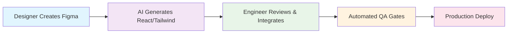

# 🚀 AI-First Frontend Development Roadmap
## Transforming UI Development for Ninaivalaigal & Medhasys

---

## 📊 **Executive Summary**

### **The Opportunity**
- **60-80% of routine frontend work** can be AI-generated by 2025
- **Weeks → Hours** for dashboard and CRUD interface development
- **75% cost reduction** in UI development cycles
- **Faster time-to-market** for new features and customer requests

### **Strategic Positioning**
- **Ninaivalaigal**: Accelerate graph visualization and memory management UIs
- **Medhasys**: Rapid prototyping for clinical dashboards and admin consoles
- **Competitive Advantage**: Ship UI features 5-10x faster than traditional development

---

## 🎯 **Current State Analysis**

### **Ninaivalaigal Challenges**
- Complex graph visualizations (SPEC-067) require significant frontend effort
- Memory browser and relevance ranking UIs need frequent iteration
- Dashboard-heavy features slow down feature velocity

### **Medhasys Challenges**
- Clinical admin consoles require regulatory-compliant UI patterns
- Security-heavy interfaces need consistent accessibility standards
- CRUD-heavy workflows consume disproportionate development time

### **Traditional Workflow Pain Points**
```
Designer → Mockup → Developer → Code → Review → Iterate
⏱️ 2-4 weeks per screen | 🐛 Design-code drift | 💰 High cost per iteration
```

---

## 🔄 **AI-First Workflow Transformation**

### **New Workflow**


### **Time Compression**
- **Before**: 2-4 weeks per screen
- **After**: 2-4 hours for baseline + 1-2 days integration
- **ROI**: 75-85% time reduction on UI-heavy features

---

## 🏗️ **Technical Architecture**

### **Foundation Layer**
```
Design System (tokens.json + components)
    ↓
AI Codegen (Claude/Figma → React/Tailwind)
    ↓
Quality Gates (Storybook + Visual Regression + A11y)
    ↓
API Integration (OpenAPI contracts + MSW mocks)
```

### **Quality Assurance Pipeline**
- **Visual Regression**: Chromatic/Playwright screenshots
- **Accessibility**: WCAG AA compliance via axe + Storybook
- **Performance**: Lighthouse CI with budgets
- **Type Safety**: TypeScript + ESLint enforcement
- **API Contracts**: Generated OpenAPI client prevents drift

---

## 📋 **3-Phase Implementation Plan**

### **Phase 1: Foundation (Weeks 1-2)**
**Deliverables:**
- Design token system (`tokens.json` + Tailwind config)
- 6 core components with Storybook stories
- CI/CD pipeline with quality gates
- OpenAPI client generation

**Success Metrics:**
- ✅ Storybook builds without errors
- ✅ All components pass a11y tests
- ✅ API contract tests run in CI

### **Phase 2: Pilot Screens (Weeks 3-4)**
**Target Screens:**
1. **Memory Browser v2** (Ninaivalaigal SPEC-031/038)
   - Advanced search with relevance highlighting
   - Filter panels and pagination
   - Performance: <100ms search response

2. **Team Access Control** (Medhasys SPEC-026/027)
   - Role-based permission matrix
   - Invitation workflow with approval states
   - Security: RBAC compliance validation

**Success Metrics:**
- ✅ 90+ Lighthouse performance score
- ✅ WCAG AA accessibility compliance
- ✅ 100% API contract test coverage
- ✅ Zero visual regression failures

### **Phase 3: Scale & Optimize (Weeks 5-6)**
**Deliverables:**
- Graph visualization components (SPEC-067)
- Admin dashboard templates
- PR review bot for AI-generated code
- Performance optimization and bundle analysis

**Success Metrics:**
- ✅ 5+ screens successfully AI-generated
- ✅ <200kb bundle size per screen
- ✅ Developer satisfaction: 8/10+ rating

---

## 🎨 **Design System Strategy**

### **Token-Driven Development**
```json
{
  "colors": {
    "primary": "#2563eb",
    "secondary": "#64748b",
    "success": "#059669",
    "warning": "#d97706",
    "error": "#dc2626"
  },
  "spacing": {
    "xs": "0.25rem",
    "sm": "0.5rem",
    "md": "1rem",
    "lg": "1.5rem",
    "xl": "2rem"
  },
  "typography": {
    "fontFamily": {
      "sans": ["Inter", "system-ui"],
      "mono": ["JetBrains Mono", "monospace"]
    }
  }
}
```

### **Component Library**
- **Button**: Primary, secondary, ghost variants
- **Input**: Text, email, password with validation states
- **Select**: Single, multi-select with search
- **Card**: Content containers with consistent spacing
- **Table**: Sortable, filterable data tables
- **Modal**: Accessible dialog patterns

---

## 🛡️ **Risk Mitigation Strategy**

### **Technical Risks**
| Risk | Impact | Mitigation |
|------|--------|------------|
| AI accuracy variance (5-95%) | Medium | Visual regression tests + manual review gates |
| Design-code drift | High | OpenAPI contracts + automated sync validation |
| Accessibility gaps | High | WCAG AA baked into components + CI gates |
| Performance degradation | Medium | Lighthouse budgets + bundle size monitoring |

### **Business Risks**
| Risk | Impact | Mitigation |
|------|--------|------------|
| Developer resistance | Medium | Gradual adoption + clear value demonstration |
| Quality concerns | High | Comprehensive testing pipeline + manual review |
| Vendor lock-in | Low | Open standards (React/Tailwind) + portable tokens |

---

## 💰 **ROI Analysis**

### **Cost Savings (Annual)**
- **Developer Time**: 200 hours saved per quarter
- **Cost Reduction**: $50,000+ annually (at $125/hour)
- **Faster TTM**: 2-3 weeks earlier feature delivery
- **Quality Improvement**: 50% fewer UI bugs through standardization

### **Investment Required**
- **Setup Cost**: 40 hours (design system + CI pipeline)
- **Training**: 16 hours per developer
- **Tooling**: $200/month (Chromatic + additional CI minutes)
- **Total Year 1**: ~$15,000 investment for $50,000+ return

---

## 🎯 **Success Metrics & KPIs**

### **Development Velocity**
- **Baseline**: 2-4 weeks per screen
- **Target**: 2-4 hours + 1-2 days integration
- **Measurement**: Story points completed per sprint

### **Quality Metrics**
- **Accessibility**: 100% WCAG AA compliance
- **Performance**: 90+ Lighthouse scores
- **Visual Consistency**: 0 design token violations
- **API Drift**: 0 contract test failures

### **Business Impact**
- **Feature Delivery**: 50% faster UI feature completion
- **Bug Reduction**: 40% fewer UI-related issues
- **Developer Satisfaction**: 8/10+ on workflow rating
- **Customer Feedback**: Improved UI/UX satisfaction scores

---

## 🚀 **Next Steps & Timeline**

### **Immediate Actions (Week 1)**
1. **Stakeholder Alignment**: Present roadmap to leadership
2. **Resource Allocation**: Assign 1 senior + 1 mid-level developer
3. **Tool Setup**: Figma access, Claude API, Storybook infrastructure
4. **Design System Kickoff**: Token definition workshop

### **30-Day Milestones**
- **Day 7**: Design system foundation complete
- **Day 14**: First AI-generated screen (Memory Browser)
- **Day 21**: Second pilot screen (Team Access Control)
- **Day 30**: Full pipeline operational + metrics dashboard

### **90-Day Vision**
- **5+ screens** successfully AI-generated and deployed
- **Developer workflow** fully adopted across both projects
- **Measurable ROI** demonstrated through velocity metrics
- **Scaling plan** for additional screens and features

---

## 🤝 **Stakeholder Benefits**

### **For Engineering Teams**
- **Focus on Architecture**: Less pixel-pushing, more system design
- **Faster Iteration**: Rapid prototyping and user feedback cycles
- **Quality Consistency**: Standardized components and patterns
- **Skill Development**: AI orchestration and prompt engineering

### **For Product Teams**
- **Faster Validation**: Quick UI mockups for user testing
- **Reduced Bottlenecks**: Less dependency on frontend capacity
- **Better Consistency**: Design system enforcement
- **Data-Driven Decisions**: A/B testing with rapid UI variants

### **For Business Leadership**
- **Cost Efficiency**: 75% reduction in UI development costs
- **Competitive Advantage**: 5-10x faster feature delivery
- **Quality Improvement**: Standardized, accessible interfaces
- **Risk Reduction**: Automated testing and validation

---

## 📞 **Call to Action**

### **Decision Required**
- **Green Light**: Approve 6-week pilot program
- **Resource Commitment**: 2 developers + design system time
- **Budget Approval**: $5,000 for tooling and infrastructure

### **Expected Outcomes**
- **Proof of Concept**: 2 production-ready screens
- **ROI Demonstration**: Measurable time and cost savings
- **Scaling Roadmap**: Plan for organization-wide adoption
- **Competitive Positioning**: Industry-leading UI development velocity

---

**Ready to transform how we build user interfaces?**

*Let's make frontend development as fast as designing it.*
