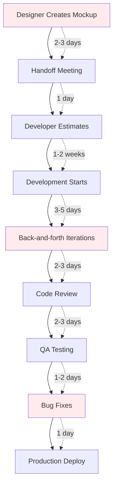
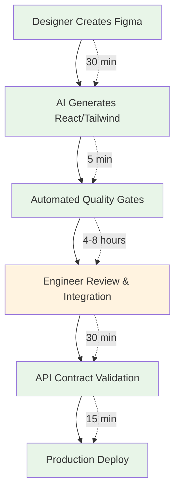
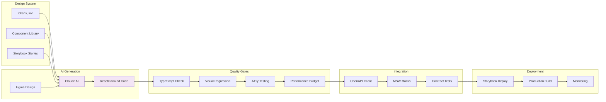
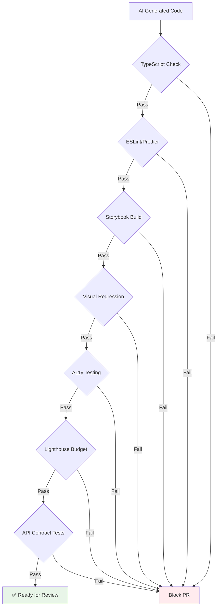
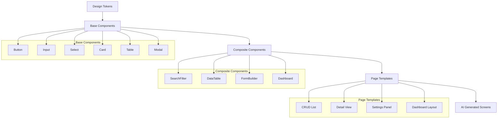
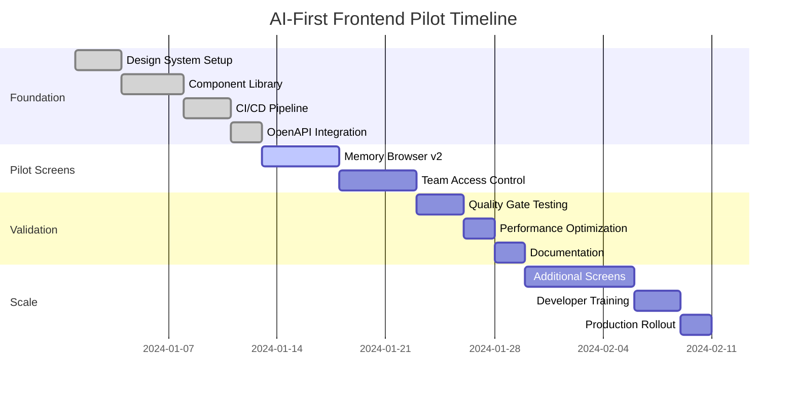
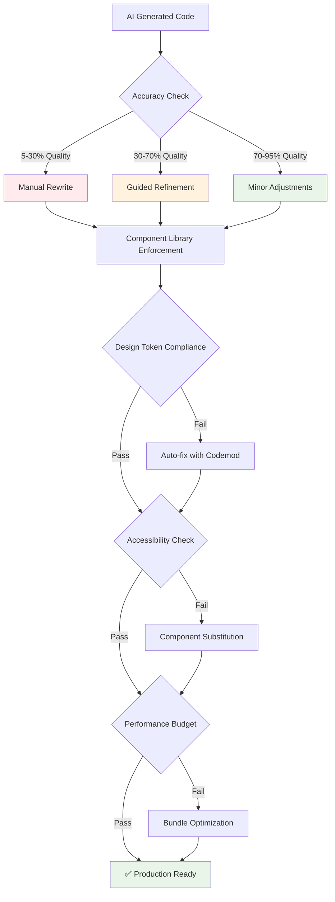
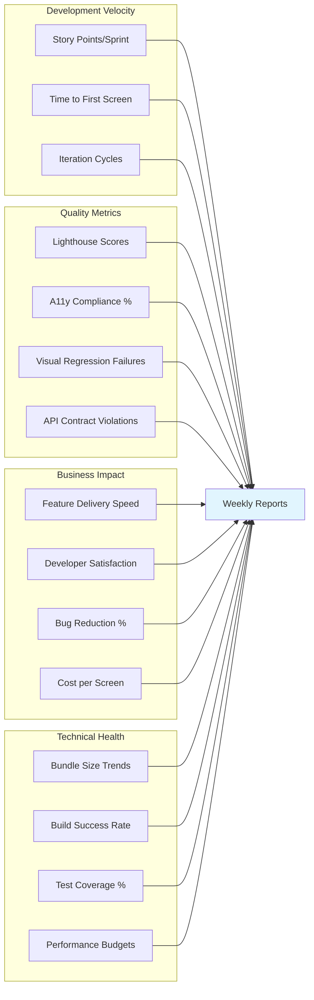
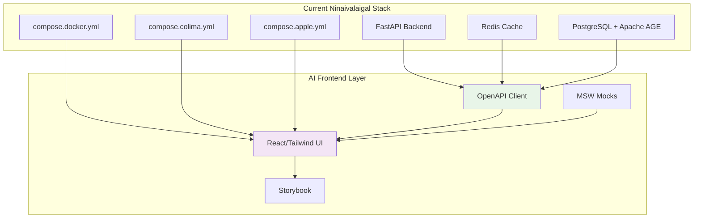

# 🔄 AI-First Frontend Workflow Diagrams

## **Current vs Future State**

### **Traditional Workflow (Current)**

**Total Time: 2-4 weeks per screen**

### **AI-First Workflow (Future)**

**Total Time: 1-2 days per screen**

---

## **Technical Architecture Flow**

---

## **Quality Assurance Pipeline**

---

## **Component Hierarchy Strategy**

---

## **Pilot Implementation Timeline**

---

## **Risk Mitigation Flow**

---

## **Success Metrics Dashboard**

---

## **Integration Points with Current Stack**

This comprehensive workflow documentation provides:

1. **Visual comparison** of current vs future workflows
2. **Technical architecture** showing all integration points
3. **Quality assurance pipeline** with automated gates
4. **Risk mitigation strategies** for different AI accuracy levels
5. **Timeline visualization** for the 6-week pilot
6. **Success metrics dashboard** for tracking ROI
7. **Integration points** with your existing triple-layer detection system

The diagrams make it easy for stakeholders to understand the transformation and see exactly how this fits into your current infrastructure without disrupting the excellent environment management system we just built.
