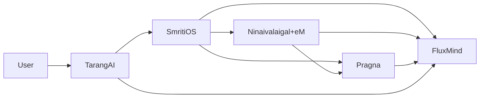
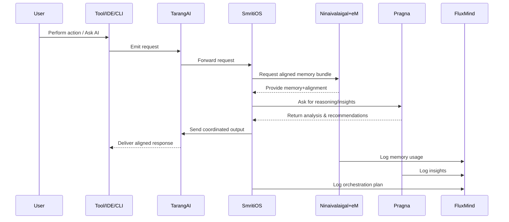

# Ninaivalaigal Ecosystem — Overall Documentation

## Layman Overview
The ecosystem is like a **company of AI assistants** where each module plays a role:

- **Ninaivalaigal + eM:** The memory vault and its right-hand assistant. Keeps everything recorded, organized, and aligned so AI stays on track.
- **SmritiOS:** The office manager. Orchestrates all modules, decides who should do what, and enforces rules.
- **TarangAI:** The phone system. Invisible pipes that deliver messages and memories between tools and agents.
- **Pragna:** The strategist. Looks across memories to find insights and trends, suggests next steps.
- **FluxMind:** The control room. Dashboards and logs that show what’s happening, why, and allow debugging and governance.

Together, they form an **AI nervous system** — memory, alignment, orchestration, transport, reasoning, and control.

---

## Technical Overview
**Ecosystem Design Goals:**
- Persistent memory for multi-user, multi-team environments.
- Alignment agent (eM) to enforce guardrails and inject correct context.
- Orchestration (SmritiOS) to coordinate agents and modules.
- Transport (TarangAI) for reliable delivery of context and events.
- Reasoning (Pragna) to generate insights from history.
- Control plane (FluxMind) for transparency, audit, and governance.

**Core Components Already in Repo:**
- Ninaivalaigal server (FastAPI + Postgres).
- eM commands (record, recall, forget).
- CLI (mem0), VS Code extension, shell integration.
- Basic orgs/teams/roles, JWT auth.

**Planned / Conceptual:**
- SmritiOS orchestration logic.
- TarangAI transport and stream router.
- Pragna reasoning module.
- FluxMind UI/dashboard.

---

## Architecture Diagram

---

## Sequence Flow (End-to-End Task)

---

## Slide-style Summary (Layman)
- Ninaivalaigal+eM = Memory + Right hand
- SmritiOS = Orchestrator
- TarangAI = Invisible pipes
- Pragna = Strategist
- FluxMind = Control room
- Together: AI nervous system

---

## Slide-style Summary (Technical)
- Core: FastAPI server, Postgres, JWT auth, CLI, IDE extensions
- eM: context injector & guardrails
- SmritiOS: orchestration & policy engine
- TarangAI: event/stream router
- Pragna: reasoning engine
- FluxMind: control plane UI
