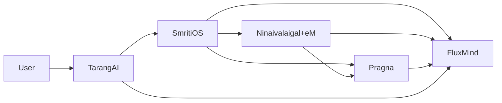
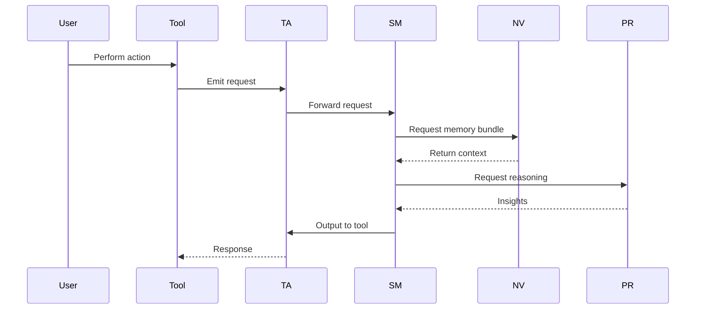

# Ecosystem — Technical Slides
## Architecture

```mermaid
flowchart LR
  User --> TA[TarangAI]
  TA --> SM[SmritiOS]
  SM --> NV[Ninaivalaigal+eM]
  SM --> PR[Pragna]
  SM --> FM[FluxMind]
  NV --> PR
  NV --> FM
  PR --> FM
  TA --> FM
```
## Sequence Flow

```mermaid
sequenceDiagram
  User->>Tool: Perform action
  Tool->>TA: Emit request
  TA->>SM: Forward request
  SM->>NV: Request memory bundle
  NV-->>SM: Return context
  SM->>PR: Request reasoning
  PR-->>SM: Insights
  SM->>TA: Output to tool
  TA-->>Tool: Response
```
