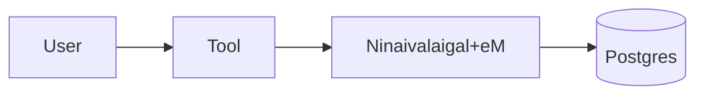
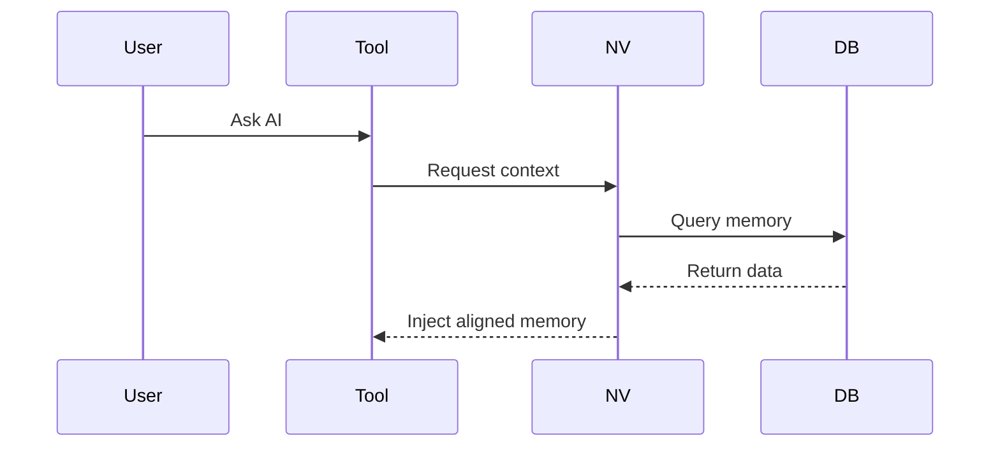

# Ninaivalaigal + eM — Technical Slides
## Responsibilities
- Persistent memory (multi-user, multi-team).
- Alignment agent (eM) injects correct context.
- Guardrails: provenance, redaction, time windows.
## Components
- FastAPI server + PostgreSQL backend.
- JWT auth, orgs/teams/roles.
- CLI (mem0), VS Code extension, shell hook.
## Architecture

## Sequence

