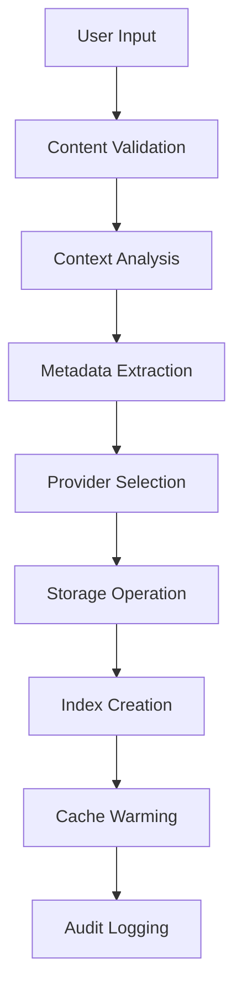
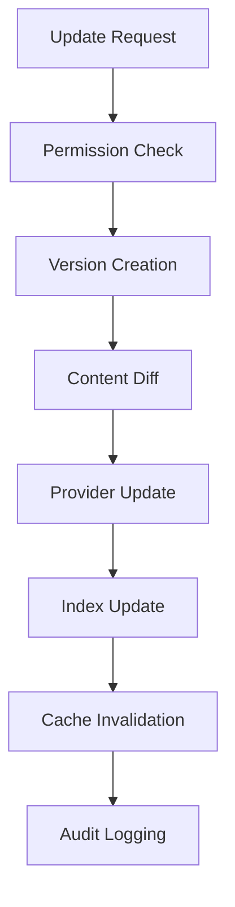
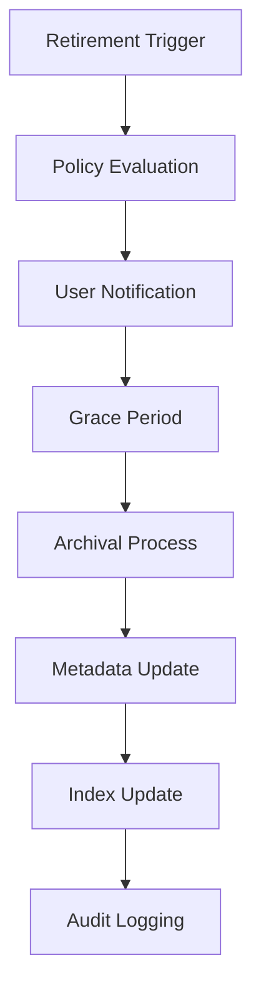

# Memory Lifecycle Documentation

**Version**: 2.0
**Last Updated**: September 27, 2024
**Audience**: Developers, System Administrators, End Users

## 🧠 **Memory Lifecycle Overview**

This document describes how memories are recorded, updated, scored, ranked, and retired in the Ninaivalaigal platform, providing a comprehensive understanding of the complete memory management workflow.

## 📝 **Memory Creation & Recording**

### **1. Memory Ingestion Process**



#### **Step 1: Content Validation**
- **Input Sanitization**: Remove harmful content, validate encoding
- **Size Limits**: Enforce content size limits (default: 10MB per memory)
- **Format Detection**: Identify content type (text, JSON, structured data)
- **Schema Validation**: Validate against memory schema requirements

#### **Step 2: Context Analysis**
- **Context Extraction**: Parse and normalize context information
- **Scope Assignment**: Determine appropriate scope (user/team/org/agent)
- **Permission Inheritance**: Apply default permissions from scope
- **Context Validation**: Ensure context follows naming conventions

#### **Step 3: Metadata Processing**
- **Automatic Metadata**: Extract creation time, user ID, content hash
- **User Metadata**: Process tags, importance level, categories
- **System Metadata**: Add provider info, storage location, version
- **Enrichment**: Add computed metadata (word count, language, etc.)

#### **Step 4: Provider Selection**
- **Provider Discovery**: Query available memory providers
- **Health Check**: Verify provider availability and performance
- **Selection Algorithm**: Choose optimal provider based on:
  - Provider priority and health status
  - Content type and size requirements
  - User preferences and scope policies
  - Load balancing considerations

#### **Step 5: Storage Operation**
```python
# Example memory creation flow
async def create_memory(content: str, context: str, metadata: dict) -> Memory:
    # Validate input
    validated_content = validate_content(content)
    validated_context = validate_context(context)

    # Extract and enrich metadata
    enriched_metadata = enrich_metadata(metadata, content, context)

    # Select optimal provider
    provider = await select_provider(content_type, user_scope)

    # Store memory
    memory = await provider.remember(
        content=validated_content,
        context=validated_context,
        metadata=enriched_metadata
    )

    # Create indexes and cache entries
    await create_indexes(memory)
    await warm_cache(memory)

    # Log creation event
    await audit_logger.log_memory_creation(memory, user_id)

    return memory
```

### **2. Memory Storage Architecture**

#### **Primary Storage**
- **PostgreSQL + pgvector**: Primary relational storage with vector search
- **Apache AGE Graph**: Relationship and graph-based storage
- **Content Storage**: Optimized for different content types

#### **Caching Layer**
- **Redis Cache**: Hot memory cache with 1-hour TTL
- **Relevance Cache**: Pre-computed relevance scores (15-min TTL)
- **Query Cache**: Cached search results for common queries

#### **Indexing Strategy**
- **Full-Text Search**: PostgreSQL full-text search indexes
- **Vector Indexes**: pgvector HNSW indexes for similarity search
- **Metadata Indexes**: B-tree indexes on commonly queried fields
- **Graph Indexes**: Apache AGE relationship indexes

## 🔄 **Memory Updates & Versioning**

### **1. Update Process**



#### **Update Types**
- **Content Updates**: Modify memory content while preserving history
- **Metadata Updates**: Update tags, importance, categories
- **Context Updates**: Change memory context or scope
- **Permission Updates**: Modify sharing and access permissions

#### **Versioning Strategy**
```python
class MemoryVersion:
    memory_id: UUID
    version_number: int
    content: str
    metadata: dict
    created_at: datetime
    created_by: int
    change_summary: str
    parent_version: Optional[int]
```

#### **Update Workflow**
```python
async def update_memory(memory_id: UUID, updates: dict, user_id: int) -> Memory:
    # Check permissions
    if not await check_update_permission(memory_id, user_id):
        raise PermissionError("Insufficient permissions to update memory")

    # Load current memory
    current_memory = await load_memory(memory_id)

    # Create new version
    new_version = await create_version(current_memory, updates, user_id)

    # Update provider storage
    updated_memory = await provider.update_memory(memory_id, new_version)

    # Update indexes
    await update_indexes(updated_memory)

    # Invalidate caches
    await invalidate_memory_cache(memory_id)

    # Log update event
    await audit_logger.log_memory_update(memory_id, user_id, updates)

    return updated_memory
```

### **2. Conflict Resolution**

#### **Concurrent Update Handling**
- **Optimistic Locking**: Version-based conflict detection
- **Merge Strategies**: Automatic and manual merge options
- **Conflict Notification**: Alert users of conflicting updates
- **Resolution Workflow**: Guided conflict resolution interface

#### **Update Policies**
- **Overwrite Policy**: Latest update wins (default for single-user memories)
- **Merge Policy**: Attempt automatic merging of non-conflicting changes
- **Approval Policy**: Require approval for updates to shared memories
- **Lock Policy**: Exclusive edit locks for critical memories

## 📊 **Memory Scoring & Ranking**

### **1. Relevance Scoring Algorithm**

The relevance scoring system uses multiple factors to determine memory importance and relevance:

```python
def calculate_relevance_score(memory: Memory, context: str, user_id: int) -> float:
    """
    Calculate comprehensive relevance score (0.0 to 1.0)
    """
    # Base factors
    time_decay_score = calculate_time_decay(memory.created_at, memory.last_accessed)
    frequency_score = calculate_access_frequency(memory.id, user_id)
    importance_score = get_importance_weight(memory.metadata.get('importance'))
    context_match_score = calculate_context_similarity(memory.context, context)

    # Advanced factors
    user_preference_score = get_user_preference_score(memory, user_id)
    social_score = calculate_social_signals(memory.id)
    content_quality_score = assess_content_quality(memory.content)

    # Weighted combination
    relevance_score = (
        time_decay_score * 0.20 +
        frequency_score * 0.25 +
        importance_score * 0.15 +
        context_match_score * 0.20 +
        user_preference_score * 0.10 +
        social_score * 0.05 +
        content_quality_score * 0.05
    )

    return min(1.0, max(0.0, relevance_score))
```

#### **Scoring Factors**

**Time Decay (20% weight)**
- Recent memories score higher
- Exponential decay function: `score = e^(-λt)` where t = days since creation
- Configurable decay rate per user/context

**Access Frequency (25% weight)**
- Frequently accessed memories score higher
- Sliding window analysis (last 30 days)
- Weighted by recency of access

**Importance Level (15% weight)**
- User-assigned importance: High (1.0), Medium (0.6), Low (0.3)
- System-detected importance based on content analysis
- Context-specific importance adjustments

**Context Match (20% weight)**
- Exact context match: 1.0
- Partial context match: 0.3-0.8 based on similarity
- Hierarchical context matching (parent/child contexts)

**User Preferences (10% weight)**
- Learning from user interactions (likes, shares, edits)
- Personalized scoring based on historical behavior
- Collaborative filtering from similar users

**Social Signals (5% weight)**
- Sharing frequency and engagement
- Comments and collaborative interactions
- Team/organization usage patterns

**Content Quality (5% weight)**
- Content completeness and structure
- Metadata richness and accuracy
- User feedback and ratings

### **2. Ranking Algorithms**

#### **Personalized Ranking**
```python
async def get_personalized_ranking(
    memories: List[Memory],
    user_id: int,
    context: str
) -> List[Memory]:
    """
    Personalize memory ranking based on user behavior and preferences
    """
    user_profile = await get_user_profile(user_id)

    scored_memories = []
    for memory in memories:
        base_score = calculate_relevance_score(memory, context, user_id)

        # Apply personalization factors
        personal_score = apply_personalization(
            base_score, memory, user_profile, context
        )

        scored_memories.append((memory, personal_score))

    # Sort by score (descending)
    scored_memories.sort(key=lambda x: x[1], reverse=True)

    return [memory for memory, score in scored_memories]
```

#### **Contextual Ranking**
- **Context Similarity**: Rank based on context matching
- **Temporal Relevance**: Boost recently created/accessed memories
- **Collaborative Signals**: Use team/org usage patterns
- **Semantic Similarity**: Vector-based content similarity

#### **Dynamic Re-ranking**
- **Real-time Updates**: Adjust rankings based on current activity
- **Feedback Integration**: Learn from user interactions
- **A/B Testing**: Experiment with different ranking algorithms
- **Performance Monitoring**: Track ranking effectiveness metrics

### **3. Caching & Performance**

#### **Score Caching Strategy**
```python
class RelevanceScoreCache:
    """Redis-backed relevance score caching"""

    async def get_cached_score(
        self,
        memory_id: UUID,
        user_id: int,
        context: str
    ) -> Optional[float]:
        cache_key = f"relevance:{user_id}:{memory_id}:{hash(context)}"
        cached_score = await self.redis.get(cache_key)

        if cached_score:
            return float(cached_score)
        return None

    async def cache_score(
        self,
        memory_id: UUID,
        user_id: int,
        context: str,
        score: float
    ):
        cache_key = f"relevance:{user_id}:{memory_id}:{hash(context)}"
        await self.redis.setex(cache_key, 900, score)  # 15-minute TTL
```

#### **Performance Optimizations**
- **Batch Scoring**: Calculate scores for multiple memories simultaneously
- **Incremental Updates**: Update scores only when factors change
- **Background Processing**: Pre-compute scores for popular memories
- **Cache Warming**: Proactively cache frequently accessed scores

## 🗂️ **Memory Organization & Categorization**

### **1. Automatic Categorization**

#### **Content-Based Classification**
```python
async def auto_categorize_memory(memory: Memory) -> List[str]:
    """
    Automatically categorize memory based on content analysis
    """
    categories = []

    # NLP-based categorization
    content_categories = await nlp_classifier.classify(memory.content)
    categories.extend(content_categories)

    # Context-based categorization
    context_categories = extract_context_categories(memory.context)
    categories.extend(context_categories)

    # Metadata-based categorization
    if memory.metadata.get('tags'):
        categories.extend(memory.metadata['tags'])

    # Remove duplicates and return
    return list(set(categories))
```

#### **Classification Methods**
- **Keyword Extraction**: Extract key terms and phrases
- **Topic Modeling**: LDA/BERT-based topic classification
- **Named Entity Recognition**: Identify people, places, organizations
- **Sentiment Analysis**: Classify emotional content
- **Content Type Detection**: Documents, code, notes, etc.

### **2. Hierarchical Organization**

#### **Context Hierarchy**
```
Organization Context
├── Department Context
│   ├── Team Context
│   │   ├── Project Context
│   │   └── User Context
│   └── User Context
└── User Context
```

#### **Category Taxonomy**
```
Root Categories
├── Work
│   ├── Projects
│   ├── Meetings
│   ├── Documentation
│   └── Communications
├── Personal
│   ├── Learning
│   ├── Ideas
│   ├── References
│   └── Notes
└── Shared
    ├── Team Knowledge
    ├── Best Practices
    └── Resources
```

### **3. Smart Tagging System**

#### **Automatic Tag Generation**
- **Content Analysis**: Extract relevant keywords and phrases
- **Context Inference**: Generate tags based on memory context
- **User Pattern Learning**: Suggest tags based on user behavior
- **Collaborative Tagging**: Learn from team/org tagging patterns

#### **Tag Management**
```python
class TagManager:
    async def suggest_tags(self, memory: Memory, user_id: int) -> List[str]:
        """Suggest relevant tags for a memory"""
        suggestions = []

        # Content-based suggestions
        content_tags = await self.extract_content_tags(memory.content)
        suggestions.extend(content_tags)

        # User history-based suggestions
        user_tags = await self.get_user_frequent_tags(user_id)
        suggestions.extend(user_tags)

        # Similar memory tags
        similar_memories = await self.find_similar_memories(memory)
        for similar_memory in similar_memories:
            suggestions.extend(similar_memory.tags)

        # Rank and return top suggestions
        return self.rank_tag_suggestions(suggestions, memory)
```

## ♻️ **Memory Retirement & Archival**

### **1. Lifecycle Policies**

#### **Automatic Retirement Rules**
```python
class MemoryRetirementPolicy:
    def __init__(self):
        self.rules = [
            # Age-based retirement
            RetirementRule(
                condition="age > 365 days AND access_count < 5",
                action="archive",
                priority=1
            ),
            # Inactivity-based retirement
            RetirementRule(
                condition="last_access > 180 days AND importance != 'high'",
                action="archive",
                priority=2
            ),
            # Storage optimization
            RetirementRule(
                condition="size > 50MB AND access_count < 10",
                action="compress",
                priority=3
            )
        ]
```

#### **Retirement Actions**
- **Archive**: Move to cold storage, maintain searchability
- **Compress**: Reduce storage footprint while keeping accessible
- **Delete**: Permanent removal (with audit trail)
- **Migrate**: Move to different provider or storage tier

### **2. Archival Process**

#### **Archival Workflow**


#### **Archival Implementation**
```python
async def archive_memory(memory_id: UUID, reason: str) -> bool:
    """
    Archive a memory while maintaining metadata and searchability
    """
    memory = await load_memory(memory_id)

    # Create archival record
    archive_record = ArchivalRecord(
        memory_id=memory_id,
        archived_at=datetime.now(),
        reason=reason,
        original_size=len(memory.content),
        archive_location=generate_archive_path(memory_id)
    )

    # Move content to cold storage
    await cold_storage.store(archive_record.archive_location, memory.content)

    # Update memory record
    memory.status = MemoryStatus.ARCHIVED
    memory.archive_info = archive_record
    memory.content = None  # Remove content from hot storage

    # Update indexes
    await update_search_index(memory)

    # Log archival
    await audit_logger.log_memory_archival(memory_id, reason)

    return True
```

### **3. Recovery & Restoration**

#### **Archive Access**
- **Metadata Search**: Search archived memories by metadata
- **On-Demand Retrieval**: Restore content when accessed
- **Bulk Restoration**: Restore multiple memories simultaneously
- **Preview Mode**: Show memory metadata before full restoration

#### **Restoration Process**
```python
async def restore_memory(memory_id: UUID, user_id: int) -> Memory:
    """
    Restore an archived memory to active status
    """
    # Check permissions
    if not await check_restore_permission(memory_id, user_id):
        raise PermissionError("Insufficient permissions to restore memory")

    # Load archived memory
    memory = await load_memory(memory_id)
    if memory.status != MemoryStatus.ARCHIVED:
        raise ValueError("Memory is not archived")

    # Restore content from cold storage
    content = await cold_storage.retrieve(memory.archive_info.archive_location)

    # Update memory record
    memory.content = content
    memory.status = MemoryStatus.ACTIVE
    memory.restored_at = datetime.now()
    memory.restored_by = user_id

    # Update indexes and cache
    await update_indexes(memory)
    await warm_cache(memory)

    # Log restoration
    await audit_logger.log_memory_restoration(memory_id, user_id)

    return memory
```

## 📈 **Performance & Monitoring**

### **1. Lifecycle Metrics**

#### **Key Performance Indicators**
- **Creation Rate**: Memories created per time period
- **Update Frequency**: Average updates per memory
- **Access Patterns**: Memory access frequency and recency
- **Retirement Rate**: Memories archived/deleted per time period
- **Storage Efficiency**: Storage utilization and optimization
- **Query Performance**: Search and retrieval response times

#### **Monitoring Dashboard**
```python
class LifecycleMetrics:
    async def get_lifecycle_summary(self, time_period: str) -> dict:
        return {
            "memories_created": await self.count_created_memories(time_period),
            "memories_updated": await self.count_updated_memories(time_period),
            "memories_accessed": await self.count_accessed_memories(time_period),
            "memories_archived": await self.count_archived_memories(time_period),
            "average_memory_age": await self.calculate_average_age(),
            "storage_utilization": await self.calculate_storage_usage(),
            "cache_hit_rate": await self.get_cache_hit_rate(),
            "query_performance": await self.get_query_performance_stats()
        }
```

### **2. Optimization Strategies**

#### **Performance Optimization**
- **Intelligent Caching**: Cache frequently accessed memories
- **Lazy Loading**: Load memory content on demand
- **Batch Operations**: Process multiple memories simultaneously
- **Background Processing**: Perform heavy operations asynchronously

#### **Storage Optimization**
- **Compression**: Compress large or infrequently accessed memories
- **Deduplication**: Identify and merge duplicate memories
- **Tiered Storage**: Move old memories to cheaper storage tiers
- **Cleanup**: Remove orphaned or corrupted memory data

## 🔧 **Configuration & Customization**

### **1. Lifecycle Configuration**

#### **User-Level Configuration**
```yaml
memory_lifecycle:
  retention_policy:
    default_retention_days: 365
    important_memory_retention_days: 1825  # 5 years
    auto_archive_threshold_days: 180

  scoring_preferences:
    time_decay_weight: 0.20
    frequency_weight: 0.25
    importance_weight: 0.15
    context_weight: 0.20

  categorization:
    auto_categorize: true
    suggest_tags: true
    max_categories_per_memory: 5
```

#### **Organization-Level Policies**
```yaml
organization_policies:
  compliance:
    audit_retention_years: 7
    data_residency: "US"
    encryption_required: true

  lifecycle_management:
    mandatory_archival_days: 1095  # 3 years
    deletion_approval_required: true
    backup_retention_days: 30
```

### **2. Custom Workflows**

#### **Workflow Configuration**
- **Custom Retirement Rules**: Define organization-specific retirement criteria
- **Approval Workflows**: Require approval for certain lifecycle actions
- **Integration Hooks**: Connect to external systems for lifecycle events
- **Notification Preferences**: Configure alerts for lifecycle events

---

**This comprehensive memory lifecycle documentation ensures that all stakeholders understand how memories flow through the system from creation to retirement, enabling effective memory management and optimization.**
