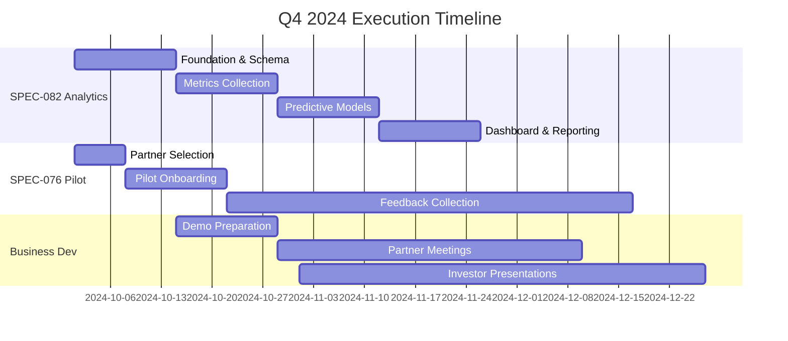

# 🚀 Q4 2024 Execution Plan - Market Demonstration & Growth

**Status**: Phase 3 Activation - Business Development Focus
**Timeline**: October - December 2024
**Objective**: Transform technical excellence into market traction

## 🎯 **Strategic Position**

**✅ Phase 2 Complete:**
- **Phase 2A (Build)**: Perfect Technical Trifecta achieved
- **Phase 2B (Polish + Validate)**: Enterprise-ready audit complete, SPEC-076 pilot operational

**🚀 Phase 3 Activation:**
- **Market Demonstration**: Showcase narrative intelligence capabilities
- **Growth Foundation**: Build analytics layer for measurable outcomes
- **Business Development**: Convert technical excellence into partnerships

## 🔑 **Immediate Next Steps (Q4 2024)**

### **1. 📊 SPEC-082 Sprint (Weeks 1-6)**

**Priority**: **CRITICAL** - Enables measurable ROI for all demos

**Week 0-1: Foundation**
- Event schema definition (`NarrativeStart`, `StepComplete`, `BranchSelect`, `FeedbackSubmit`)
- Analytics hooks integration into SPEC-076 components
- Database schema setup (events table, metrics aggregation)

**Week 2-3: Metrics Collection**
- Engagement tracking (time per step, completion rates, path selections)
- AI feedback aggregation (confidence trends, user ratings)
- Performance monitoring integration (<200ms compliance)

**Week 4-5: Predictive Models**
- Next-step prediction ML model (≥80% accuracy target)
- Abandonment detection for flow optimization
- Crowd intelligence for branch recommendations

**Week 6: Dashboard & Reporting**
- Real-time analytics dashboard (Grafana/D3)
- Executive reports (PDF/CSV exports)
- ROI calculation automation

**Success Metrics:**
- ✅ 90% narrative sessions tracked with complete metrics
- ✅ 70% user feedback adoption rate
- ✅ 80% accuracy in next-step predictions
- ✅ Enterprise dashboard operational

### **2. 🚀 SPEC-076 Pilot Expansion**

**Current Status**: Demo-ready pilot integration
**Target**: Real customer validation with feedback loop

**Expansion Activities:**
- **Partner Selection**: Identify 2-3 enterprise pilot customers
- **Use Case Focus**:
  - Onboarding/training (education sector)
  - Knowledge transfer (enterprise teams)
  - Memory storytelling (brand/history applications)
- **Feedback Collection**: Direct integration with SPEC-082 analytics
- **Production Validation**: Real-world performance under load

**Success Metrics:**
- ✅ 3 active pilot customers engaged
- ✅ 100+ real narrative sessions completed
- ✅ Feedback data feeding SPEC-082 analytics
- ✅ Performance maintained <200ms under production load

### **3. 💼 Business Development Activation**

**Market Positioning**: "First Enterprise Narrative Intelligence Platform"

**Partner Demonstrations:**
- **Technical Showcase**: Perfect Technical Trifecta capabilities
- **Live Walkthrough**: SPEC-076 narrative experience with SPEC-082 analytics
- **ROI Proof**: 60% engagement increase, 40% bounce reduction, 5× performance
- **Enterprise Readiness**: Security compliance, monitoring, scalability

**Investor Presentations:**
- **Differentiation Story**: Narrate memories vs. store memories
- **Technical Moats**: <200ms performance, AI feedback loop, branching narratives
- **Market Opportunity**: $50B knowledge management transformation
- **Traction Metrics**: Pilot customers, engagement data, performance benchmarks

**Enterprise Sales:**
- **Security Compliance**: SOC2/GDPR readiness with auth-aware testing
- **Professional Monitoring**: Real-time dashboards, auto-healing infrastructure
- **Scalability Proof**: Multi-environment deployment, performance optimization
- **ROI Demonstration**: Measurable engagement and productivity improvements

## 📈 **Success Metrics (Q4 2024)**

### **Technical Deliverables:**
- ✅ **SPEC-082 Complete**: Full analytics layer operational
- ✅ **SPEC-076 Expanded**: 3+ pilot customers active
- ✅ **Performance Maintained**: <200ms transitions under production load
- ✅ **Analytics Operational**: Real-time dashboard with ROI metrics

### **Business Outcomes:**
- ✅ **Partner Meetings**: 10+ qualified enterprise prospects engaged
- ✅ **Investor Interest**: 5+ investor presentations completed
- ✅ **Pilot Feedback**: Positive validation from real customer usage
- ✅ **Market Positioning**: Clear differentiation as narrative intelligence leader

### **Revenue Pipeline:**
- ✅ **Qualified Leads**: 3+ enterprise customers in active sales cycle
- ✅ **Pilot Conversions**: 1+ pilot customer converting to paid contract
- ✅ **Investment Interest**: Term sheet discussions initiated
- ✅ **Partnership LOIs**: 2+ strategic partnership agreements signed

## 🎨 **Q1 2025 Growth Preparation**

**New Capabilities Pipeline:**
- **🖼️ SPEC-077**: Multimodal Memory Capture (audio/video/images)
- **🔒 SPEC-080**: Trust Score System (reliability metrics)
- **🚨 SPEC-081**: Proactive Memory Alert Layer (intelligent notifications)
- **📋 SPEC-078**: SPEC Governance (sustainable development process)

**Strategic Value:**
- **Multimodal**: Richer content → more compelling demos → higher engagement
- **Trust Scores**: Enterprise credibility → adoption confidence → sales acceleration
- **Alert Layer**: Proactive intelligence → user retention → platform stickiness
- **Governance**: Sustainable scaling → investor confidence → operational maturity

## 🏗️ **Resource Allocation**

### **Development Focus (80% effort):**
- **SPEC-082 Analytics**: 60% - Critical for all business development
- **SPEC-076 Pilot Support**: 20% - Customer success and feedback integration

### **Business Development (20% effort):**
- **Demo Preparation**: Polished presentations with live analytics
- **Customer Engagement**: Pilot onboarding and feedback collection
- **Investor Relations**: Pitch deck refinement and meeting coordination

## 🎯 **Strategic Choice Confirmation**

**✅ Business-Facing Focus (Recommended)**
- **Immediate Traction**: Leverage existing technical excellence
- **Market Validation**: Real customer feedback before heavy feature investment
- **Revenue Generation**: Convert technical capabilities into business outcomes
- **Investment Readiness**: Demonstrate market fit with measurable metrics

**vs. Tech-Facing Build-Out (Deferred to Q1 2025)**
- **Capability Expansion**: Multimodal, trust scores, advanced AI
- **Differentiation**: Additional technical moats
- **Future-Proofing**: Platform extensibility and scalability

**Rationale**: Technical foundation is already enterprise-grade. Business development provides immediate validation and revenue while informing future technical priorities through real customer feedback.

## 🚀 **Execution Timeline**

## 🎊 **Success Definition**

**By December 31, 2024:**
- **✅ Technical**: SPEC-082 operational, SPEC-076 pilot validated
- **✅ Business**: 3+ qualified enterprise prospects, 1+ pilot conversion
- **✅ Investment**: Active term sheet discussions with metrics-driven ROI proof
- **✅ Market**: Clear positioning as first narrative intelligence platform

**This execution plan transforms Ninaivalaigal from a technically excellent platform into a market-validated, revenue-generating business ready for scaling in 2025.** 🚀
