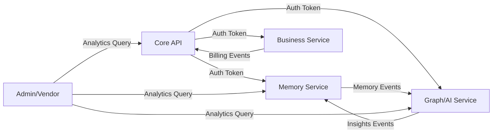

# SPEC-100: Router-to-Service Mapping Analysis

**Date**: October 15, 2025
**Phase**: Stage 1 - Refactor Router Boundaries
**Status**: 🚧 In Progress
**Author**: Developer C (DevOps/Infrastructure)

---

## Executive Summary

Current state analysis of the Ninaivalaigal API monolith for decomposition into 5 microservices per SPEC-100 architecture.

**Current Structure**:
- **Routers**: 11 organized routers in `server/routers/`
- **Standalone APIs**: ~75 direct API files in `server/`
- **Total Endpoints**: Estimated 200+ endpoints
- **Target**: 5 independent microservices

---

## 1. 📁 Current Router Structure

### Organized Routers (`server/routers/`)

| Router File | Lines | Primary Domain | Target Service |
|-------------|-------|----------------|----------------|
| `users.py` | ~100 | User management | **Core API** |
| `teams.py` | ~150 | Team management | **Core API** |
| `organizations.py` | ~120 | Organization CRUD | **Core API** |
| `approvals.py` | ~130 | Approval workflows | **Core API** |
| `memory.py` | ~250 | Memory operations | **Memory Service** |
| `contexts.py` | ~200 | Context management | **Memory Service** |
| `contexts_unified.py` | ~500 | Unified context API | **Memory Service** |
| `recording.py` | ~150 | Recording sessions | **Memory Service** |
| `substrate.py` | ~400 | Memory substrate | **Memory Service** |
| `intelligence.py` | ~550 | AI/Graph intelligence | **Graph/AI Service** |
| `provider_management.py` | ~270 | Provider configs | **Business Service** |

**Total Router Lines**: ~2,720 lines

---

## 2. 📊 Standalone API Files Analysis

### Core API Domain (Authentication, Users, Teams, RBAC)

| File | Lines | Description | Target Service |
|------|-------|-------------|----------------|
| `auth.py` | ~700 | Authentication logic | **Core API** |
| `auth_async.py` | ~220 | Async auth helpers | **Core API** |
| `auth_health_check.py` | ~360 | Auth health monitoring | **Core API** |
| `auth_utils.py` | ~90 | Auth utilities | **Core API** |
| `auth_working.py` | ~180 | Legacy auth | **Core API** (migrate) |
| `signup_api.py` | ~700 | User signup | **Core API** |
| `enhanced_signup_api.py` | ~520 | Enhanced signup flow | **Core API** |
| `rbac_api.py` | ~630 | Role-based access | **Core API** |
| `rbac_middleware.py` | ~360 | RBAC middleware | **Core API** |
| `rbac_models.py` | ~340 | RBAC data models | **Core API** |
| `staff_auth_api.py` | ~270 | Staff authentication | **Core API** |
| `staff_management_api.py` | ~430 | Staff management | **Core API** |
| `standalone_teams_api.py` | ~580 | Teams API | **Core API** |
| `team_api_keys_api.py` | ~560 | Team API keys | **Core API** |
| `team_invitations_api.py` | ~500 | Team invitations | **Core API** |
| `token_api.py` | ~310 | Token management | **Core API** |
| `token_refresh.py` | ~250 | Token refresh | **Core API** |

**Core API Subtotal**: ~7,000 lines

### Memory Service Domain

| File | Lines | Description | Target Service |
|------|-------|-------------|----------------|
| `memory_api.py` | ~180 | Memory CRUD | **Memory Service** |
| `memory_acl_api.py` | ~590 | Memory access control | **Memory Service** |
| `memory_acl_engine.py` | ~770 | ACL logic engine | **Memory Service** |
| `memory_drift_api.py` | ~390 | Drift detection API | **Memory Service** |
| `memory_drift_engine.py` | ~730 | Drift analysis | **Memory Service** |
| `memory_health_api.py` | ~490 | Memory health | **Memory Service** |
| `memory_health_engine.py` | ~650 | Health monitoring | **Memory Service** |
| `memory_injection.py` | ~590 | Memory injection | **Memory Service** |
| `memory_injection_api.py` | ~460 | Injection API | **Memory Service** |
| `memory_suggestions.py` | ~710 | Suggestion engine | **Memory Service** |
| `memory_suggestions_api.py` | ~530 | Suggestions API | **Memory Service** |
| `memory_system.py` | ~360 | Core memory system | **Memory Service** |
| `context_scoping.py` | ~480 | Context scoping | **Memory Service** |
| `context_merger.py` | ~130 | Context merging | **Memory Service** |
| `auto_recording.py` | ~390 | Auto recording | **Memory Service** |
| `preload_api.py` | ~430 | Preloading | **Memory Service** |
| `preloading_engine.py` | ~550 | Preload logic | **Memory Service** |
| `session_api.py` | ~430 | Session management | **Memory Service** |
| `timeline_api.py` | ~700 | Timeline views | **Memory Service** |

**Memory Service Subtotal**: ~9,560 lines

### Graph/AI Service Domain

| File | Lines | Description | Target Service |
|------|-------|-------------|----------------|
| `graph_intelligence_api.py` | ~360 | Graph intelligence | **Graph/AI Service** |
| `graph_intelligence_integration_api.py` | ~650 | Graph integration | **Graph/AI Service** |
| `graph_rank.py` | ~650 | Graph ranking | **Graph/AI Service** |
| `graph_usage_analytics.py` | ~680 | Usage analytics | **Graph/AI Service** |
| `graph_validation_checklist.py` | ~680 | Validation | **Graph/AI Service** |
| `ai_feedback_api.py` | ~420 | AI feedback | **Graph/AI Service** |
| `ai_feedback_system.py` | ~540 | Feedback system | **Graph/AI Service** |
| `ai_integrations.py` | ~610 | AI integrations | **Graph/AI Service** |
| `agentic_api.py` | ~510 | Agentic workflows | **Graph/AI Service** |
| `insights_api.py` | ~660 | Insights generation | **Graph/AI Service** |
| `intelligent_session.py` | ~800 | Intelligent sessions | **Graph/AI Service** |
| `relevance_engine.py` | ~630 | Relevance scoring | **Graph/AI Service** |
| `feedback_api.py` | ~440 | Feedback API | **Graph/AI Service** |
| `feedback_engine.py` | ~490 | Feedback engine | **Graph/AI Service** |
| `suggestions_api.py` | ~550 | Suggestions API | **Graph/AI Service** |
| `suggestions_engine.py` | ~760 | Suggestion engine | **Graph/AI Service** |
| `tag_suggester.py` | ~550 | Tag suggestions | **Graph/AI Service** |
| `copilot_wrapper.py` | ~430 | Copilot integration | **Graph/AI Service** |
| `universal_ai_wrapper.py` | ~660 | Universal AI wrapper | **Graph/AI Service** |
| `unified_macro_intelligence_api.py` | ~600 | Macro intelligence | **Graph/AI Service** |

**Graph/AI Service Subtotal**: ~11,670 lines

### Business Service Domain (Billing, Analytics, Usage)

| File | Lines | Description | Target Service |
|------|-------|-------------|----------------|
| `billing_console_api.py` | ~620 | Billing console | **Business Service** |
| `billing_engine_integration_api.py` | ~830 | Billing engine | **Business Service** |
| `standalone_teams_billing_api.py` | ~840 | Teams billing | **Business Service** |
| `team_billing_portal_api.py` | ~690 | Billing portal | **Business Service** |
| `invoice_management_api.py` | ~750 | Invoice management | **Business Service** |
| `usage_analytics_api.py` | ~750 | Usage analytics | **Business Service** |
| `performance_api.py` | ~580 | Performance tracking | **Business Service** |
| `gamification_api.py` | ~490 | Gamification | **Business Service** |
| `early_adopter_api.py` | ~660 | Early adopter program | **Business Service** |
| `partner_ecosystem_api.py` | ~690 | Partner ecosystem | **Business Service** |
| `queue_api.py` | ~290 | Queue management | **Business Service** |

**Business Service Subtotal**: ~7,190 lines

### Admin/Vendor Service Domain

| File | Lines | Description | Target Service |
|------|-------|-------------|----------------|
| `admin_analytics_api.py` | ~710 | Admin analytics | **Admin/Vendor Service** |
| `dashboard_widgets_api.py` | ~620 | Dashboard widgets | **Admin/Vendor Service** |
| `vendor_admin_api.py` | ~540 | Vendor admin | **Admin/Vendor Service** |
| `discussion_api.py` | ~700 | Discussion forums | **Admin/Vendor Service** |
| `approval_workflow.py` | ~430 | Approval workflows | **Admin/Vendor Service** |
| `approval_workflows.py` | ~490 | Workflow management | **Admin/Vendor Service** |
| `spec_kit.py` | ~770 | Spec management | **Admin/Vendor Service** |
| `demo_api.py` | ~190 | Demo endpoints | **Admin/Vendor Service** |

**Admin/Vendor Service Subtotal**: ~4,450 lines

---

## 3. 🎯 Service Decomposition Summary

| Service | Total Lines | Router Count | API Files | Complexity |
|---------|-------------|--------------|-----------|------------|
| **Core API** | ~7,500 | 4 | 17 | Medium |
| **Memory Service** | ~12,000 | 5 | 19 | High |
| **Graph/AI Service** | ~12,500 | 1 | 20 | High |
| **Business Service** | ~7,500 | 1 | 11 | Medium |
| **Admin/Vendor Service** | ~4,500 | 0 | 8 | Low |

**Grand Total**: ~44,000 lines of API code

---

## 4. 📦 Proposed Service Structure

```
services/
├── core-api/                    # ~7,500 lines
│   ├── routers/
│   │   ├── auth.py              # Authentication
│   │   ├── users.py             # User management
│   │   ├── teams.py             # Team management
│   │   ├── organizations.py     # Organization management
│   │   └── rbac.py              # Role-based access control
│   ├── middleware/
│   │   ├── auth_middleware.py
│   │   └── rbac_middleware.py
│   └── models/
│       ├── user.py
│       ├── team.py
│       └── organization.py
│
├── memory-service/              # ~12,000 lines
│   ├── routers/
│   │   ├── memory.py            # Memory CRUD
│   │   ├── contexts.py          # Context management
│   │   ├── recording.py         # Recording sessions
│   │   ├── substrate.py         # Memory substrate
│   │   └── timeline.py          # Timeline views
│   ├── engines/
│   │   ├── memory_acl_engine.py
│   │   ├── memory_drift_engine.py
│   │   └── memory_health_engine.py
│   └── models/
│       ├── memory.py
│       └── context.py
│
├── graph-ai-service/            # ~12,500 lines
│   ├── routers/
│   │   ├── intelligence.py      # AI intelligence
│   │   ├── graph.py             # Graph operations
│   │   ├── insights.py          # Insights generation
│   │   ├── feedback.py          # Feedback processing
│   │   └── suggestions.py       # Suggestions API
│   ├── engines/
│   │   ├── ai_feedback_system.py
│   │   ├── relevance_engine.py
│   │   └── suggestion_engine.py
│   └── integrations/
│       ├── ai_integrations.py
│       └── copilot_wrapper.py
│
├── business-service/            # ~7,500 lines
│   ├── routers/
│   │   ├── billing.py           # Billing management
│   │   ├── usage.py             # Usage analytics
│   │   ├── invoices.py          # Invoice management
│   │   └── providers.py         # Provider management
│   ├── engines/
│   │   └── billing_engine.py
│   └── models/
│       ├── invoice.py
│       └── usage.py
│
└── admin-vendor-service/        # ~4,500 lines
    ├── routers/
    │   ├── admin_analytics.py   # Admin analytics
    │   ├── dashboard.py         # Dashboard widgets
    │   ├── vendor.py            # Vendor management
    │   └── discussion.py        # Discussion forums
    └── workflows/
        └── approval_workflow.py
```

---

## 5. 🔗 Cross-Service Dependencies

### Shared Components (Move to `shared/`)

| Component | Current Location | Usage |
|-----------|------------------|-------|
| Database models | `server/database/`, `server/models/` | All services |
| Redis client | `server/redis_client.py` | All services |
| Auth utilities | `server/auth_utils.py` | Core API, others |
| Input validation | `server/input_validation.py` | All services |
| Rate limiting | `server/rate_limiting.py` | Gateway/Middleware |
| Security middleware | `server/security/`, `server/middleware/` | All services |
| HTTP safety | `server/http_safety_middleware.py` | All services |
| Performance monitoring | `server/performance_monitor.py` | All services |

### Inter-Service Communication Patterns



---

## 6. 🚧 Migration Strategy

### Phase 1: Extract Core API (Days 1-2)
- Move `auth*.py`, `signup*.py`, `rbac*.py` to `services/core-api/`
- Move `users.py`, `teams.py`, `organizations.py` routers
- Create shared database models package
- Test authentication flows

### Phase 2: Extract Memory Service (Days 3-4)
- Move `memory*.py`, `context*.py`, `recording*.py` to `services/memory-service/`
- Move memory routers
- Implement memory event publisher
- Test memory operations

### Phase 3: Extract Graph/AI Service (Days 5-6)
- Move `graph*.py`, `ai*.py`, `intelligence*.py` to `services/graph-ai-service/`
- Move intelligence router
- Implement insights event publisher
- Test AI integrations

### Phase 4: Extract Business Service (Day 7)
- Move `billing*.py`, `usage*.py`, `invoice*.py` to `services/business-service/`
- Move provider router
- Test billing workflows

### Phase 5: Extract Admin/Vendor Service (Day 7)
- Move `admin*.py`, `vendor*.py`, `dashboard*.py` to `services/admin-vendor-service/`
- Test admin analytics

---

## 7. 🎯 Next Steps (Immediate Actions)

### For Developer C (DevOps/Infrastructure):

1. **Create Service Directory Structure**
   ```bash
   mkdir -p services/{core-api,memory-service,graph-ai-service,business-service,admin-vendor-service}/{routers,models,engines}
   mkdir -p shared/{contracts,utils,middleware,models}
   ```

2. **Create Service Stub Files**
   - Create `__init__.py` in each service
   - Create `main.py` stubs for each service
   - Create `requirements.txt` per service

3. **Extract Shared Components**
   - Move common utilities to `shared/utils/`
   - Move common models to `shared/models/`
   - Move middleware to `shared/middleware/`

4. **Create OpenAPI Schemas**
   - Generate OpenAPI spec for each service domain
   - Add to `shared/contracts/[service]/v1/openapi.yaml`

5. **Update Contract Validation**
   - Extend `ci/validate-api-contracts.py` to validate OpenAPI schemas
   - Add JSON Schema validation

### For Coordination:

- **With Developer A**: Ensure Rust GraphOps integrates with Graph/AI Service contracts
- **With Developer B**: Coordinate on database schema separation strategy

---

## 8. 📊 Metrics & Success Criteria

| Metric | Current | Target | Progress |
|--------|---------|--------|----------|
| Service Count | 1 (monolith) | 5 (microservices) | 0% |
| Build Time | 30+ min | <10 min | 0% |
| Deploy Granularity | All-or-nothing | Per-service | 0% |
| Code Organization | Flat structure | Service boundaries | 10% |
| Contract Coverage | Partial | 100% validated | 20% |

---

## 9. 🔄 Compatibility & Risk Mitigation

### Backward Compatibility

- **Gateway routing** preserves existing API paths
- **Shared contracts** ensure type safety across services
- **Gradual migration** allows parallel operation

### Risk Mitigation

1. **Database Access Conflicts**
   - Solution: Start with shared DB (Phase 1), migrate to separate schemas later

2. **Circular Dependencies**
   - Solution: Use event bus for async communication, contracts for sync

3. **Performance Regression**
   - Solution: Parallel benchmarking (Python baseline vs federated architecture)

---

## 10. ✅ Acceptance Criteria for Stage 1

- [x] Router inventory complete (this document)
- [ ] Service directory structure created
- [ ] Service stubs initialized
- [ ] Shared components extracted
- [ ] OpenAPI schemas generated
- [ ] Documentation updated

---

**Next Document**: `spec-100-stage-2-contracts.md` (Shared Contracts Repository Setup)

**Last Updated**: 2025-10-15
**Status**: Stage 1 Analysis Complete - Ready for Implementation
**Estimated Completion**: Day 2 (October 16, 2025)
