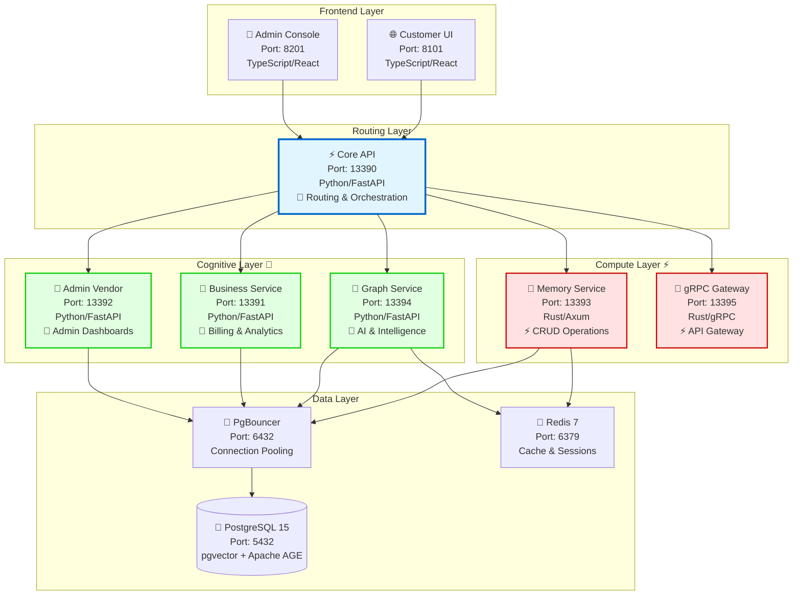
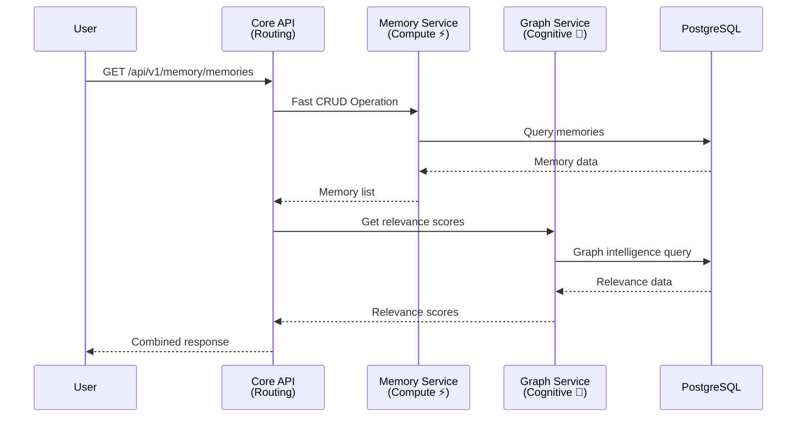

# Hybrid Compute-Cognitive Architecture Diagram

**Version**: 3.0
**Date**: November 4, 2025
**Related**: US#144, SPEC-020 Addendum, SPEC-099, SPEC-100

---

## 🏗️ Architecture Overview

Ninaivalaigal implements a **hybrid compute-cognitive architecture** that separates:
- **Compute Layer (Rust/Go)**: Fast, deterministic, throughput-bound operations
- **Cognitive Layer (Python)**: Intelligence, ML models, adaptive reasoning
- **Routing Layer (Python)**: API gateway and orchestration

---

## 📊 Service Topology Diagram

---

## 🔄 Request Flow Diagram

---

## 📋 Layer Classification

### Compute Layer ⚡ (Rust/Go)
**Purpose**: Fast, deterministic, throughput-bound operations

| Service | Port | Language | Rationale |
|---------|------|----------|-----------|
| Memory Service | 13393 | Rust | CRUD operations, vector search, Redis caching |
| gRPC Gateway | 13395 | Rust | Low-latency API gateway |

### Cognitive Layer 🧠 (Python)
**Purpose**: Intelligence, ML models, adaptive reasoning

| Service | Port | Language | Rationale |
|---------|------|----------|-----------|
| Graph Service | 13394 | Python | AI feedback, relevance ranking, graph intelligence |
| Business Service | 13391 | Python | Billing analytics, Stripe integration |
| Admin Vendor | 13392 | Python | Admin dashboards, vendor management |

### Routing Layer 🔀 (Python)
**Purpose**: API gateway and orchestration

| Service | Port | Language | Rationale |
|---------|------|----------|-----------|
| Core API | 13390 | Python | Auth, users, teams, routing between layers |

---

## 🎯 Architecture Benefits

### Performance
- ⚡ **10-100x faster** on compute-bound operations (Rust)
- 🧠 **Full intelligence** preserved in Python
- 🔄 **Optimal routing** between layers

### Cost
- 💰 **30-60% infrastructure cost reduction**
- 🚀 **Better resource utilization**
- 📊 **Scalable per layer**

### Maintainability
- 🔧 **Clear separation of concerns**
- 📚 **Language-appropriate tools**
- 🧪 **Easier testing and debugging**

---

## 📚 Related Documentation

- **SPEC-020 Addendum**: `/specs/020-memory-provider-architecture/ADDENDUM_HYBRID_ARCHITECTURE.md`
- **Architecture Overview**: `/docs/architecture/ARCHITECTURE_OVERVIEW.md`
- **Container Language Reference**: `/docs/architecture/CONTAINER_LANGUAGE_REFERENCE.md`
- **Validation Summary**: `/docs/architecture/HYBRID_ARCHITECTURE_VALIDATION_SUMMARY.md`

---

**Last Updated**: November 4, 2025
**Maintained By**: Developer G
**Related US**: #144
