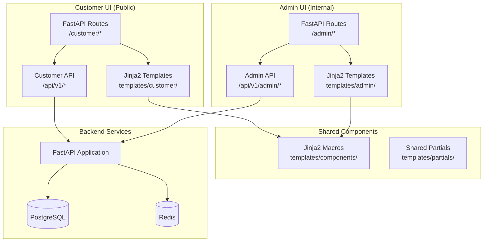

# Frontend Architecture Overview

**Version:** 2.0 (FastAPI Templating)
**Last Updated:** January 2025
**Status:** Production
**References:** SPEC-005 (Admin Dashboard), SPEC-146 (Customer UI), SPEC-114 (Auth & Security)

---

## Executive Summary

Ninaivalaigal uses **FastAPI + Jinja2 templates** for both customer-facing and admin/internal UIs. This approach provides server-side rendering with lightweight client-side interactivity, eliminating the need for separate frontend build processes.

**Key Architecture Decisions:**
- ✅ FastAPI templating (no Next.js/React build process)
- ✅ Jinja2 templates with component reuse via macros/partials
- ✅ Alpine.js for lightweight interactivity (~3KB)
- ✅ TailwindCSS for styling (via CDN or build)
- ✅ Server-side form handling and validation

---

## Architecture Overview

### High-Level Architecture



---

## Template Structure

### Directory Layout

```
services/core-api/
├── lib/
│   ├── customer/
│   │   ├── routers.py          # Customer UI routes
│   │   └── templates/
│   │       └── customer/
│   │           ├── base.html    # Base layout
│   │           ├── dashboard.html
│   │           ├── login.html
│   │           ├── signup.html
│   │           ├── memories.html
│   │           └── profile.html
│   │
│   ├── admin/
│   │   ├── routers.py          # Admin UI routes
│   │   └── templates/
│   │       └── admin/
│   │           ├── base.html
│   │           ├── dashboard.html
│   │           ├── users.html
│   │           └── teams.html
│   │
│   └── templates/
│       ├── components/         # Reusable Jinja2 macros
│       │   ├── forms.html     # Form components
│       │   ├── cards.html      # Card components
│       │   └── tables.html     # Table components
│       │
│       └── partials/          # Shared partials
│           ├── header.html
│           ├── footer.html
│           └── navigation.html
```

---

## Component Reuse Pattern

### Jinja2 Macros (Reusable Components)

Instead of React components, we use Jinja2 macros for component reuse:

```jinja2
{# templates/components/cards.html #}

<div class="bg-white rounded-lg shadow-md p-6">
    <h3 class="text-xl font-semibold">{{ memory.title }}</h3>
    <p class="text-gray-600 mt-2">{{ memory.content[:100] }}...</p>
    
    <div class="mt-4 flex gap-2">
        <a href="/customer/memories/{{ memory.id }}" class="btn-primary">View</a>
        <a href="/customer/memories/{{ memory.id }}/edit" class="btn-secondary">Edit</a>
    </div>
    
</div>

```

### Usage in Templates

```jinja2
{# templates/customer/memories.html #}




<div class="grid grid-cols-1 md:grid-cols-3 gap-4">
    
        {{ memory_card(memory) }}
    
</div>

```

---

## State Management

### Server-Side State

- **Session State**: Stored in Redis (JWT tokens, user sessions)
- **Form State**: Server-side validation with FastAPI/Pydantic
- **Data State**: Fetched from PostgreSQL via FastAPI routes

### Client-Side State (Alpine.js)

For lightweight interactivity without full React:

```html
<div x-data="{ isOpen: false, count: 0 }">
    <button @click="isOpen = !isOpen">Toggle</button>
    <div x-show="isOpen">
        Content here
    </div>
    <button @click="count++">Count: <span x-text="count"></span></button>
</div>
```

---

## Data Flow

### Request Flow

```
1. User requests /customer/dashboard
   ↓
2. FastAPI route handler (customer/routers.py)
   ↓
3. Fetch data from PostgreSQL via service layer
   ↓
4. Render Jinja2 template with data
   ↓
5. Return HTML response to browser
```

### Form Submission Flow

```
1. User submits form (POST /customer/memories)
   ↓
2. FastAPI validates with Pydantic model
   ↓
3. Save to PostgreSQL
   ↓
4. Redirect to success page or return errors
```

---

## Styling Strategy

### TailwindCSS

**Option 1: CDN (Development)**
```html
<script src="https://cdn.tailwindcss.com"></script>
```

**Option 2: Build Process (Production)**
```bash
# Build TailwindCSS
npx tailwindcss -i ./src/input.css -o ./static/output.css
```

### Component Styling

Use TailwindCSS utility classes for consistent styling:

```html
<button class="px-4 py-2 bg-blue-600 text-white rounded-lg hover:bg-blue-700">
    Submit
</button>
```

---

## Interactivity (Alpine.js)

### Basic Interactivity

```html
<div x-data="{ loading: false, data: null }">
    <button
        @click="loading = true; fetch('/api/data').then(r => r.json()).then(d => data = d)"
        :disabled="loading"
    >
        <span x-show="loading">Loading...</span>
        <span x-show="!loading">Load Data</span>
    </button>
</div>
```

### Form Validation

```html
<form x-data="{ errors: {} }" @submit.prevent="validateForm()">
    <input type="email" x-model="email" />
    <span x-show="errors.email" x-text="errors.email"></span>
</form>
```

---

## Authentication & Security

### JWT-Based Authentication

- **Login**: POST `/auth/login` → Returns JWT token
- **Session**: Stored in httpOnly cookie (secure)
- **Authorization**: Middleware checks JWT token
- **Role-Based Access**: Customer vs Admin roles

### Template Authentication

```python
# In route handler
@router.get("/customer/dashboard")
async def dashboard(request: Request, current_user: User = Depends(get_current_customer)):
    return templates.TemplateResponse("customer/dashboard.html", {
        "request": request,
        "user": current_user
    })
```

---

## Performance Considerations

### Server-Side Rendering Benefits

- ✅ **Fast Initial Load**: No JavaScript bundle to download
- ✅ **SEO Friendly**: Full HTML content for search engines
- ✅ **Progressive Enhancement**: Works without JavaScript
- ✅ **Simple Deployment**: Single FastAPI service

### Optimization Strategies

1. **Template Caching**: Jinja2 templates are compiled and cached
2. **Static Assets**: Serve via CDN or FastAPI static files
3. **Database Queries**: Use eager loading to minimize queries
4. **Redis Caching**: Cache frequently accessed data

---

## Integration Points

### Backend Services

- **FastAPI Application**: Main application server
- **PostgreSQL**: Primary data store
- **Redis**: Session storage, caching
- **Prometheus**: Metrics collection (SPEC-118)
- **Grafana**: Monitoring dashboards (SPEC-118)

### External Services

- **Email Service**: For password resets, notifications
- **Payment Processing**: For billing (if applicable)
- **Analytics**: Optional (if needed)

---

## Migration from Next.js

### Deprecated Components

- ❌ React components → ✅ Jinja2 macros
- ❌ Next.js routing → ✅ FastAPI routes
- ❌ Client-side state (Zustand) → ✅ Server-side state
- ❌ Vercel deployment → ✅ FastAPI deployment

### Legacy Code

- `frontend-nextjs-customer/` - Legacy Next.js app (may need migration)
- `frontend-shared/` - Legacy React component library (deprecated)

---

## Future Enhancements

### Potential Additions

1. **HTMX**: For dynamic updates without full page reloads
2. **WebSockets**: For real-time features (SPEC-115)
3. **Service Workers**: For offline support (if needed)
4. **Progressive Web App**: For mobile app-like experience

---

## References

- **SPEC-005**: Admin Dashboard (FastAPI templating)
- **SPEC-146**: Customer UI (FastAPI templating)
- **SPEC-114**: Auth & Security Integration
- **SPEC-016**: CI/CD Pipeline Architecture
- **SPEC-118**: Observability & Performance Budgets

---

**Status**: ✅ **Production-Ready**
**Last Updated**: January 2025
**Next Review**: After frontend documentation completion
