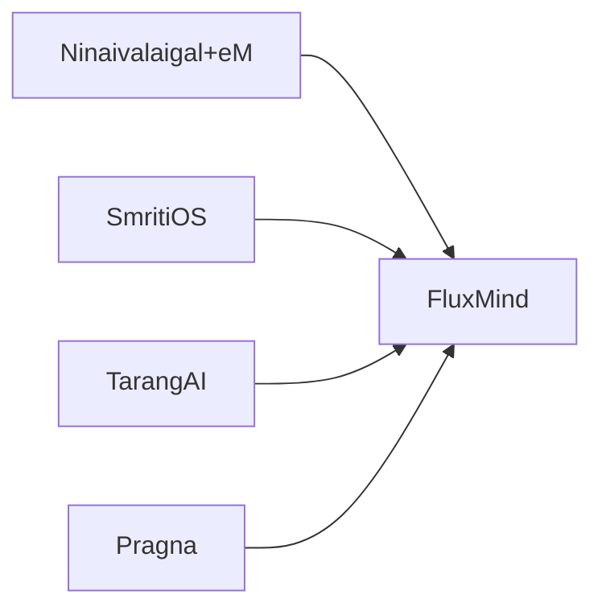
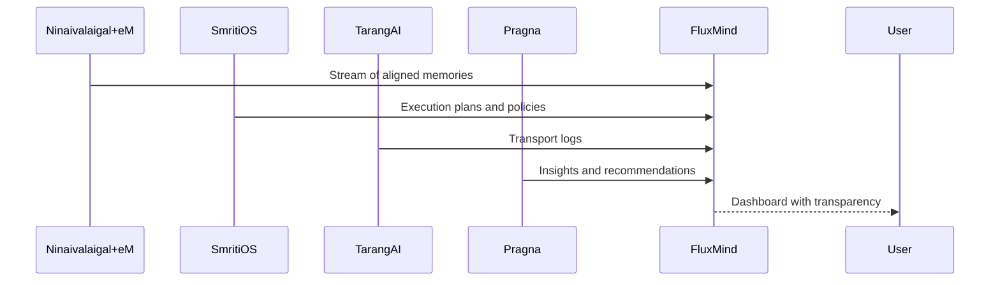
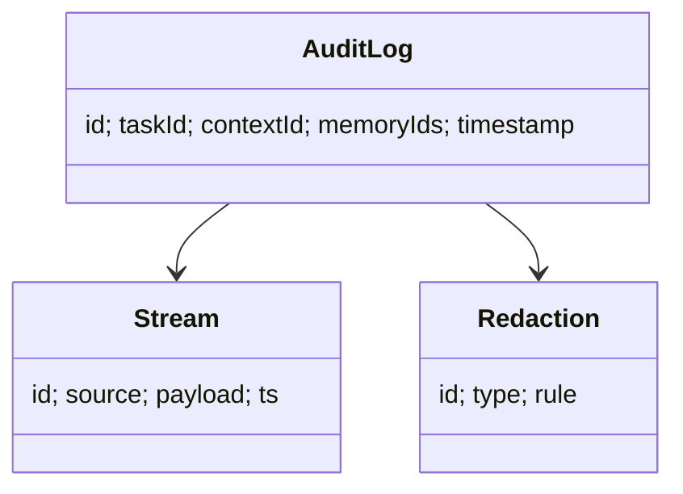

# FluxMind Documentation

## Layman Overview
**What it is:**  
FluxMind is the *control panel* for the AI memory ecosystem. It gives developers and teams a live window into what the AI is doing, what memories are being used, and how decisions are made.

**Value:**  
- Transparency: see why an AI responded a certain way.  
- Debugging: catch when wrong memories are used.  
- Governance: ensure policies and rules are followed.  

**Analogy:**  
Think of FluxMind as the **control room** with monitors and dashboards, showing everything the AI system is thinking and doing in real time.

---

## Technical Overview
**Core Responsibilities:**  
- Stream Viewer: display memory/context streams in real time.  
- Audit Trail: log which memories were injected into which tasks.  
- Redaction Controls: allow admins to hide sensitive data.  
- Replay & Trace: re-run sessions with the same memory context.  

**Building Blocks:**  
- Web dashboard UI.  
- Audit log store.  
- Stream visualization engine.  
- Interfaces to Ninaivalaigal+eM, SmritiOS, TarangAI, Pragna.

---

## Architecture Diagram

---

## Sequence Flow (Auditing)

---

## Data Model (Simplified)

---

## Slide-style Summary (Layman)
- FluxMind = Control Room
- Transparency into AI decisions
- Debugging and governance tools
- Replay and audit capabilities

---

## Slide-style Summary (Technical)
- Stream viewer + audit logs
- Redaction controls
- Replay sessions
- Interfaces with all modules (Ninaivalaigal+eM, SmritiOS, TarangAI, Pragna)
