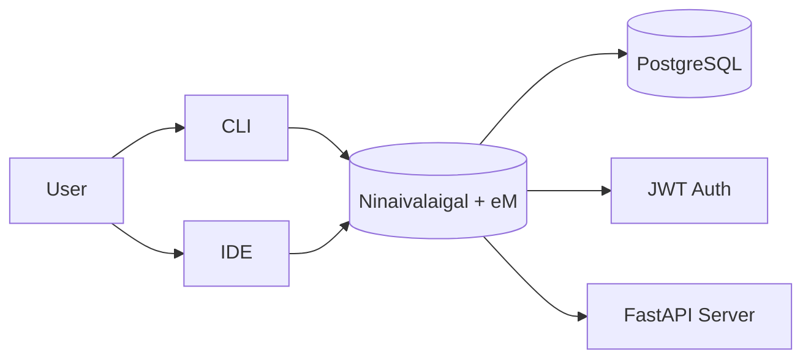
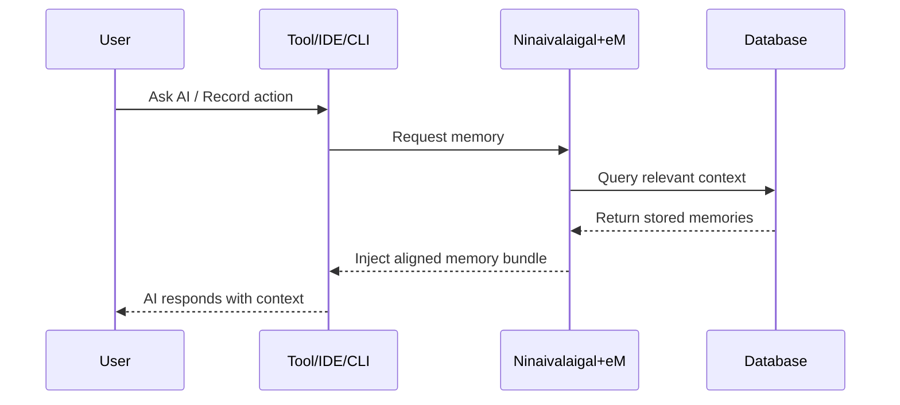
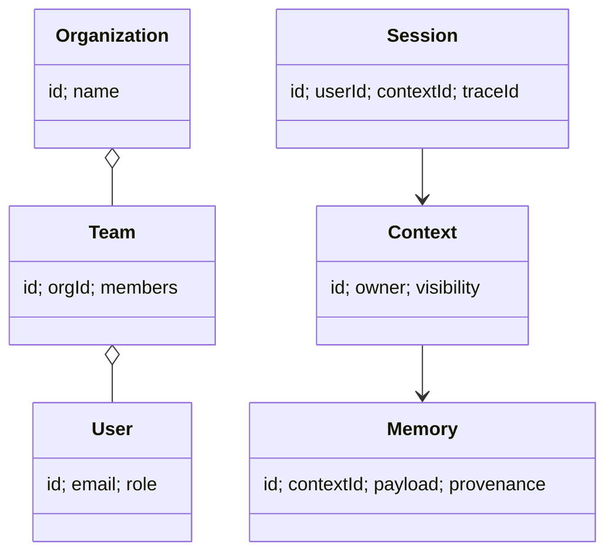

# Ninaivalaigal + eM Documentation

## Layman Overview
**What it is:**  
Ninaivalaigal is the memory nervous system for AI. It records what you and your AI tools do, organizes these memories, and then feeds the right context back so the AI stays consistent and on track.  
The **eM Agent** is its right hand – it provides simple commands like *record, remember, recall, forget*. It ensures the AI doesn’t drift or hallucinate by injecting the right memory at the right time.

**Value:**  
- Keeps conversations and tasks consistent.  
- Reduces repetition by remembering past context.  
- Stops the AI from wandering off-topic.  

**Analogy:**  
Think of Ninaivalaigal as the **filing cabinet** and eM as the **assistant who hands you the right folder whenever you need it**.

---

## Technical Overview
**Core Components:**  
- FastAPI server (memory service)  
- PostgreSQL (storage backend)  
- JWT authentication (secure access)  
- Organizations, Teams, Roles (multi-user, multi-team)  
- CLI tool `mem0` with eM verbs (record, recall, etc.)  
- VS Code Extension (developer integration)  
- zsh Hook (automatic capture of shell history)

**eM Agent Actions:**  
- Selects and injects context into AI prompts  
- Applies guardrails (e.g., no outdated info, redactions)  
- Provides traceability and provenance  
- Prevents hallucinations and drift

---

## Architecture Diagram

---

## Sequence Flow (How eM Aligns AI)

---

## Data Model (Simplified)

---

## Slide-style Summary (Layman)
- Ninaivalaigal = Brain’s filing cabinet  
- eM = Right hand assistant  
- Helps AI stay on track  
- Prevents hallucinations  
- Works across tools (CLI, IDE, Shell)

---

## Slide-style Summary (Technical)
- Server: FastAPI + PostgreSQL  
- Auth: JWT, orgs/teams/roles  
- Clients: CLI (mem0), VS Code ext, shell hook  
- eM = context injector + guardrails  
- Outputs: aligned memory bundles  
