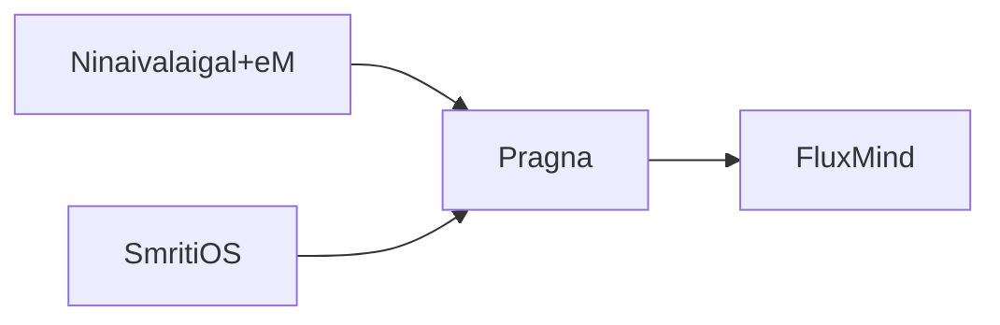
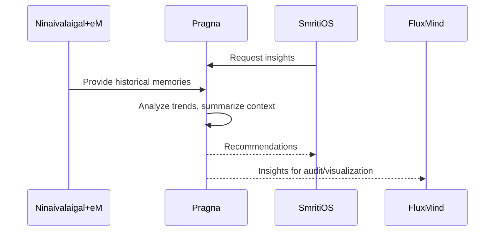
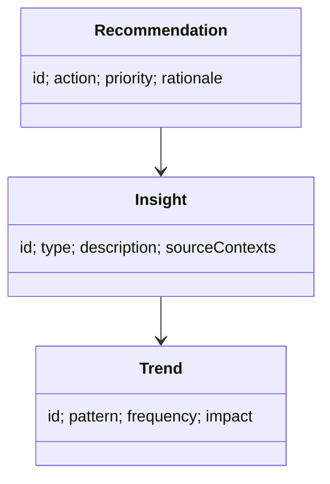

# Pragna Documentation

## Layman Overview
**What it is:**  
Pragna is the *higher reasoning engine* of the ecosystem. While Ninaivalaigal+eM remembers facts and context, Pragna looks across all those memories to find insights, patterns, and recommendations.

**Value:**  
- Turns logs into lessons and foresight.  
- Spots patterns across many events.  
- Suggests next steps based on historical context.  

**Analogy:**  
Think of Pragna as the **strategist** of the team — it studies the records, sees the trends, and advises on what to do next.

---

## Technical Overview
**Core Responsibilities:**  
- Cross-context reasoning: look across multiple contexts for patterns.  
- Trend detection: identify recurring issues or opportunities.  
- Recommendation engine: propose next-best-actions.  
- Insight generation: summaries and foresight from historical data.

**Building Blocks:**  
- Summarization and inference engine.  
- Trend detection module.  
- Next-action recommender.  
- Interfaces to Ninaivalaigal+eM, SmritiOS, TarangAI, FluxMind.

---

## Architecture Diagram

---

## Sequence Flow (Reasoning)

---

## Data Model (Simplified)

---

## Slide-style Summary (Layman)
- Pragna = Strategist
- Sees patterns across memories
- Suggests next steps
- Transforms recall into foresight

---

## Slide-style Summary (Technical)
- Reasoning module with summarization and inference
- Detects trends across contexts
- Recommender for next-best-actions
- Interfaces with Ninaivalaigal+eM, SmritiOS, FluxMind
