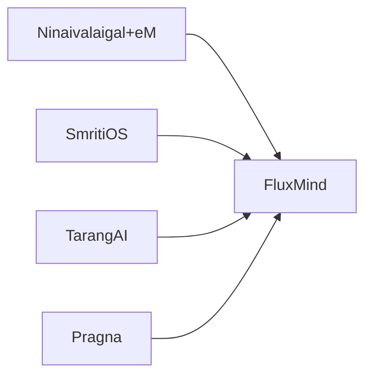

# FluxMind — Technical Slides
## Responsibilities
- Stream viewer and audit trail.
- Redaction and replay controls.
- Governance enforcement.
## Components
- Dashboard UI.
- Audit log store.
- Stream visualizer.
## Architecture
