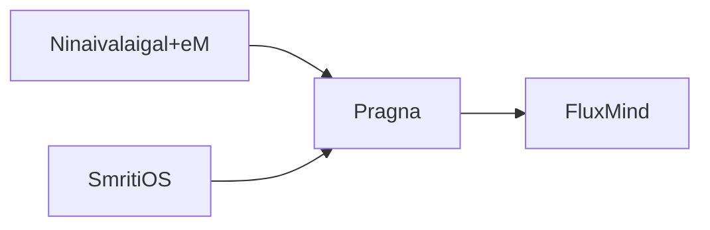

# Pragna — Technical Slides
## Responsibilities
- Cross-context reasoning.
- Trend detection and recommendations.
- Summarization of historical data.
## Components
- Summarization engine.
- Trend detector.
- Next-action recommender.
## Architecture
