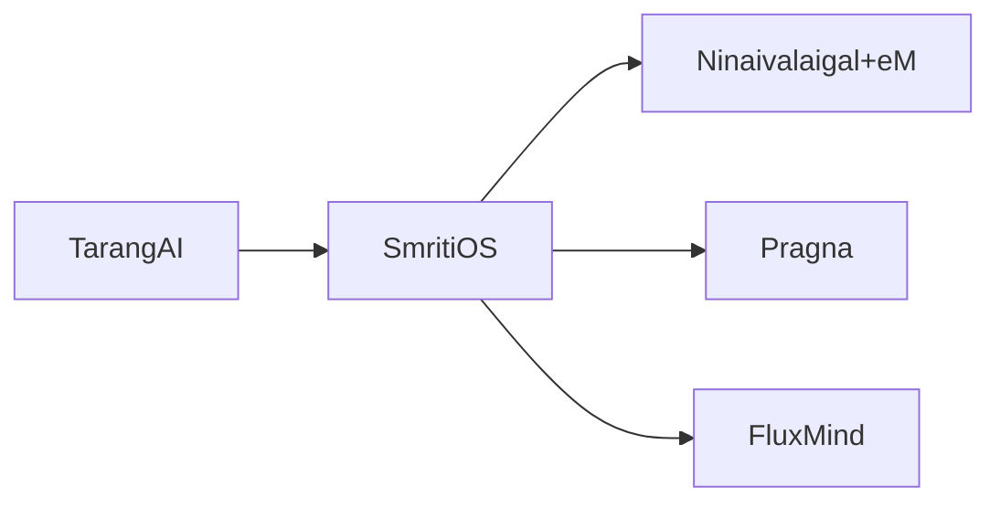

# SmritiOS — Technical Slides
## Responsibilities
- Orchestration and routing.
- Execution plans and conflict resolution.
- Policy enforcement across contexts.
## Components
- Orchestration engine.
- Policy manager.
- Execution planner.
## Architecture

