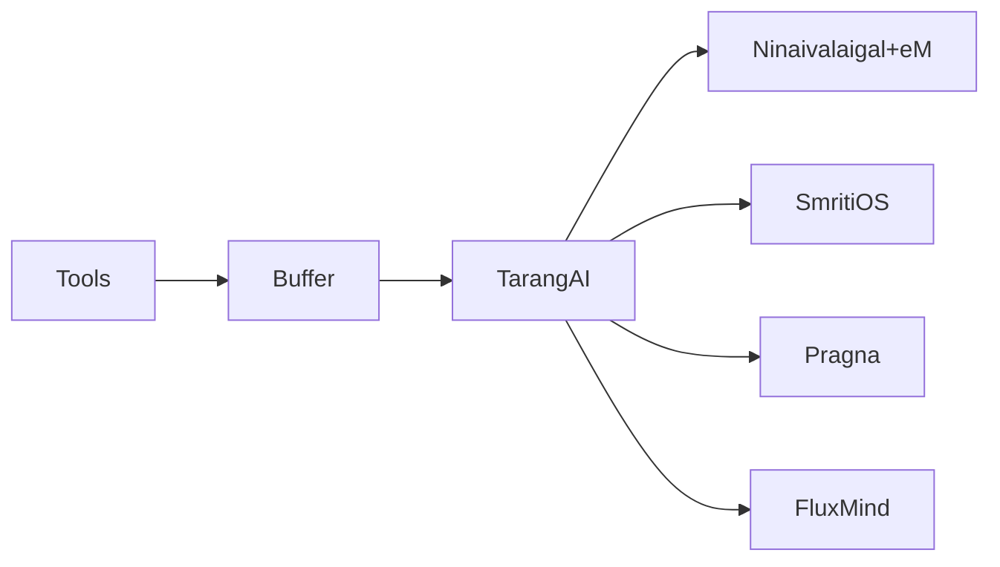

# TarangAI — Technical Slides
## Responsibilities
- Transport and delivery of memory bundles.
- Routing and buffering.
- Delivery guarantees.
## Components
- Stream router.
- Buffer manager.
- Audit hooks for FluxMind.
## Architecture

