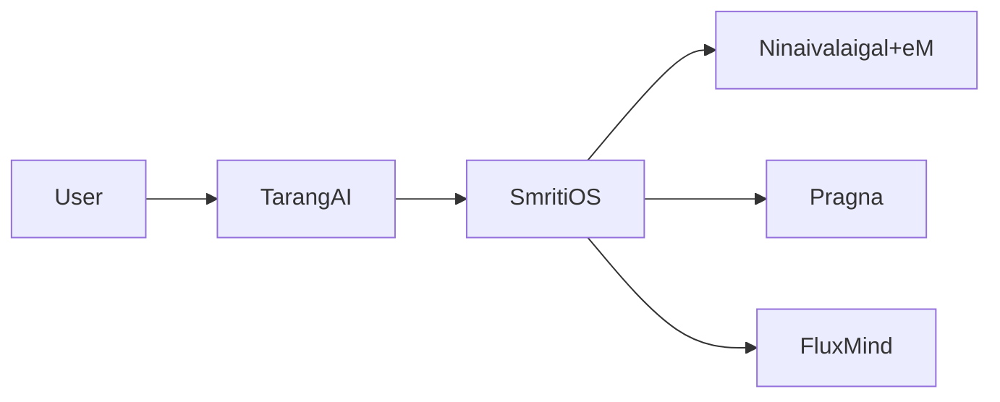
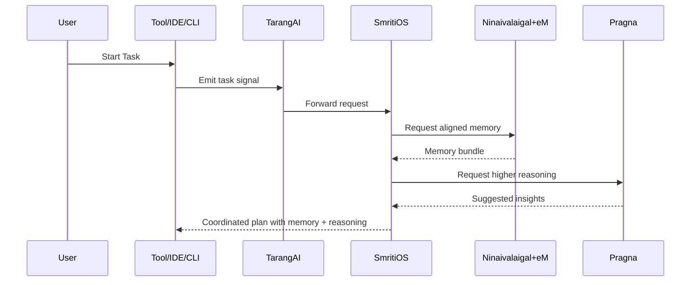
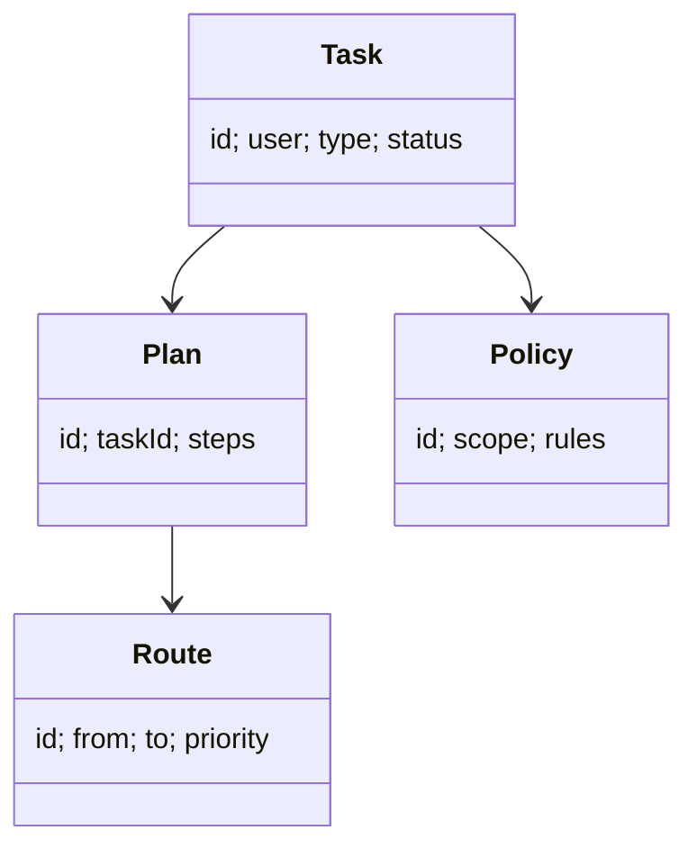

# SmritiOS Documentation

## Layman Overview
**What it is:**  
SmritiOS is the *operating system for AI memory orchestration*. It makes sure that the memory system (Ninaivalaigal + eM), reasoning modules, and transport layers all work together smoothly.

**Value:**  
- Prevents chaos when multiple AIs and tools are active.  
- Ensures the right memory is used at the right time.  
- Acts like a conductor keeping the orchestra in sync.

**Analogy:**  
Think of SmritiOS as the **office manager** who organizes meetings, assigns tasks, and makes sure everyone is on the same page.

---

## Technical Overview
**Core Responsibilities:**  
- Routing: decides which agent or module should handle a request.  
- Execution Plans: defines the steps needed to complete a task.  
- Policy Enforcement: applies organizational rules (e.g., redactions, must-include facts).  
- Conflict Resolution: prevents overlaps when multiple agents act on the same memory.

**Building Blocks:**  
- Orchestration engine (service layer).  
- Policy manager.  
- Execution planner.  
- Interfaces to Ninaivalaigal+eM, TarangAI, Pragna, FluxMind.

---

## Architecture Diagram

---

## Sequence Flow (Task Orchestration)

---

## Data Model (Simplified)

---

## Slide-style Summary (Layman)
- SmritiOS = Orchestrator  
- Keeps all modules in sync  
- Ensures right memory + reasoning are used  
- Prevents conflicts  

---

## Slide-style Summary (Technical)
- Orchestration engine with routing and planning  
- Policy enforcement across contexts  
- Interfaces with Ninaivalaigal+eM, TarangAI, Pragna, FluxMind  
- Ensures coherent execution across AI ecosystem  
