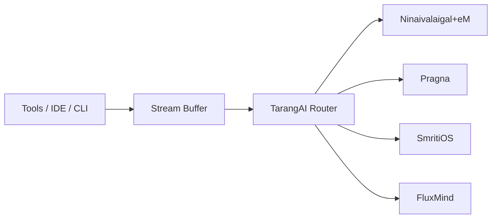
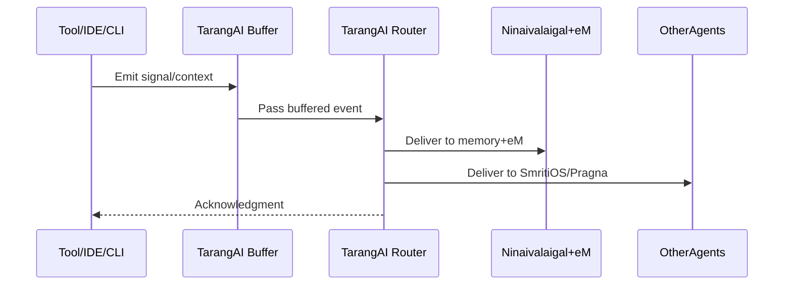
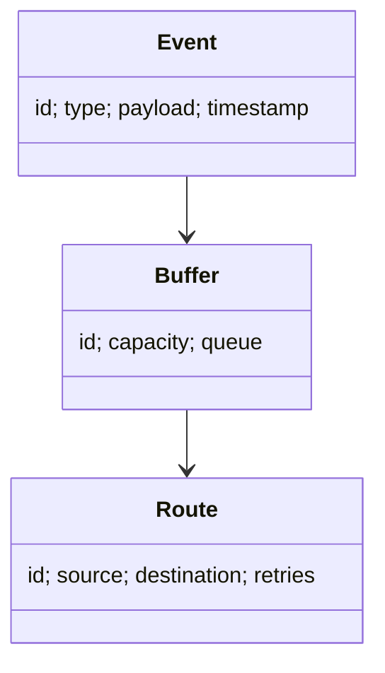

# TarangAI Documentation

## Layman Overview
**What it is:**
TarangAI is the invisible *wave/transport layer* that carries signals, context, and memory between your tools, AI agents, and services. It works quietly in the background, making sure the right information flows to the right place.

**Value:**
- Delivers memory/context where it’s needed automatically.
- Ensures smooth coordination between different AIs and tools.
- Invisible but essential — like plumbing in a house.

**Analogy:**
Think of TarangAI as the **phone system** or **Wi-Fi network** of the AI ecosystem — you don’t see it, but without it, nothing connects.

---

## Technical Overview
**Core Responsibilities:**
- Transport: reliable delivery of memory bundles, events, and signals.
- Routing: ensures the right context reaches the right tool/agent.
- Buffering & Backpressure: manages bursts of activity.
- Auditing Hooks: streams available to FluxMind for debugging and governance.

**Building Blocks:**
- Stream Router.
- Buffer Manager.
- Delivery Guarantees (retry, acknowledgments).
- APIs to SmritiOS, Ninaivalaigal+eM, Pragna, FluxMind.

---

## Architecture Diagram

---

## Sequence Flow (Transport)

---

## Data Model (Simplified)

---

## Slide-style Summary (Layman)
- TarangAI = Invisible pipes
- Delivers memory and signals to the right place
- Works silently in the background
- Without it, nothing connects

---

## Slide-style Summary (Technical)
- Event/Stream Router
- Buffer and delivery guarantees
- Interfaces with Ninaivalaigal+eM, SmritiOS, Pragna, FluxMind
- Auditing hooks for FluxMind
