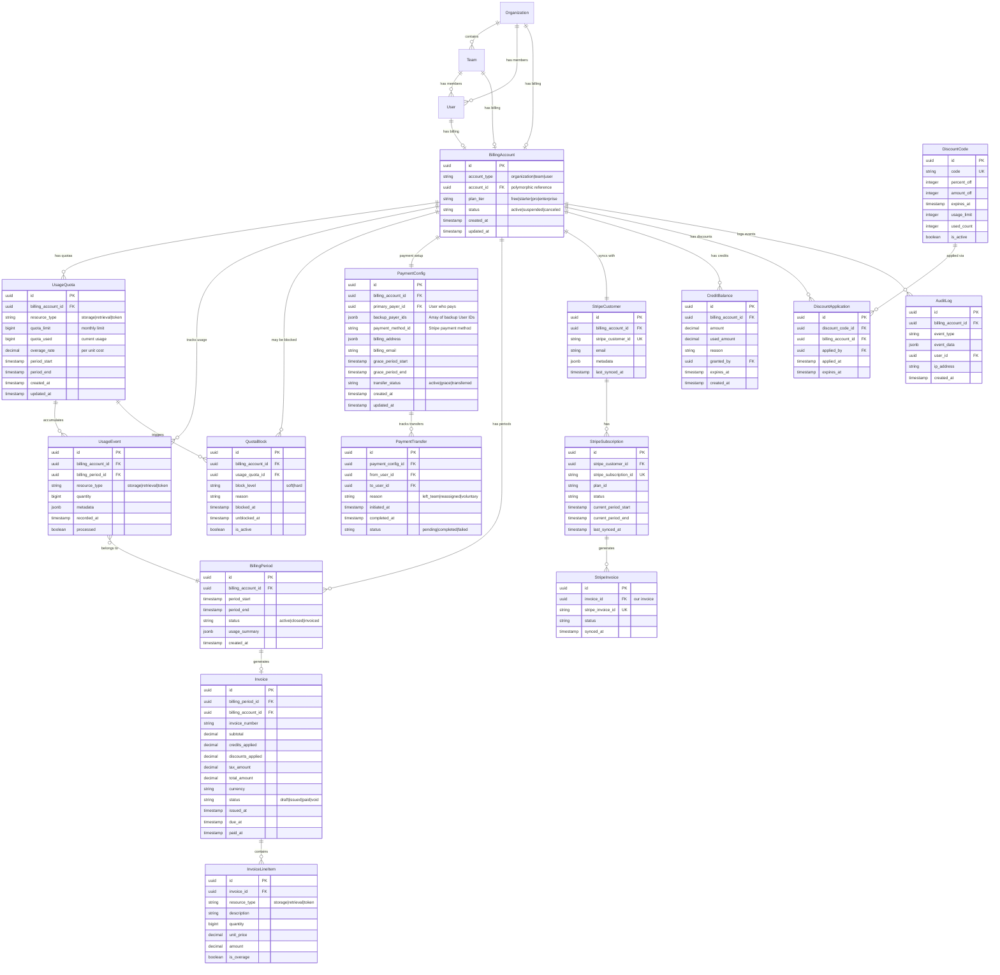

# SPEC-147 Clean Billing Schema - Fresh Start

## Overview

Since billing has not been used in production, we can start with a clean, unified architecture that implements SPEC-147 from the ground up without legacy compatibility concerns.

## Clean ER Diagram



## Simplified Table Structure

### Core Tables (7)

1. **billing_accounts** - Unified billing for Org/Team/User
2. **usage_quotas** - Three-dimensional quota limits
3. **usage_events** - Real-time usage capture
4. **quota_blocks** - Soft/hard enforcement
5. **payment_configs** - Payment responsibility & transfers
6. **billing_periods** - Monthly billing cycles
7. **invoices** - Invoice generation

### Supporting Tables (6)

8. **invoice_line_items** - Invoice details
9. **payment_transfers** - Transfer history
10. **credit_balances** - Credit tracking
11. **discount_codes** - Discount management
12. **discount_applications** - Applied discounts
13. **audit_logs** - Compliance trail

### Stripe Sync Tables (3)

14. **stripe_customers** - Stripe customer sync
15. **stripe_subscriptions** - Stripe subscription sync
16. **stripe_invoices** - Stripe invoice sync

**Total: 16 tables** (vs 20+ with legacy compatibility)

## Key Design Decisions

### 1. Polymorphic Billing Account

```sql
CREATE TABLE billing_accounts (
    id UUID PRIMARY KEY DEFAULT gen_random_uuid(),
    account_type VARCHAR(20) NOT NULL CHECK (account_type IN ('organization', 'team', 'user')),
    account_id UUID NOT NULL, -- References organizations.id, teams.id, or users.id
    plan_tier VARCHAR(20) NOT NULL DEFAULT 'free',
    status VARCHAR(20) NOT NULL DEFAULT 'active',
    created_at TIMESTAMPTZ NOT NULL DEFAULT NOW(),
    updated_at TIMESTAMPTZ NOT NULL DEFAULT NOW(),

    UNIQUE(account_type, account_id)
);

CREATE INDEX idx_billing_account_lookup ON billing_accounts(account_type, account_id);
CREATE INDEX idx_billing_account_status ON billing_accounts(status) WHERE status = 'active';
```

### 2. Three-Dimensional Usage Quotas

```sql
CREATE TABLE usage_quotas (
    id UUID PRIMARY KEY DEFAULT gen_random_uuid(),
    billing_account_id UUID NOT NULL REFERENCES billing_accounts(id) ON DELETE CASCADE,
    resource_type VARCHAR(20) NOT NULL CHECK (resource_type IN ('storage', 'retrieval', 'token')),
    quota_limit BIGINT NOT NULL,
    quota_used BIGINT NOT NULL DEFAULT 0,
    overage_rate DECIMAL(10,4) NOT NULL DEFAULT 0, -- Cost per unit over quota
    period_start TIMESTAMPTZ NOT NULL,
    period_end TIMESTAMPTZ NOT NULL,
    created_at TIMESTAMPTZ NOT NULL DEFAULT NOW(),
    updated_at TIMESTAMPTZ NOT NULL DEFAULT NOW(),

    CHECK (quota_limit >= 0),
    CHECK (quota_used >= 0),
    CHECK (period_start < period_end),
    UNIQUE(billing_account_id, resource_type, period_start)
);

CREATE INDEX idx_usage_quota_account ON usage_quotas(billing_account_id, resource_type);
CREATE INDEX idx_usage_quota_period ON usage_quotas(period_start, period_end);
```

### 3. High-Volume Usage Events

```sql
CREATE TABLE usage_events (
    id UUID PRIMARY KEY DEFAULT gen_random_uuid(),
    billing_account_id UUID NOT NULL REFERENCES billing_accounts(id) ON DELETE CASCADE,
    billing_period_id UUID NOT NULL REFERENCES billing_periods(id),
    resource_type VARCHAR(20) NOT NULL,
    quantity BIGINT NOT NULL,
    metadata JSONB,
    recorded_at TIMESTAMPTZ NOT NULL DEFAULT NOW(),
    processed BOOLEAN NOT NULL DEFAULT FALSE,

    CHECK (quantity > 0)
);

-- Partitioning by month for performance
CREATE INDEX idx_usage_event_account_time ON usage_events(billing_account_id, recorded_at DESC);
CREATE INDEX idx_usage_event_period ON usage_events(billing_period_id) WHERE NOT processed;
CREATE INDEX idx_usage_event_type ON usage_events(resource_type, recorded_at DESC);
```

### 4. Payment Configuration with Grace Period

```sql
CREATE TABLE payment_configs (
    id UUID PRIMARY KEY DEFAULT gen_random_uuid(),
    billing_account_id UUID NOT NULL UNIQUE REFERENCES billing_accounts(id) ON DELETE CASCADE,
    primary_payer_id UUID NOT NULL REFERENCES users(id),
    backup_payer_ids JSONB NOT NULL DEFAULT '[]', -- Array of user IDs
    payment_method_id VARCHAR(255), -- Stripe payment method
    billing_address JSONB,
    billing_email VARCHAR(255) NOT NULL,
    grace_period_start TIMESTAMPTZ,
    grace_period_end TIMESTAMPTZ,
    transfer_status VARCHAR(20) NOT NULL DEFAULT 'active',
    created_at TIMESTAMPTZ NOT NULL DEFAULT NOW(),
    updated_at TIMESTAMPTZ NOT NULL DEFAULT NOW(),

    CHECK (transfer_status IN ('active', 'grace', 'transferred'))
);

CREATE INDEX idx_payment_config_payer ON payment_configs(primary_payer_id);
CREATE INDEX idx_payment_config_grace ON payment_configs(grace_period_end)
    WHERE transfer_status = 'grace';
```

## Migration from SPEC-026 Tables

### Option 1: Clean Break (Recommended)

```sql
-- Drop old tables (if no production data)
DROP TABLE IF EXISTS team_billing CASCADE;
DROP TABLE IF EXISTS team_subscriptions CASCADE;
DROP TABLE IF EXISTS team_usage_metrics CASCADE;

-- Create new SPEC-147 tables
-- (See schema above)
```

### Option 2: Data Migration (If needed)

```sql
-- Migrate team_billing to billing_accounts
INSERT INTO billing_accounts (account_type, account_id, plan_tier, status)
SELECT
    'team',
    team_id,
    CASE
        WHEN plan_id = 'free' THEN 'free'
        WHEN plan_id = 'starter' THEN 'starter'
        WHEN plan_id = 'pro' THEN 'pro'
        ELSE 'enterprise'
    END,
    'active'
FROM team_billing tb
JOIN team_subscriptions ts ON tb.team_id = ts.team_id;

-- Migrate payment info
INSERT INTO payment_configs (billing_account_id, billing_email, payment_method_id, billing_address)
SELECT
    ba.id,
    tb.billing_email,
    tb.payment_method_id,
    tb.billing_address
FROM team_billing tb
JOIN billing_accounts ba ON ba.account_id = tb.team_id AND ba.account_type = 'team';

-- Drop old tables after validation
DROP TABLE team_billing CASCADE;
DROP TABLE team_subscriptions CASCADE;
DROP TABLE team_usage_metrics CASCADE;
```

## Business Logic Implementation

### Hierarchical Billing Check

```python
def get_billing_account(entity_type: str, entity_id: UUID) -> BillingAccount:
    """
    Get billing account with hierarchy fallback:
    1. Check if entity has its own billing
    2. If team, check if org has billing
    3. If user, check if team has billing, then org
    """
    # Direct billing account
    account = db.query(BillingAccount).filter(
        BillingAccount.account_type == entity_type,
        BillingAccount.account_id == entity_id
    ).first()

    if account:
        return account

    # Fallback logic
    if entity_type == 'team':
        team = db.query(Team).get(entity_id)
        if team.organization_id:
            return get_billing_account('organization', team.organization_id)

    elif entity_type == 'user':
        # Check user's team billing
        team_membership = db.query(TeamMember).filter(
            TeamMember.user_id == entity_id
        ).first()

        if team_membership:
            return get_billing_account('team', team_membership.team_id)

    return None
```

### Usage Quota Check

```python
def check_quota(billing_account_id: UUID, resource_type: str, quantity: int) -> dict:
    """
    Check if usage is within quota limits.
    Returns: {allowed: bool, block_level: str, usage_percent: float}
    """
    quota = db.query(UsageQuota).filter(
        UsageQuota.billing_account_id == billing_account_id,
        UsageQuota.resource_type == resource_type,
        UsageQuota.period_start <= datetime.utcnow(),
        UsageQuota.period_end > datetime.utcnow()
    ).first()

    if not quota:
        return {"allowed": True, "block_level": None, "usage_percent": 0}

    new_usage = quota.quota_used + quantity
    usage_percent = (new_usage / quota.quota_limit) * 100

    if usage_percent >= 100:
        return {"allowed": False, "block_level": "hard", "usage_percent": usage_percent}
    elif usage_percent >= 75:
        return {"allowed": True, "block_level": "soft", "usage_percent": usage_percent}
    else:
        return {"allowed": True, "block_level": None, "usage_percent": usage_percent}
```

### Payment Transfer Workflow

```python
def initiate_payment_transfer(billing_account_id: UUID, reason: str):
    """
    Start 30-day grace period when payer leaves.
    """
    config = db.query(PaymentConfig).filter(
        PaymentConfig.billing_account_id == billing_account_id
    ).first()

    # Start grace period
    config.grace_period_start = datetime.utcnow()
    config.grace_period_end = datetime.utcnow() + timedelta(days=30)
    config.transfer_status = 'grace'

    # Notify backup payers
    backup_payers = json.loads(config.backup_payer_ids)
    for payer_id in backup_payers:
        send_notification(
            user_id=payer_id,
            type='payment_transfer_required',
            data={
                'billing_account_id': billing_account_id,
                'deadline': config.grace_period_end,
                'reason': reason
            }
        )

    # Schedule escalation jobs
    schedule_soft_block(billing_account_id, days=15)
    schedule_hard_block(billing_account_id, days=30)

    db.commit()
```

## Advantages of Clean Start

✅ **Simpler Schema** - 16 tables vs 20+ with legacy
✅ **No Technical Debt** - No migration baggage
✅ **Modern Design** - Polymorphic relationships, JSONB
✅ **Better Performance** - Optimized indexes from day 1
✅ **Cleaner Code** - No backward compatibility hacks
✅ **Easier Testing** - Single source of truth
✅ **Future-Proof** - Built for SPEC-147 requirements

## Implementation Plan

### Week 1: Schema Creation
- Create all 16 tables
- Add indexes and constraints
- Write migration scripts (if needed)

### Week 2: Core Logic
- Billing account management
- Usage quota enforcement
- Payment configuration

### Week 3: Stripe Integration
- Customer sync
- Subscription management
- Invoice generation

### Week 4: Advanced Features
- Payment transfer workflow
- Credit/discount system
- Audit logging

### Week 5: Testing & Validation
- Unit tests
- Integration tests
- Load testing

## Recommendation

**✅ GO WITH CLEAN START**

Since billing hasn't been used in production:
1. Drop old SPEC-026 tables
2. Implement clean SPEC-147 schema
3. No migration complexity
4. Start with best practices from day 1
5. Faster development timeline
6. Lower maintenance burden

This gives you a production-ready, scalable billing system without legacy constraints! 🚀
