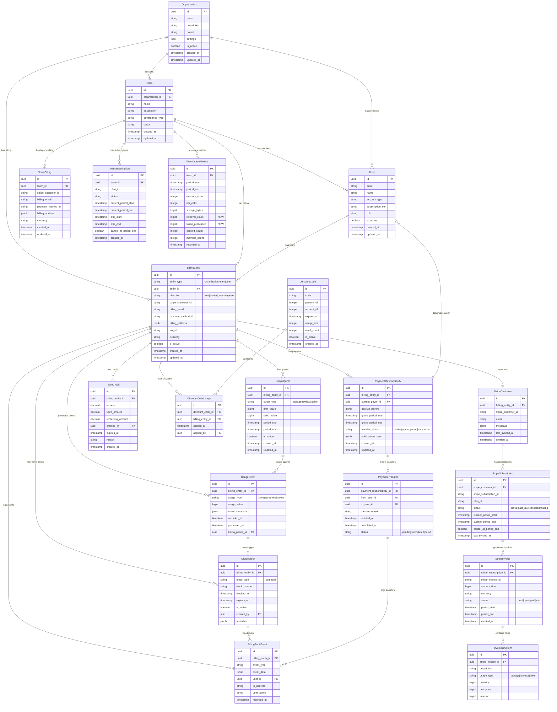
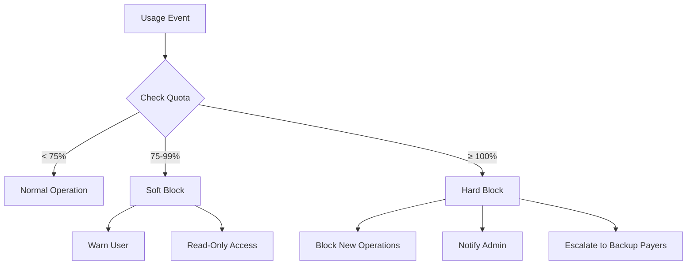
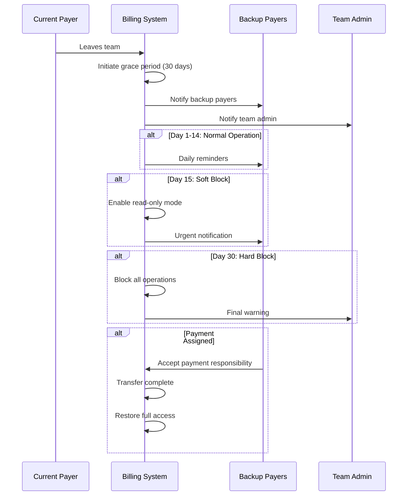
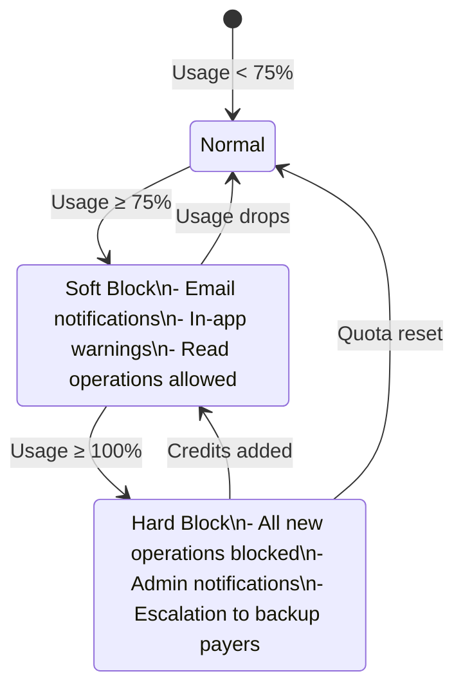
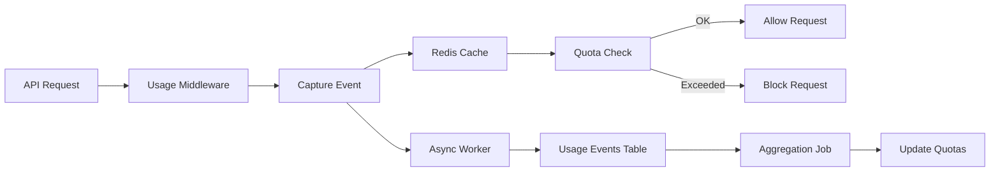
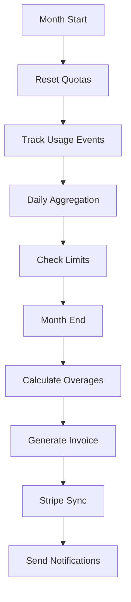

# SPEC-147 Billing Architecture - Entity Relationship Diagram

## Complete ER Structure with Hierarchical Billing



## Hierarchical Billing Design

### 1. Payment Responsibility Hierarchy

```
OrganizationBilling (overrides all)
    ↓
TeamBilling (team-level subscription)
    ↓
UserBilling (individual usage)
```

**Business Rules:**
- If org pays, teams don't pay separately
- If team pays, members don't pay individually
- Clear billing ownership hierarchy

### 2. Usage Limits & Blocking Logic



### 3. Three-Dimensional Usage Tracking

```
Storage (GB-month)
├── Memory uploads
├── Context storage
└── File attachments

Retrievals (count)
├── Memory recalls
├── Search queries
└── Context retrievals

Tokens (processed)
├── Text embeddings
├── AI processing
└── Semantic search
```

## Key Relationships

### Payment Transfer Workflow



### Quota Enforcement Flow



## Data Flow

### Usage Metering Pipeline



### Billing Cycle



## Migration Strategy

### Phase 1: Enhancement (Weeks 1-2)
- Add fields to `team_usage_metrics` (retrieval_count, token_processed)
- Create new SPEC-147 tables
- Maintain backward compatibility

### Phase 2: Dual Write (Weeks 3-4)
- Write to both old and new structures
- Validate data consistency
- Monitor performance

### Phase 3: Migration (Weeks 5-6)
- Migrate historical data
- Switch reads to new tables
- Keep old tables for rollback

### Phase 4: Deprecation (Months 2-6)
- Mark old tables as deprecated
- Monitor for any remaining usage
- Plan final cleanup

### Phase 5: Cleanup (Month 7+)
- Remove deprecated tables
- Update documentation
- Archive historical data

## Indexes and Performance

### Critical Indexes

```sql
-- BillingEntity lookups
CREATE INDEX idx_billing_entity_type_id ON billing_entities(entity_type, entity_id);
CREATE INDEX idx_billing_entity_stripe ON billing_entities(stripe_customer_id);

-- Usage quota checks (hot path)
CREATE INDEX idx_usage_quota_entity_type ON usage_quotas(billing_entity_id, quota_type, is_active);
CREATE INDEX idx_usage_quota_period ON usage_quotas(period_start, period_end);

-- Usage events (high volume)
CREATE INDEX idx_usage_event_entity_time ON usage_events(billing_entity_id, recorded_at);
CREATE INDEX idx_usage_event_period ON usage_events(billing_period_id);
CREATE INDEX idx_usage_event_type ON usage_events(usage_type, recorded_at);

-- Blocks (enforcement)
CREATE INDEX idx_usage_block_entity_active ON usage_blocks(billing_entity_id, is_active);
CREATE INDEX idx_usage_block_expires ON usage_blocks(expires_at) WHERE is_active = true;

-- Payment responsibility
CREATE INDEX idx_payment_resp_entity ON payment_responsibilities(billing_entity_id);
CREATE INDEX idx_payment_resp_status ON payment_responsibilities(transfer_status);

-- Audit trail
CREATE INDEX idx_audit_entity_time ON billing_audit_events(billing_entity_id, recorded_at);
CREATE INDEX idx_audit_event_type ON billing_audit_events(event_type, recorded_at);
```

## Summary

This ER structure provides:

✅ **Hierarchical Billing** - Org → Team → User with clear payment responsibility
✅ **3D Usage Tracking** - Storage, Retrievals, Tokens
✅ **Quota Enforcement** - Soft/hard blocks with graceful degradation
✅ **Payment Transfer** - 30-day grace period workflow
✅ **Stripe Integration** - Subscription sync and invoicing
✅ **Audit Trail** - Complete compliance tracking
✅ **Backward Compatibility** - Gradual migration from SPEC-026
✅ **Performance** - Optimized indexes for hot paths

The design prevents double charging, ensures graceful payment transfers, and provides production-grade scalability across multiple regions.
