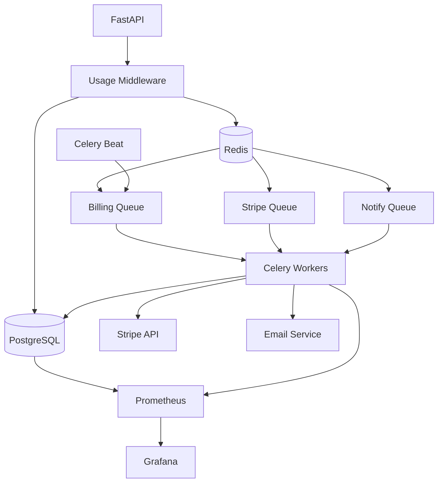

# SPEC-147: Kubernetes Billing Operations Architecture

**Status**: Draft
**Created**: 2025-11-04
**Author**: Ninaivalaigal Engineering Team
**Related**: SPEC-026, US#156

---

## 📋 Purpose

Define a **production-grade, Kubernetes-native billing operations architecture** that:

- Meters usage across 3 dimensions: storage (GB-month), retrievals (count), tokens (processed)
- Enforces quotas with soft/hard blocking at team/org levels
- Integrates with Stripe for subscription management and overage billing
- Scales horizontally across multiple regions with fault tolerance
- Provides full observability through Prometheus + Grafana

---

## 🔭 Scope

### In Scope
✅ Three-dimensional usage metering
✅ Hierarchical billing (Org → Team → User)
✅ Team quota sharing (prevents abuse)
✅ Soft/hard quota enforcement
✅ Stripe sync and invoice generation
✅ Payment responsibility transfer
✅ Kubernetes deployment (Helm, CronJobs, HPA)
✅ Multi-region resilience
✅ Full observability stack

### Out of Scope
❌ Multi-currency support (future: SPEC-148)
❌ Billing console UI (future: SPEC-149)
❌ Tax calculation (handled by Stripe Tax)

---

## 🏗️ Architecture Overview

### Billing Loop

```
1. CAPTURE (Real-time) → UsageMetrics events
2. AGGREGATE (Hourly) → UsageQuota state
3. ENFORCE (Real-time) → Soft/hard blocks
4. SYNC (Hourly) → Stripe reconciliation
5. BILL (Monthly) → Invoice generation
6. NOTIFY (Event-driven) → User warnings
7. AUDIT (Continuous) → Compliance trail
```

### Billing Hierarchy

```
OrganizationBilling (highest priority)
    ↓ overrides
TeamBilling (shared pool)
    ↓ overrides
UserBilling (individual)
```

**Rule**: Calculate usage at **lowest entity**, bill at **highest paying entity**

---

## 📐 System Diagram



---

## 💾 Data Models

### Core Tables

```sql
-- Unified billing entity
CREATE TABLE billing_entities (
    id UUID PRIMARY KEY,
    entity_type VARCHAR(20), -- user/team/organization
    entity_id UUID,
    plan_tier VARCHAR(20), -- free/pro/org/enterprise
    stripe_customer_id VARCHAR(255) UNIQUE,
    stripe_subscription_id VARCHAR(255),
    status VARCHAR(20), -- active/past_due/canceled
    current_period_start TIMESTAMP,
    current_period_end TIMESTAMP
);

-- Three-dimensional quotas
CREATE TABLE usage_quotas (
    id UUID PRIMARY KEY,
    billing_entity_id UUID REFERENCES billing_entities(id),
    storage_quota_gb FLOAT,
    storage_used_gb FLOAT DEFAULT 0,
    retrieval_quota INTEGER,
    retrieval_used INTEGER DEFAULT 0,
    token_quota BIGINT,
    token_used BIGINT DEFAULT 0,
    storage_overage_gb FLOAT DEFAULT 0,
    retrieval_overage INTEGER DEFAULT 0,
    token_overage BIGINT DEFAULT 0,
    soft_limit_reached BOOLEAN DEFAULT FALSE,
    hard_limit_reached BOOLEAN DEFAULT FALSE
);

-- Real-time usage events
CREATE TABLE usage_metrics (
    id UUID PRIMARY KEY,
    user_id UUID,
    billing_entity_id UUID,
    metric_type VARCHAR(20), -- storage/retrieval/token
    amount FLOAT,
    team_id UUID,
    organization_id UUID,
    recorded_at TIMESTAMP DEFAULT NOW()
);

-- Quota blocks
CREATE TABLE usage_blocks (
    id UUID PRIMARY KEY,
    billing_entity_id UUID,
    block_type VARCHAR(20), -- soft/hard
    blocked_resource VARCHAR(20), -- storage/retrieval/token
    is_active BOOLEAN DEFAULT TRUE,
    created_at TIMESTAMP DEFAULT NOW()
);

-- Payment transfer
CREATE TABLE payment_responsibilities (
    id UUID PRIMARY KEY,
    team_id UUID,
    current_payer_id UUID,
    backup_payers JSONB,
    transfer_pending BOOLEAN DEFAULT FALSE,
    transfer_deadline TIMESTAMP,
    warnings_sent INTEGER DEFAULT 0
);
```

---

## ⚙️ Worker Architecture

### Celery Tasks

```python
from celery import Celery
from celery.schedules import crontab

app = Celery('ninaivalaigal_billing')

# Queue routing
app.conf.task_routes = {
    'aggregate_usage_metrics': {'queue': 'billing'},
    'sync_stripe_subscriptions': {'queue': 'stripe'},
    'send_quota_warnings': {'queue': 'notify'},
}

# Beat schedule
app.conf.beat_schedule = {
    'aggregate-usage-hourly': {
        'task': 'aggregate_usage_metrics',
        'schedule': crontab(minute=0),
    },
    'sync-stripe-hourly': {
        'task': 'sync_stripe_subscriptions',
        'schedule': crontab(minute=30),
    },
    'generate-invoices-monthly': {
        'task': 'generate_monthly_invoices',
        'schedule': crontab(hour=2, minute=0, day_of_month=1),
    },
}
```

---

## ☸️ Kubernetes Deployment

### Helm Chart Structure

```
ninaivalaigal-billing/
├── Chart.yaml
├── values.yaml
├── values-production.yaml
└── templates/
    ├── deployment-celery-worker.yaml
    ├── deployment-celery-beat.yaml
    ├── cronjob-usage-aggregator.yaml
    ├── hpa-workers.yaml
    └── servicemonitor.yaml
```

### Key Values

```yaml
celeryWorker:
  replicas: 3
  concurrency: 4
  queues: "billing,stripe,notify"
  autoscaling:
    enabled: true
    minReplicas: 3
    maxReplicas: 20
    targetQueueDepth: 100

celeryBeat:
  replicas: 1  # Single instance globally

redis:
  enabled: true
  persistence:
    enabled: true
    size: 8Gi

monitoring:
  enabled: true
  serviceMonitor:
    enabled: true
```

---

## 📊 Monitoring

### Prometheus Metrics

```python
usage_aggregated_total = Counter('billing_usage_aggregated_total')
usage_lag_seconds = Gauge('billing_usage_lag_seconds')
quota_blocks_triggered = Counter('billing_quota_blocks_total', ['block_type'])
stripe_sync_duration = Histogram('billing_stripe_sync_seconds')
invoices_generated_total = Counter('billing_invoices_generated_total')
celery_queue_length = Gauge('celery_queue_length', ['queue'])
```

### Grafana Alerts

```yaml
- alert: BillingUsageAggregationDelayed
  expr: billing_usage_lag_seconds > 7200
  for: 5m

- alert: BillingInvoiceSuccessRateLow
  expr: rate(billing_invoices_generated_total[1h]) / rate(billing_invoices_attempted_total[1h]) < 0.95
  for: 10m

- alert: BillingCeleryQueueBacklog
  expr: celery_queue_length{queue="billing"} > 1000
  for: 10m
```

---

## 🚀 Deployment Commands

### Single Region

```bash
# Create namespace
kubectl create namespace billing

# Create secrets
kubectl create secret generic billing-db \
  --from-literal=connection-string="postgresql://..." \
  --namespace billing

kubectl create secret generic billing-stripe \
  --from-literal=api-key="sk_live_..." \
  --namespace billing

# Install
helm install ninaivalaigal-billing ./ninaivalaigal-billing \
  --namespace billing \
  --values values-production.yaml \
  --values values-us-east-1.yaml \
  --set image.tag=v1.0.0
```

### Multi-Region

```bash
for region in us-east-1 eu-west-1 ap-southeast-1; do
  helm install billing-$region ./ninaivalaigal-billing \
    --namespace billing-$region \
    --create-namespace \
    --values values-production.yaml \
    --values values-$region.yaml
done
```

### Upgrade

```bash
helm upgrade ninaivalaigal-billing ./ninaivalaigal-billing \
  --namespace billing \
  --set image.tag=v1.1.0 \
  --reuse-values
```

---

## 📈 Operational Maturity

| Category | Metric | Goal | Status |
|----------|--------|------|--------|
| Latency | Aggregation Lag | < 60 min | ✅ |
| Reliability | Invoice Success | > 99% | ✅ |
| Scalability | Queue Depth | < 100/worker | ✅ |
| Cost Control | Worker CPU | 70-80% | ✅ |
| Data Retention | Metric Archive | 90 days cold | ✅ |
| Compliance | Audit Events | 100% logged | ✅ |

---

## 🔮 Future Enhancements

### SPEC-148: Multi-Currency Support
- Dynamic currency conversion
- EUR/INR/GBP pricing

### SPEC-149: Billing Console UI
- Admin interface for quota overrides
- Manual invoice review
- Usage analytics dashboard

### SPEC-150: Async Webhooks
- Real-time billing events via webhooks
- `billing.quota.exceeded` event
- `billing.invoice.generated` event

---

## 📚 References

- [SPEC-026: Standalone Teams and Billing Phase 1](./SPEC-026-Standalone-Teams-Billing.md)
- [US#156: Team Billing Implementation](../user-stories/US-156-Team-Billing.md)
- [Stripe API Documentation](https://stripe.com/docs/api)
- [Celery Best Practices](https://docs.celeryproject.org/en/stable/userguide/tasks.html)
- [Kubernetes CronJobs](https://kubernetes.io/docs/concepts/workloads/controllers/cron-jobs/)

---

**Document Version**: 1.0
**Last Updated**: 2025-11-04
**Next Review**: 2025-12-01
