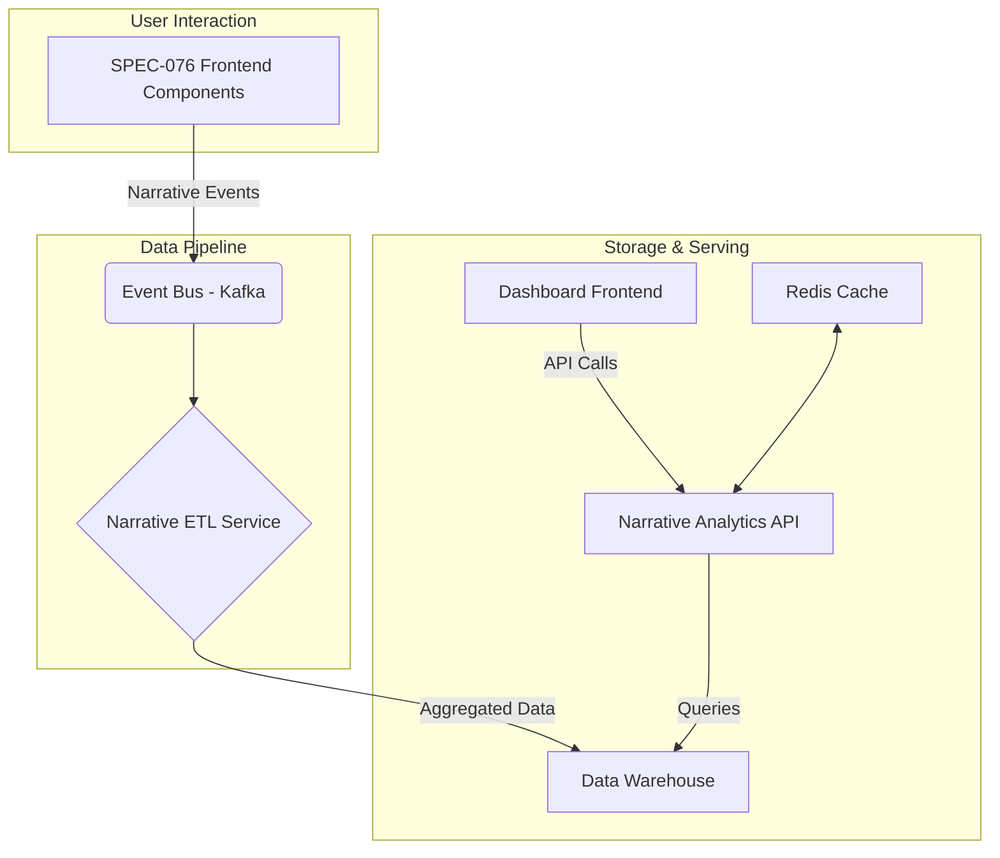

# SPEC-082: Narrative Analytics Architecture

This document outlines the architecture for collecting and processing narrative analytics events, integrating with the Visual Narrative Layer (SPEC-076).

---

## 1. Data Flow Diagram (Text-Based)

This diagram shows how narrative events flow from the user interface to the analytics backend.

---

## 2. Component Interactions

1.  **Event Generation (SPEC-076 Components)**: The React components built for the Visual Narrative Layer (Stepper, Overlay, Callout) will be instrumented to fire narrative events as defined in `data-model.md`.

2.  **Event Bus (Kafka)**: A dedicated Kafka topic, `narrative-events`, will receive all raw event data. This provides a durable and scalable buffer.

3.  **Narrative ETL Service**: A dedicated service will consume from the `narrative-events` topic. It will be responsible for:
    - **Sessionization**: Grouping events into user sessions (`sessionId`).
    - **Path Reconstruction**: Re-creating the path a user took through a narrative.
    - **Aggregation**: Calculating metrics like step duration, drop-off rates, and completion rates.
    - **Loading**: Writing the aggregated data to the `narrative_daily_summary` and `narrative_step_performance` tables in the data warehouse.

4.  **Data Warehouse**: Stores the aggregated narrative analytics data. This is the source of truth for the dashboard.

5.  **Narrative Analytics API**: A new set of endpoints, separate from the core API, will be created to serve the analytics dashboard. This API will query the data warehouse and will have its own caching layer.

6.  **Dashboard Frontend**: The frontend application that visualizes the narrative analytics data.

---

## 3. Database Schema

The detailed schema for the aggregation tables is in the data model document.

**Reference**: See [`data-model.md`](./data-model.md) for the complete schema.

---

## 4. Caching Strategy

- **API-Level Caching**: The Narrative Analytics API will use Redis to cache responses.
- **Cache Keys**: Keys will be based on the narrative ID and the date range being queried (e.g., `narrative:nar_123:metrics:7d`).
- **TTL**: Cache will have a TTL of 1 hour for recent data and 24 hours for historical data to ensure dashboards load quickly without putting excessive load on the data warehouse.
