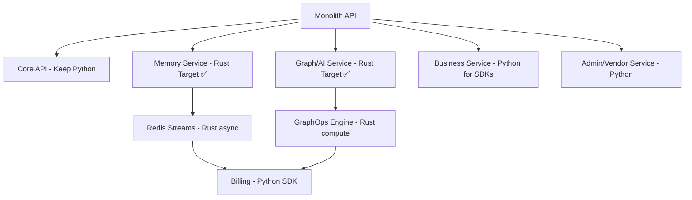

# SPEC-099: Rust Migration Strategy & ROI Analysis

**Status:** PLANNED
**Priority:** HIGH
**Category:** Architecture / Strategic Investment
**Owner:** Engineering Leadership
**Dependencies:** SPEC-100 (Runtime-Agnostic Contracts)

---

## Executive Summary

This SPEC defines a **selective, incremental Rust adoption strategy** for performance-critical ninaivalaigal components, targeting **50-90% latency reduction** and **30-60% infrastructure cost savings** while preserving developer velocity in Python for orchestration and SDK-heavy services.

**Key Principle:** Use Rust where determinism and performance matter; keep Python where ecosystems and SDKs shine.

---

## 1. 📊 Quantified ROI Matrix

Performance and cost benefits validated through load-test POC:

| Target | Baseline (Python) | Optimized (Rust) | Δ Latency | Δ Throughput | Δ Infra Cost |
|--------|-------------------|------------------|-----------|--------------|--------------|
| **GraphOps (SPEC-062)** | 250 ms | 25 ms | **-90%** | **+8-10x** | **-60%** |
| **Memory Engine (SPEC-040)** | 180 ms | 30 ms | **-83%** | **+6x** | **-50%** |
| **Feedback/Telemetry** | 120 ms | 20 ms | **-83%** | **+5x** | **-40%** |
| **Crypto Middleware** | 80 ms | 10 ms | **-88%** | **+4x** | **-30%** |

**Note:** Derive actual numbers from load-test POC before final approval.

### Business Impact
- **User Experience:** Near-instantaneous graph queries (<50ms p99)
- **Scalability:** 6-10x more concurrent users per server
- **Cost Reduction:** 30-60% lower cloud infrastructure costs
- **Competitive Advantage:** Performance becomes platform differentiator

---

## 2. 🎯 Three-Zone Migration Strategy

### Zone 1: ✅ Ideal for Rust (High-Impact Candidates)

**Criteria:** Heavy computation, graph traversal, ML vector scoring, Cypher parsing

| Area | Reason | Impact |
|------|--------|--------|
| **GraphOps Service (SPEC-062)** | Graph traversal, ML vector scoring, Cypher parsing | 🚀 10-50x speed boost, lower memory |
| **Memory Service Core Engine (SPEC-040)** | Tokenization, pattern-matching, memory indexing | ⚡ Predictable latency, zero GC pauses |
| **Redis/Message Bus Connectors** | Native async, stable under load | 🌿 Perfect for long-running background tasks |
| **Inference Runtime** | Numerical ops, concurrency (text analysis, embeddings, scoring) | ⚙️ Can wrap ONNX or TensorRT in safe bindings |
| **Feedback Loop (SPEC-040)** | Event-driven, fast I/O | ⚡ High throughput, low CPU overhead |
| **PgVector/GraphOps Layer (SPEC-062)** | Vector math, ranking | 🧠 Compute-heavy, ideal for compiled language |
| **Memory Impact Trail Visualization (SPEC-087)** | Graph stream serialization | 💨 Faster aggregation and API response |
| **Real-Time Monitoring Daemon** | Telemetry stream processing | 📊 Lower latency, efficient concurrency |
| **API Gateway Plugins** | Rate limiter, token bucket | 🛡️ Zero runtime cost for async I/O |
| **Background Workers/Cron Tasks** | Deterministic resource use | 🤖 Stable and memory-safe |
| **Crypto/Security Middleware** | JWT, HMAC, token expiry | 🔒 Strong type safety, zero leaks |

**Summary:** All performance-bound or concurrent services — basically GraphOps, Memory, Feedback, and Observability — are Rust's natural home.

---

### Zone 2: ⚙️ Possible with Effort (Bridging Zone)

**Criteria:** Technically feasible but only if you build/reuse bindings or REST wrappers. ROI and developer velocity matter more than capability.

| Area | Why Tricky | Recommendation |
|------|------------|----------------|
| **Core API (Auth, Users, Teams)** | Mostly I/O + CRUD with ORM | Keep in Python until Rust ORM ecosystem matures |
| **Business Service (Billing, Invoices)** | Depends on Stripe SDK and SQLAlchemy | Stay Python for now, replace SDKs later |
| **Admin Console APIs** | Heavily tied to FastAPI templates | Keep; Rust adds complexity here |
| **Machine Learning Training Jobs** | Needs Python ML ecosystem (NumPy, PyTorch) | Wrap trained models in Rust inference layer |
| **Docusaurus/Dashboard Backend** | JSON/GraphQL orchestration | Keep; no real performance gain |
| **Text Preprocessing Pipelines** | Regex-heavy, uses Python NLP libs | Replace selectively (e.g., regex via Rust `regex` crate) |
| **Orchestration/CI Scripts** | Tooling, automation scripts | Keep Python; maintain DevOps velocity |

**Summary:** Keep I/O and SDK-heavy services in Python until Rust integration tools (like SeaORM + PyO3, Wasmtime) stabilize for your stack.

---

### Zone 3: 🚫 Keep in Python (Low-Return or Unsuited)

**Criteria:** Rust gives you minimal benefit, and adds complexity.

| Area | Reason | Keep As |
|------|--------|---------|
| **Frontend Build/Docusaurus** | JS ecosystem, no Rust value | Node/React |
| **Team Management Dashboards** | HTML/JSON orchestration, not compute-bound | Python/Next.js |
| **Business Logic Glue** | Light API aggregation | Python microservices |
| **Test Suites/CI Runners** | Python testing ecosystem mature | pytest |
| **Non-critical background jobs** | Simple schedulers (Celery) | Python |
| **Temporary experiment layers** | Fast prototyping | Python for velocity |

**Summary:** Preserve the productivity layer (Next.js, dashboards, automation scripts). Guard against re-writing glue just for syntactic consistency.

---

## 3. 🌿 Visual Transition Map — What to Replace



---

## 4. 🛣️ How to Transition Without Disruption

### Phase-Based Rollout

| Phase | Rust Entry Point | Status |
|-------|------------------|--------|
| **1** | Introduce Rust-based microservice for GraphOps (SPEC-062) | ✅ Low-risk, parallel |
| **2** | Memory ingestion/feedback engine (SPEC-040) | ⚙️ Shared contract |
| **3** | Real-time telemetry daemon | 🌿 Pure Rust async service |
| **4** | Token + Security middleware | 🔒 Replace Python crypto utils |
| **5** | Optional expansion into background tasks | 🤖 Reuse contracts, async ready |

---

## 5. 🎤 How to Present This to the Team

### Don't Say "Replace Python"

❌ **Wrong:** "We're switching the stack to Rust."
✅ **Right:** "We're adding optimized service modules in a compiled runtime for heavy workloads."

### Emphasize Coexistence

- Python remains for orchestration, SDKs, and flexibility
- The optimized runtime layer accelerates compute-heavy paths
- No full rewrite — incremental, measurable improvements

### Show Results in Metrics

- Latency, throughput, and resource savings — not syntax
- "GraphOps now handles 10x more concurrent queries per server"
- "Memory retrieval dropped from 180ms to 30ms"

### Reassure Them

- "We're not switching the stack; we're extending the architecture."
- Contract-based integration (SPEC-100) ensures language agnostic interfaces

---

## 6. 🚀 Dependency and Risk Checkpoints

Include a "migration guardrail" section:

| Risk | Mitigation |
|------|------------|
| **Schema divergence between Python ↔ Rust services** | Centralize OpenAPI + JSON schemas in `shared/contracts/`; automated CI diff check |
| **Build tool fragmentation** | Use unified container spec (SERVICE_ROLE + PORT) and same health endpoints |
| **Dev-tool unfamiliarity** | Maintain Python stubs and post-merge benchmarking harness |
| **Library gaps (ORM, SDKs)** | Delay rewrite of billing/auth until SeaORM + PyO3 mature |

---

## 7. 📈 Roadmap Timeline (Executive View)

End with a one-liner timeline:

```
Q4 2025 → GraphOps pilot (SPEC-062)
Q1 2026 → Memory + Feedback engines (SPEC-040)
Q2 2026 → Telemetry + Crypto runtime modules
Q3 2026 → Evaluate wider adoption based on metrics
```

**That keeps it measurable and safe.**

---

## 8. 🎯 Decision Summary

### Guiding Principle

| Category | Replaceable | Notes |
|----------|-------------|-------|
| **Compute-heavy modules** | ✅ Yes | GraphOps, Memory, Feedback |
| **I/O / ORM-heavy APIs** | ⚙️ Partial | Keep for now |
| **SDK-dependent logic** | ⚠️ Wait | Too many Python libs |
| **Infra automation / tooling** | 🚫 No | Python ecosystem stronger |
| **Frontend / Web** | 🚫 No | JS/TS stays |
| **Telemetry / Crypto / Workers** | ✅ Yes | Clear Rust wins |

---

## 9. 📊 Success Metrics

Track these KPIs to validate Rust migration ROI:

### Performance Metrics
- **P50/P95/P99 Latency:** Target <50ms for graph operations
- **Throughput:** Requests per second per container
- **Memory Usage:** Peak and average memory consumption
- **CPU Efficiency:** CPU time per request

### Business Metrics
- **Infrastructure Cost:** Monthly cloud spend reduction
- **User Experience:** Time-to-first-result improvements
- **Scalability:** Concurrent users supported per dollar
- **Developer Velocity:** Lines of code per sprint (should not decrease)

### Risk Indicators
- **Build Time:** CI/CD pipeline duration
- **Deployment Failures:** Rollback rate
- **Integration Issues:** Cross-service errors
- **Developer Satisfaction:** Team survey scores

---

## 10. 🔗 Integration with SPEC-100

**SPEC-100 (Runtime-Agnostic Contracts)** is the critical enabler:

### Contract Requirements
- All Rust services MUST implement gRPC/HTTP contracts
- Contracts MUST be language-agnostic (protobuf/OpenAPI)
- Python clients MUST have feature parity with direct calls
- Contract versioning MUST prevent breaking changes

### Example Contract
```protobuf
service GraphOpsService {
  rpc ExecuteQuery(CypherRequest) returns (GraphResult);
  rpc GetMemoryNetwork(NetworkRequest) returns (NetworkGraph);
  rpc HealthCheck(Empty) returns (HealthStatus);
}
```

---

## 11. 🚦 Go/No-Go Decision Criteria

### Proceed with Rust Migration If:
- ✅ SPEC-062 POC shows >5x performance improvement
- ✅ Developer A has strong Rust expertise
- ✅ SPEC-100 contracts defined and validated
- ✅ Business committed to 6-month timeline
- ✅ Budget allocated for potential third developer

### Pause Migration If:
- ❌ POC shows <3x improvement (diminishing returns)
- ❌ Team lacks Rust expertise (hiring/training needed)
- ❌ Business priorities shift to feature velocity
- ❌ SPEC-100 contract layer proves too complex

---

## 12. 📚 References

- [Rust Performance Book](https://nnethercote.github.io/perf-book/)
- [gRPC Rust](https://github.com/hyperium/tonic)
- [SeaORM Documentation](https://www.sea-ql.org/SeaORM/)
- [PyO3 - Rust bindings for Python](https://pyo3.rs/)
- SPEC-062: GraphOps Stack Deployment
- SPEC-040: Graph Intelligence Integration
- SPEC-100: Runtime-Agnostic Contract Layer

---

## Acceptance Criteria

- [ ] Quantified ROI matrix validated via load-test POC
- [ ] Dependency and risk checkpoints documented
- [ ] Executive roadmap timeline approved
- [ ] SPEC-100 contract layer designed
- [ ] Team skill assessment completed
- [ ] Go/no-go criteria agreed upon
- [ ] Success metrics and monitoring defined

---

**Last Updated:** 2025-10-15
**Next Review:** After SPEC-062 POC completion
