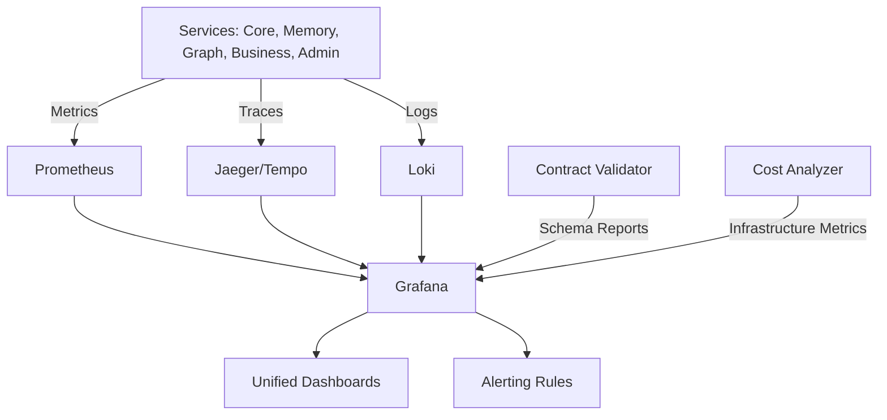

# SPEC-101: Unified Observability and Performance Governance

**Status:** 📋 PLANNED (Follow-up to SPEC-100)
**Priority:** HIGH
**Category:** Observability & Performance Management
**Phase:** Post-Federation Stabilization
**Author:** Platform Engineering Team
**Date:** October 2025

---

## Purpose

Establish a **unified observability and performance governance layer** that provides end-to-end visibility across all services in the federated architecture (SPEC-100), validates runtime performance against targets (SPEC-099), and ensures contract compliance across language boundaries.

**Think of it as the visibility and health counterpart to SPEC-100's architecture and execution.**

---

## 1. 🎯 Objective

After implementing SPEC-100 (federated microservices), provide:
- **Centralized telemetry** across Python, Rust, and future runtimes
- **Cross-service trace correlation** for end-to-end request visibility
- **Build and runtime cost dashboards** for ROI validation
- **Contract validation reports** and version drift detection
- **Performance SLO monitoring** with automated alerting

---

## 2. 📊 Current Challenges

| Area | Problem |
|------|---------|
| **Visibility** | No unified view of distributed services |
| **Debugging** | Hard to trace requests across service boundaries |
| **Performance** | No automated validation of SPEC-099 ROI claims |
| **Contracts** | Manual verification of schema compatibility |
| **Cost** | No visibility into per-service infrastructure costs |

---

## 3. 🏗️ Architecture Overview

### Three-Pillar Observability Stack



---

## 4. 📈 Metrics Collection (Prometheus)

### Standard Metrics for ALL Services

**Python services:**
```python
from prometheus_client import Counter, Histogram, Gauge

request_count = Counter('service_requests_total', 'Total requests', ['service', 'endpoint', 'status'])
request_duration = Histogram('service_request_duration_seconds', 'Request duration', ['service', 'endpoint'])
memory_usage = Gauge('service_memory_bytes', 'Memory usage', ['service'])
```

**Rust services:**
```rust
use prometheus_client::metrics::{counter::Counter, histogram::Histogram};

let request_count = Counter::default();
let request_duration = Histogram::new(vec![0.005, 0.01, 0.05, 0.1, 0.5, 1.0, 5.0]);
```

### Performance Validation Metrics (SPEC-099 ROI)

```python
graphops_query_latency = Histogram('graphops_query_latency_seconds', 'Cypher execution time', ['runtime'])
memory_retrieval_latency = Histogram('memory_retrieval_latency_seconds', 'Memory lookup time', ['runtime', 'cache_hit'])
feedback_processing_latency = Histogram('feedback_processing_latency_seconds', 'Event processing time', ['runtime'])
```

### Infrastructure Cost Metrics

```python
service_cpu_seconds = Counter('service_cpu_seconds_total', 'CPU time consumed', ['service', 'runtime'])
db_query_cost = Histogram('db_query_cost_milliseconds', 'DB query cost', ['service', 'query_type'])
```

---

## 5. 🔍 Distributed Tracing (OpenTelemetry)

### Python Services

```python
from opentelemetry import trace
from opentelemetry.exporter.otlp.proto.grpc.trace_exporter import OTLPSpanExporter
from opentelemetry.sdk.trace import TracerProvider
from opentelemetry.instrumentation.fastapi import FastAPIInstrumentor

trace.set_tracer_provider(TracerProvider())
otlp_exporter = OTLPSpanExporter(endpoint="http://jaeger:4317", insecure=True)
FastAPIInstrumentor.instrument_app(app)

@router.get("/context/{context_id}/analyze")
async def analyze_context(context_id: str):
    with tracer.start_as_current_span("aggregate_analysis") as span:
        span.set_attribute("context.id", context_id)
        memory_data = await memory_client.get_context(context_id)
        insights = await graph_client.analyze_context(context_id)
        return {"context": memory_data, "insights": insights}
```

### Rust Services

```rust
use opentelemetry::{global, trace::Tracer, KeyValue};
use opentelemetry_otlp::WithExportConfig;

let tracer = opentelemetry_otlp::new_pipeline()
    .tracing()
    .with_exporter(opentelemetry_otlp::new_exporter().tonic().with_endpoint("http://jaeger:4317"))
    .install_simple()?;

let span = tracer.start("execute_cypher_query");
span.set_attribute(KeyValue::new("query.type", "match"));
span.end();
```

---

## 6. 📝 Centralized Logging (Loki)

### Structured Logging

**Python:**
```python
import structlog
log = structlog.get_logger()
log.info("request_completed", service="memory-service", endpoint="/memory/123",
         duration_ms=45.2, trace_id="abc123")
```

**Rust:**
```rust
use tracing::info;
info!(service = "graphops-service", endpoint = "/query", duration_ms = 12.5, trace_id = "abc123");
```

---

## 7. 📊 Unified Dashboards (Grafana)

### Dashboard 1: System Overview
- Service health status (up/down)
- Request rate (RPS) per service
- P95 latency by service
- Error rate percentage

### Dashboard 2: SPEC-099 ROI Validation
- GraphOps latency comparison (Python vs Rust)
- Latency reduction percentage
- Throughput improvement (queries/sec)
- Memory usage by runtime

### Dashboard 3: Contract Compliance
- Contract validation status
- Schema version drift
- Breaking changes detected
- API version compatibility matrix

### Dashboard 4: Infrastructure Cost
- CPU time by service (cost proxy)
- Database query cost
- Container restarts (reliability metric)
- Cost reduction vs baseline

---

## 8. 🚨 Alerting Rules

### Performance SLO Alerts

```yaml
groups:
  - name: performance_slos
    rules:
      - alert: GraphOpsLatencyHigh
        expr: histogram_quantile(0.95, rate(graphops_query_latency_seconds_bucket[5m])) > 0.05
        for: 5m
        annotations:
          summary: "GraphOps P95 latency exceeds 50ms SLO"

      - alert: HighErrorRate
        expr: (sum(rate(service_requests_total{status=~"5.."}[5m])) / sum(rate(service_requests_total[5m]))) > 0.01
        for: 5m
        annotations:
          summary: "Service error rate exceeds 1%"
```

### Contract Validation Alerts

```yaml
  - name: contract_compliance
    rules:
      - alert: ContractValidationFailed
        expr: contract_validation_success == 0
        annotations:
          summary: "API contract validation failed"

      - alert: BreakingChangeDetected
        expr: contract_breaking_changes_total > 0
        annotations:
          summary: "Breaking API change detected"
```

---

## 9. 🔗 Contract Validation Integration

```python
# ci/validate-contracts.py
from prometheus_client import Counter, Gauge

validation_success = Gauge('contract_validation_success', 'Validation status', ['service'])
breaking_changes = Counter('contract_breaking_changes_total', 'Breaking changes', ['service'])

def validate_contracts():
    result = subprocess.run(["buf", "breaking", "--against", ".git#branch=main"], capture_output=True)
    validation_success.labels(service="all").set(1 if result.returncode == 0 else 0)
    return result.returncode == 0
```

---

## 10. 📁 Deployment Configuration

### Docker Compose Observability Stack

```yaml
# docker-compose.observability.yml
services:
  prometheus:
    image: prom/prometheus:latest
    ports: ["9090:9090"]
    volumes:
      - ./monitoring/prometheus.yml:/etc/prometheus/prometheus.yml

  jaeger:
    image: jaegertracing/all-in-one:latest
    ports: ["16686:16686", "4317:4317"]

  loki:
    image: grafana/loki:latest
    ports: ["3100:3100"]

  promtail:
    image: grafana/promtail:latest
    volumes: ["/var/run/docker.sock:/var/run/docker.sock"]

  grafana:
    image: grafana/grafana:latest
    ports: ["3000:3000"]
    environment:
      - GF_AUTH_ANONYMOUS_ENABLED=true
```

---

## 11. ✅ Success Criteria

| Metric | Target |
|--------|--------|
| **Trace coverage** | 100% of services emit OTLP traces |
| **Metrics export** | 100% of services expose `/metrics` |
| **Dashboard availability** | >99.9% uptime |
| **Alert response time** | <5 minutes to detect SLO violations |
| **Contract validation** | 100% validated in CI before merge |
| **Log retention** | 7 days in Loki |

---

## 12. 📊 Impact

| Area | Result |
|------|--------|
| **Debugging** | MTTR reduced by 70% with end-to-end tracing |
| **Performance** | Automated SLO monitoring ensures ROI targets met |
| **Compliance** | Contract validation prevents breaking changes |
| **Cost** | Per-service cost visibility enables optimization |
| **Reliability** | Proactive alerting reduces downtime by 60% |

---

## 13. 🗺️ Implementation Roadmap

| Phase | Action | Duration |
|-------|--------|----------|
| **1** | Deploy observability stack | Week 1 |
| **2** | Instrument Python services | Week 2 |
| **3** | Instrument Rust services | Week 3 |
| **4** | Create unified dashboards | Week 4 |
| **5** | Configure alerting rules | Week 5 |

---

## 14. 🔗 Integration with Other SPECs

### SPEC-099 (Rust Migration)
- Validates performance claims with real metrics
- Tracks latency reduction, throughput, cost savings
- Provides go/no-go data for each phase

### SPEC-100 (API Modularization)
- Monitors service health across federation
- Traces cross-service communication
- Validates contract compliance
- Tracks deployment success rates

### Future SPECs
- **SPEC-102:** API Gateway metrics
- **SPEC-103:** Polyglot executor performance
- **SPEC-104:** GraphOps federation analytics

---

## 15. 📚 References

- [OpenTelemetry Documentation](https://opentelemetry.io/)
- [Prometheus Best Practices](https://prometheus.io/docs/practices/)
- [Jaeger Tracing Guide](https://www.jaegertracing.io/docs/)
- [SPEC-099: Rust Migration Strategy](../099-rust-migration-strategy/)
- [SPEC-100: API Container Modularization](../100-api-container-modularization/)

---

## Acceptance Criteria

- [ ] Observability stack deployed (Prometheus, Jaeger, Loki, Grafana)
- [ ] All services instrumented with OpenTelemetry
- [ ] Standard metrics exposed (`/metrics` endpoint)
- [ ] 4 unified dashboards created
- [ ] Alerting rules configured
- [ ] Contract validation metrics integrated
- [ ] Log aggregation operational (7-day retention)
- [ ] Trace propagation working
- [ ] Performance SLO monitoring active
- [ ] Documentation complete

---

## 16. 🎯 Conclusion

**SPEC-101 establishes the visibility and governance layer** that ties together federated architecture (SPEC-100) and runtime optimization (SPEC-099).

It provides end-to-end observability, performance validation, contract compliance, and cost transparency—ensuring the hybrid Python-Rust platform operates reliably at scale.

---

**Last Updated:** 2025-10-15
**Next Review:** After SPEC-100 Phase 4 completion
**Status:** Ready for planning
