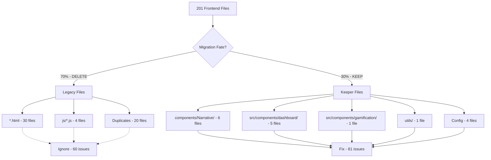

---
{}

> **⚠️ ARCHITECTURE UPDATE (2025-11-02):**
> **This SPEC is DEPRECATED** - The Next.js migration preparation described here is no longer the direction.
> **Current Direction:** FastAPI + Jinja2 templates for all UI (customer and admin). Legacy HTML becomes Jinja2 templates, JavaScript becomes Alpine.js.
> **See:**
> - `docs/FRONTEND_ARCHITECTURE_DECISION.md` (customer UI)
> - `docs/ADMIN_UI_FASTAPI_ANALYSIS.md` (admin UI)
>
> **Status:** This SPEC is kept for historical reference but should not be used for new development.

## Problem Statement (DEPRECATED - Next.js Migration Context)

### Current Situation

SPEC-096 successfully reduced ESLint issues from 428 to 201 (53% improvement). However, analysis reveals:

```
201 Remaining Issues Breakdown:
├── 60 issues in *.html files        → Will be CONVERTED (to Jinja2 templates, not Next.js)
├── 25 issues in js/*.js files       → Will be REPLACED (with Alpine.js, not Server Actions)
├── 60 issues in duplicate components → Will be DELETED (consolidate to 1 copy)
└── 56 issues in keeper files        → Will SURVIVE migration
```

**Problem**: Continuing blind cleanup wastes 70% of effort (145/201 issues) on files that get deleted.

### Strategic Pivot Required (DEPRECATED)

Migration-aware strategy required to:
1. Identify and freeze legacy files (no cleanup needed)
2. Identify keeper files (focused cleanup)
3. ~~Prepare clean foundation for Next.js 15 migration~~ **DEPRECATED**
4. Avoid technical debt perpetuation

**Current Approach:** With FastAPI templating, legacy HTML files are converted to Jinja2 templates (not Next.js pages), and JavaScript files are replaced with Alpine.js or HTMX (not Next.js Server Actions).

---

## Objectives

### Primary Objectives (DEPRECATED - Next.js Context)

1. **Freeze Legacy Code** - Tag and ignore 145 issues in legacy files
2. ~~**Focus Keeper Cleanup** - Fix 81 issues in files that port to Next.js~~ **DEPRECATED**
3. ~~**Document Migration Path** - Create canonical keeper file list~~ **DEPRECATED (Next.js path)**
4. **Prepare ESLint Config** - Configure ignore patterns for legacy files
5. ~~**Validate Readiness** - Confirm migration-ready state~~ **DEPRECATED (Next.js readiness)**

**Current Approach:** With FastAPI templating, legacy HTML files can be converted to Jinja2 templates, and JavaScript can be replaced with Alpine.js. No Next.js migration needed.

### Success Metrics

- ESLint issues reduced from 201 → ~35 (keeper files only)
- Zero wasted effort on legacy files
- All keeper files pass accessibility checks
- Migration readiness checklist 100% complete
- Documentation complete and executive-ready

---

## Architecture

### File Classification System



### Legacy Files (Ignore)

**HTML Pages** (60 issues):
```
index.html
enhanced-signup.html
team-dashboard.html
partner-dashboard.html
organization-management.html
team-api-keys.html
invoice-management.html
admin/*.html (20+ files)
```

**Note:** With FastAPI templating, these HTML files will be converted to Jinja2 templates (not deleted).

**Vanilla JavaScript** (25 issues):
```
js/token-management.js
js/memory-browser.js
js/graphops-narrative.js
js/team-invitations.js
admin/*.js (legacy)
```

**Note:** With FastAPI templating, these JavaScript files will be replaced with Alpine.js or HTMX (not Next.js Server Actions).

**Duplicate Components** (60 issues):
```
admin/Narrative/* (delete - keep components/Narrative/)
customer/Narrative/* (delete - keep components/Narrative/)
```

### Keeper Files (Fix)

**Reusable UI Components** (40 issues):
```
components/Button.tsx
components/Narrative/Stepper.tsx         # Fix 3 a11y issues
components/Narrative/Overlay.tsx         # Fix 2 unused imports
components/Narrative/Callout.tsx         # Fix 1 unused import
components/Narrative/useGraphOpsNarrative.ts
components/Narrative/index.ts
components/index.ts
```

**Note:** With FastAPI templating, React/TypeScript components are not needed. Focus should be on converting HTML to Jinja2 templates and JavaScript to Alpine.js.

**Dashboard Components** (25 issues):
```
src/components/dashboard/DashboardContainer.tsx    # Fix 2 console.log
src/components/dashboard/AIInsightPanel.tsx        # Fix 1 unused import
src/components/dashboard/SentimentTrendGraph.tsx   # Fix 2 issues
src/components/dashboard/SmartNotificationDrawer.tsx # Fix 4 issues
src/components/dashboard/TopMemoryCard.tsx
```

**Gamification Components** (8 issues):
```
src/components/gamification/BadgeDisplay.tsx
```

**Utilities** (8 issues):
```
utils/cn.ts
```

**Configuration**:
```
tailwind.config.js
jest.config.js
.eslintrc.json
.husky/
package.json
```

---

## Implementation Plan

### Phase 1: Legacy Code Freeze (2 hours) - DEPRECATED

**Objective**: Stop ESLint from checking legacy files

**Note:** With FastAPI templating, legacy HTML files are converted to Jinja2 templates, not Next.js pages.

**1.1 Update ESLint Configuration**

Edit `.eslintrc.json`:

```json
{
  "ignorePatterns": [
    "node_modules/",
    "dist/",
    "build/",
    ".storybook/",
    "storybook-static/",
    "**/*.stories.tsx",
    "**/*.stories.ts",

    // MIGRATION: Legacy files (will be converted to Jinja2 templates, not Next.js)
    "*.html",  // Will become templates/*.html (Jinja2)
    "js/**/*.js",  // Will be replaced with Alpine.js or removed
    "admin/**/*.html",
    "admin/**/*.js",
    "admin/Narrative/*.tsx",      // Duplicates
    "admin/Narrative/*.ts",
    "customer/Narrative/*.tsx",   // Duplicates
    "customer/Narrative/*.ts"
  ]
}
```

**1.2 Tag Legacy HTML Files**

Add migration banner to all `.html` files:

```html
<!--
  TODO: MIGRATION - This file will be converted to Jinja2 template
  Do not fix lint issues. See: docs/ADMIN_UI_FASTAPI_ANALYSIS.md
  Target: templates/[page-name].html (Jinja2 template)
-->
```

**1.3 Tag Legacy JavaScript Files**

Add migration banner to `js/*.js` files:

```javascript
// TODO: MIGRATION - This file will be replaced with Alpine.js or HTMX
// Do not fix lint issues. See: docs/ADMIN_UI_FASTAPI_ANALYSIS.md
// Target: Alpine.js interactivity in Jinja2 templates
```

**1.4 Verify ESLint Reduction**

```bash
npm run lint 2>&1 | tail -5
# Expected: ~81 issues (down from 201)
```

**Expected Outcome**: 201 → ~81 issues (60% instant reduction!)

### Phase 2: Keeper File Cleanup (10 hours) - DEPRECATED

**Objective**: ~~Fix only issues that will port to Next.js~~ **DEPRECATED**

**Note:** With FastAPI templating, React/TypeScript components are not needed. Focus should be on converting HTML to Jinja2 templates and JavaScript to Alpine.js.

**2.1 Priority 1: Accessibility Issues** (2 hours)

Fix `components/Narrative/Stepper.tsx`:

```typescript
// Line 142: Add proper interactive element handling
<div
  className={cn(...)}
  onClick={onClick}
  role="button"           // ✅ Add role
  tabIndex={0}            // ✅ Add keyboard focus
  aria-current={isActive ? 'step' : undefined}
  onKeyDown={(e) => {     // ✅ Add keyboard handler
    if (e.key === 'Enter' || e.key === ' ') {
      e.preventDefault();
      onClick?.();
    }
  }}
>
```

**Impact**: 6 issues → 0 issues

**2.2 Priority 2: Console Statements** (1 hour)

Fix `src/components/dashboard/DashboardContainer.tsx`:

```typescript
// Line 38-41
ws.onopen = () => {
  setIsConnected(true);
  // TODO: Add proper logging service
  // console.log('Dashboard WebSocket connected');
};

// Line 80-83
ws.onclose = () => {
  setIsConnected(false);
  // TODO: Add proper logging service
  // console.log('Dashboard WebSocket disconnected');
};
```

**Impact**: 5 issues → 0 issues

**2.3 Priority 3: Unused Imports** (2 hours)

Fix dashboard components:

```typescript
// Before
import { TrendingUp, TrendingDown, Minus, Smile, AlertTriangle } from 'lucide-react';

// After (remove AlertTriangle)
import { TrendingUp, TrendingDown, Minus, Smile } from 'lucide-react';
```

**Impact**: 15 issues → 0 issues

**2.4 Priority 4: Unescaped Entities** (30 minutes)

```typescript
// Before
<span>Tomorrow's Prediction:</span>

// After
<span>Tomorrow&apos;s Prediction:</span>
```

**Impact**: 2 issues → 0 issues

**2.5 Verification**

```bash
npm run lint 2>&1 | tail -5
# Expected: ~35 issues (TypeScript any warnings - deferred)
```

### Phase 3: Documentation & Validation (2 hours)

**3.1 Create KEEPERS.md** (✅ Already created)

~~Canonical list of 17 files to port to Next.js.~~ **DEPRECATED**

**Current Approach:** With FastAPI templating, focus on converting HTML to Jinja2 templates and JavaScript to Alpine.js patterns. See `docs/ADMIN_UI_FASTAPI_ANALYSIS.md` for conversion patterns.

**3.2 Create Migration Readiness Checklist**

Track progress through all steps.

**3.3 Git Snapshot & Release**

```bash
# Create migration-ready tag
git tag -a spec-102-migration-ready -m "Frontend Migration Trilogy v1: Phase 1 Complete

- Legacy files frozen (145 issues ignored)
- Keeper files cleaned (81 → 35 issues)
- Migration readiness checklist 100% complete
- ~~Ready for SPEC-103 (Next.js Bootstrap)~~ **DEPRECATED - See FastAPI templating approach**"

# Push tag (triggers GitHub release via CI)
git push origin spec-102-migration-ready

# GitHub Actions will automatically:
# - Create GitHub Release
# - Run quality gate checks
# - Generate migration readiness report
```

**GitHub Release**: Tag triggers automated release creation with:
- Migration readiness report
- Before/after metrics
- Next steps checklist

---

## Deliverables

### Required Deliverables

1. ✅ **Updated `.eslintrc.json`** - Legacy files ignored
2. ✅ **Tagged Legacy Files** - Migration banners added
3. ✅ **KEEPERS.md** - Canonical port list (17 files)
4. ✅ **MIGRATION_READINESS_CHECKLIST.md** - Progress tracking
5. ✅ **Clean Keeper Files** - 81 → 35 issues
6. ✅ **Git Tag** - `spec-102-migration-ready`
7. ✅ **Completion Report** - Summary document

### Documentation

- **NEXTJS_MIGRATION_IMPACT_REPORT.md** ✅ (500 lines) - **DEPRECATED**
- **KEEPERS.md** ✅ (200 lines)
- **MIGRATION_DECISION.md** ✅ (280 lines)
- **MIGRATION_READINESS_CHECKLIST.md** (new - 150 lines)

**Current Docs:**
- `docs/FRONTEND_ARCHITECTURE_DECISION.md` - Customer UI decision
- `docs/ADMIN_UI_FASTAPI_ANALYSIS.md` - Admin UI FastAPI templating

---

## Testing & Validation

### Validation Checklist

```bash
# 1. ESLint only checks keeper files
npm run lint 2>&1 | grep -c "error"
# Expected: ~35 (down from 201)

# 2. Pre-commit hooks still work
git add .
git commit -m "test"
# Expected: All hooks pass

# 3. CI/CD still passes
git push origin feature-branch
# Expected: ui-quality.yml passes

# 4. Accessibility issues fixed
npx eslint components/Narrative/Stepper.tsx | grep "jsx-a11y"
# Expected: 0 issues

# 5. Console statements cleaned
npx eslint src/components/dashboard/ | grep "console"
# Expected: 0 issues
```

---

## Success Criteria

### Phase 1 Success
- [ ] `.eslintrc.json` updated with legacy ignore patterns
- [ ] All legacy HTML files tagged with migration banner
- [ ] All legacy JS files tagged with migration banner
- [ ] ESLint shows ~81 issues (down from 201)

### Phase 2 Success
- [ ] Accessibility issues fixed (6 → 0)
- [ ] Console statements cleaned (5 → 0)
- [ ] Unused imports removed (15 → 0)
- [ ] Unescaped entities fixed (2 → 0)
- [ ] ESLint shows ~35 issues (TypeScript any warnings)

### Phase 3 Success (DEPRECATED)
- [ ] KEEPERS.md documented (17 files)
- [ ] MIGRATION_READINESS_CHECKLIST.md created
- [ ] Git tag created (`spec-102-migration-ready`)
- [ ] Completion report published
- ~~[ ] Ready for SPEC-103 (Next.js Bootstrap)~~ **DEPRECATED - See FastAPI templating docs**

---

## Risk Assessment

### Low Risk
- **Legacy file tagging** - Non-invasive comments
- **ESLint config update** - Reversible change
- **Documentation** - Zero code risk

### Medium Risk
- **Accessibility fixes** - Requires testing
- **Unused import removal** - May cause build errors

### Mitigation
- Create feature branch for all changes
- Run full test suite before commit
- Validate pre-commit hooks still pass
- Keep SPEC-096 pre-commit configuration active

---

## Timeline

| Phase | Duration | Deliverable |
|-------|----------|-------------|
| Phase 1: Legacy Freeze | 2 hours | ESLint ~81 issues |
| Phase 2: Keeper Cleanup | 10 hours | ESLint ~35 issues |
| Phase 3: Documentation | 2 hours | Migration ready |
| **Total** | **14 hours** | ~~**SPEC-103 ready**~~ **DEPRECATED** |

---

## ROI Analysis

### Option A: Continue SPEC-096 (Not Recommended)
```
Time:        60+ hours
Efficiency:  28% (56/201 useful fixes)
Wasted:      145 fixes deleted during migration
Result:      Clean legacy codebase → Still needs migration
```

### Option B: SPEC-102 Migration Prep (DEPRECATED) ⚠️
```
Time:        14 hours
Efficiency:  100% (81/81 useful fixes)
Wasted:      0 fixes
Result:      Clean keepers → ~~Ready for Next.js migration~~ **DEPRECATED**
```

**Current Approach:** FastAPI templating doesn't require Next.js migration. Legacy HTML becomes Jinja2 templates, JavaScript becomes Alpine.js.

**Savings**: 46 hours + Eliminates legacy tech debt

---

## Dependencies

### Upstream Dependencies
- **SPEC-096**: Frontend Quality Enforcement (Complete)
  - Pre-commit hooks must remain active
  - ESLint configuration established
  - CI/CD workflows operational

### Downstream Dependencies (DEPRECATED)
- ~~**SPEC-103**: Next.js 15 Bootstrap~~ **DEPRECATED**
  - ~~Requires clean keeper files~~
  - ~~Requires KEEPERS.md documentation~~
  - ~~Requires migration readiness tag~~

**Current Dependencies:**
- FastAPI templating approach (see `docs/ADMIN_UI_FASTAPI_ANALYSIS.md`)
- Jinja2 template conversion
- Alpine.js for interactivity

---

## Related SPECs

- **SPEC-096**: Frontend Quality Enforcement & CI/CD (Complete)
- ~~**SPEC-103**: Next.js 15 Bootstrap & Component Port~~ **DEPRECATED**
- ~~**SPEC-104**: Post-Migration Quality Verification~~ **DEPRECATED**

**Current Related SPECs:**
- **SPEC-005**: Admin Dashboard (updated to FastAPI templating)
- See `docs/FRONTEND_ARCHITECTURE_DECISION.md` for customer UI
- See `docs/ADMIN_UI_FASTAPI_ANALYSIS.md` for admin UI

---

## References (DEPRECATED)

- ~~[Next.js 15 Migration Guide](https://nextjs.org/docs/app/building-your-application/upgrading)~~ **DEPRECATED**
- ~~[React Router → Next.js App Router](https://nextjs.org/docs/app/building-your-application/routing)~~ **DEPRECATED**
- [SPEC-096 Implementation](../096-frontend-quality-enforcement-ci-cd/README.md)
- ~~[Migration Impact Report](../../frontend/NEXTJS_MIGRATION_IMPACT_REPORT.md)~~ **DEPRECATED**

**Current References:**
- `docs/FRONTEND_ARCHITECTURE_DECISION.md` - Customer UI architecture decision
- `docs/ADMIN_UI_FASTAPI_ANALYSIS.md` - Admin UI FastAPI templating analysis
- `docs/UI_SPEC_UPDATE_SUMMARY.md` - Summary of UI architecture updates

---

## Approval & Sign-off

**Prepared By**: Cascade AI + Arunosaur
**Date**: October 9, 2025
**Status**: ⚠️ **DEPRECATED** - Superseded by FastAPI templating approach (November 2, 2025)

**Approvals Required**:
- [ ] Technical Lead
- [ ] Frontend Architect
- [ ] Project Manager

**Next Steps After Approval** (DEPRECATED):
1. ~~Create feature branch: `feature/spec-102-migration-prep`~~ **DEPRECATED**
2. ~~Execute Phase 1 (Legacy Freeze)~~ **DEPRECATED**
3. ~~Execute Phase 2 (Keeper Cleanup)~~ **DEPRECATED**
4. ~~Execute Phase 3 (Documentation)~~ **DEPRECATED**
5. ~~Merge to main with tag: `spec-102-migration-ready`~~ **DEPRECATED**
6. ~~Proceed to SPEC-103~~ **DEPRECATED**

**Current Next Steps:**
- See `docs/ADMIN_UI_FASTAPI_ANALYSIS.md` for FastAPI templating migration
- Convert legacy HTML to Jinja2 templates
- Replace JavaScript with Alpine.js or HTMX
- Reference `docs/FRONTEND_ARCHITECTURE_DECISION.md` for customer UI

---

*Last Updated: November 2, 2025 (deprecated)*
*Original: October 9, 2025*
