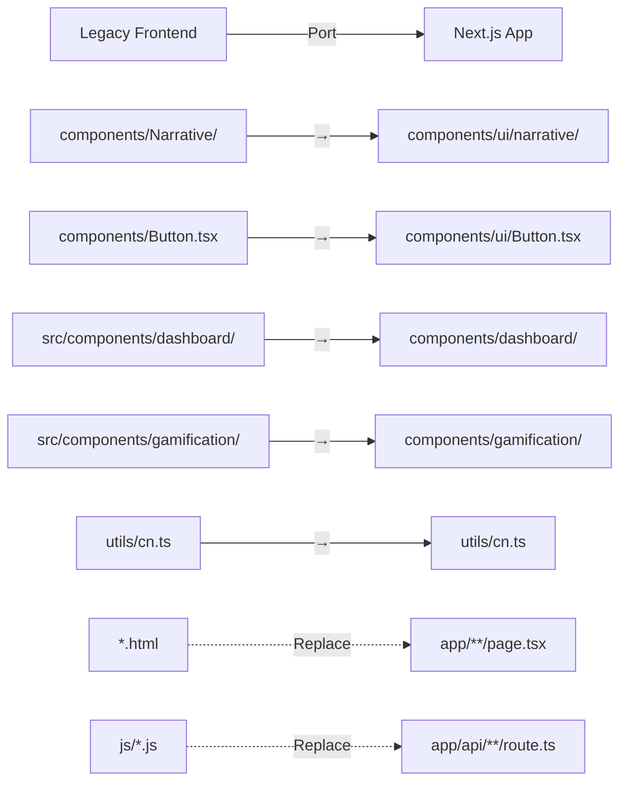

---
{}
---


## Problem Statement

### Current Situation

Legacy frontend architecture:
```
Legacy Stack Issues:
├── React Router DOM (manual routing)
├── Webpack/Vite configuration complexity
├── Manual state management boilerplate
├── 201 ESLint issues (145 in files to be deleted)
├── No built-in optimization
├── No automatic code splitting
└── Fragmented component structure
```

### Migration Opportunity

Next.js 15 provides:
- App Router (file-based routing)
- Server Components (automatic optimization)
- Server Actions (replace API routes)
- Zero-config build system
- Automatic code splitting
- Built-in performance optimization
- TypeScript + Tailwind native support

---

## Objectives

### Primary Objectives

1. **Bootstrap Next.js 15 Project** - Create clean modern application
2. **Port Keeper Components** - Migrate 17 files (0 legacy baggage)
3. **Integrate Quality Tools** - ESLint + Prettier + Husky + pre-commit
4. **Establish Component Library** - Organized structure for scale
5. **Configure CI/CD** - GitHub Actions for Next.js

### Success Metrics

- Next.js 15 project created with App Router
- 17 keeper files successfully ported
- ESLint shows &lt;20 issues (vs 201 in legacy)
- Pre-commit hooks operational
- CI/CD pipeline green
- Storybook integrated for component development

---

## Architecture

### Next.js 15 Project Structure

```
ninaivalaigal-next/
├── app/                          # App Router (Next.js 15)
│   ├── layout.tsx               # Root layout
│   ├── page.tsx                 # Home page
│   ├── dashboard/
│   │   └── page.tsx             # Dashboard page
│   ├── signup/
│   │   └── page.tsx             # Signup page
│   └── api/                     # API Routes
│       └── [route]/
│           └── route.ts         # Server Actions
├── components/                   # Ported keeper components
│   ├── ui/                      # Reusable UI components
│   │   ├── narrative/
│   │   │   ├── Stepper.tsx     # ✅ From components/Narrative/
│   │   │   ├── Overlay.tsx
│   │   │   ├── Callout.tsx
│   │   │   └── useGraphOpsNarrative.ts
│   │   └── Button.tsx           # ✅ From components/
│   ├── dashboard/               # ✅ From src/components/dashboard/
│   │   ├── DashboardContainer.tsx
│   │   ├── AIInsightPanel.tsx
│   │   ├── SentimentTrendGraph.tsx
│   │   ├── SmartNotificationDrawer.tsx
│   │   └── TopMemoryCard.tsx
│   └── gamification/            # ✅ From src/components/gamification/
│       └── BadgeDisplay.tsx
├── utils/                       # ✅ From utils/
│   └── cn.ts
├── lib/                         # Shared libraries
│   ├── api-client.ts           # API wrapper
│   └── constants.ts            # Shared constants
├── public/                      # Static assets
├── styles/                      # Global styles
│   └── globals.css
├── .storybook/                  # ✅ Ported from legacy
│   ├── main.ts
│   └── preview.ts
├── .husky/                      # ✅ Ported from legacy
│   └── pre-commit
├── tailwind.config.js           # ✅ Ported from legacy
├── jest.config.js               # ✅ Ported from legacy
├── .eslintrc.json               # ✅ Enhanced for Next.js
├── package.json                 # Updated dependencies
└── tsconfig.json                # TypeScript configuration
```

### Component Migration Map



---

## Implementation Plan

### Phase 1: Project Bootstrap (1 day)

**1.1 Create Next.js 15 Project**

```bash
# Navigate to parent directory
cd /Users/swami/WorkSpace/ninaivalaigal

# Create Next.js 15 app
npx create-next-app@latest frontend-next \
  --typescript \
  --tailwind \
  --app \
  --src-dir \
  --import-alias "@/*" \
  --no-eslint  # We'll configure manually

# Rename for clarity
mv frontend-next frontend-nextjs
```

**1.2 Initial Configuration**

Configure `next.config.js`:

```javascript
/** @type {import('next').NextConfig} */
const nextConfig = {
  reactStrictMode: true,
  swcMinify: true,

  // API configuration
  async rewrites() {
    return [
      {
        source: '/api/:path*',
        destination: 'http://localhost:13370/api/:path*',
      },
    ];
  },

  // Environment variables
  env: {
    NEXT_PUBLIC_API_URL: process.env.NEXT_PUBLIC_API_URL || 'http://localhost:13370',
  },
};

module.exports = nextConfig;
```

**1.3 Install Dependencies**

```bash
cd frontend-nextjs

# Core dependencies (most already included)
npm install

# Additional dependencies for ported components
npm install lucide-react recharts class-variance-authority clsx tailwind-merge

# Development dependencies
npm install -D \
  @typescript-eslint/parser \
  @typescript-eslint/eslint-plugin \
  eslint-config-next \
  eslint-plugin-jsx-a11y \
  eslint-plugin-security \
  eslint-plugin-sonarjs \
  prettier \
  prettier-plugin-tailwindcss \
  husky \
  lint-staged \
  @storybook/react \
  @storybook/addon-essentials \
  @storybook/nextjs
```

### Phase 2: Configuration Port (2 hours)

**Note on ESLint Performance**: For optimal local development speed, `sonarjs` and `security` plugins are configured for CI-only. Create `.eslintrc.ci.json` for full checks:

```json
{
  "extends": [
    "./.eslintrc.json",
    "plugin:security/recommended",
    "plugin:sonarjs/recommended"
  ],
  "plugins": ["security", "sonarjs"]
}
```

Use in CI: `eslint --config .eslintrc.ci.json`

---

**2.1 Port Tailwind Configuration**

Copy from `frontend/tailwind.config.js`:

```javascript
// frontend-nextjs/tailwind.config.js
import type { Config } from 'tailwindcss';

const config: Config = {
  content: [
    './src/pages/**/*.{js,ts,jsx,tsx,mdx}',
    './src/components/**/*.{js,ts,jsx,tsx,mdx}',
    './src/app/**/*.{js,ts,jsx,tsx,mdx}',
  ],
  theme: {
    extend: {
      colors: {
        primary: {
          50: '#f0f9ff',
          // ... (copy from legacy)
        },
        secondary: {
          // ... (copy from legacy)
        },
      },
    },
  },
  plugins: [],
};

export default config;

const createJestConfig = nextJest({
  dir: './',
});

const customJestConfig = {
  setupFilesAfterEnv: ['<rootDir>/jest.setup.js'],
  testEnvironment: 'jest-environment-jsdom',
  moduleNameMapper: {
    '^@/(.*)$': '<rootDir>/src/$1',
  },
  collectCoverageFrom: [
    'src/**/*.{js,jsx,ts,tsx}',
    '!src/**/*.stories.{js,jsx,ts,tsx}',
    '!src/**/*.d.ts',
  ],
  coverageThresholds: {
    global: {
      branches: 80,
      functions: 80,
      lines: 80,
      statements: 80,
    },
  },
};

module.exports = createJestConfig(customJestConfig);
```

**2.4 Port Husky + Pre-commit Hooks**

```bash
# Initialize Husky
npx husky-init && npm install

# Configure pre-commit hook
cat > .husky/pre-commit << 'EOF'
#!/usr/bin/env sh
. "$(dirname -- "$0")/_/husky.sh"

# Run lint-staged
npx lint-staged

# Run type checking
npm run type-check
EOF

chmod +x .husky/pre-commit
```

Configure `lint-staged` in `package.json`:

```json
{
  "lint-staged": {
    "**/*.{js,jsx,ts,tsx}": [
      "eslint --fix",
      "prettier --write"
    ],
    "**/*.{json,md,yml,yaml}": [
      "prettier --write"
    ]
  }
}
```

### Phase 3: Component Port (3 days)

**3.1 Port Utility Files**

```bash
# Create utils directory
mkdir -p src/utils

# Copy cn.ts (class name utility)
cp ../frontend/utils/cn.ts src/utils/

# Verify import paths
# Should use: import { cn } from '@/utils/cn';
```

**3.2 Port UI Components**

```bash
# Create components structure
mkdir -p src/components/ui/narrative

# Copy narrative components (canonical version only)
cp ../frontend/components/Narrative/Stepper.tsx src/components/ui/narrative/
cp ../frontend/components/Narrative/Overlay.tsx src/components/ui/narrative/
cp ../frontend/components/Narrative/Callout.tsx src/components/ui/narrative/
cp ../frontend/components/Narrative/useGraphOpsNarrative.ts src/components/ui/narrative/
cp ../frontend/components/Narrative/index.ts src/components/ui/narrative/

# Copy Button component
cp ../frontend/components/Button.tsx src/components/ui/

# Update import paths
# Change: import { cn } from '../utils/cn'
# To: import { cn } from '@/utils/cn'
```

**3.3 Port Dashboard Components**

```bash
# Create dashboard structure
mkdir -p src/components/dashboard

# Copy all dashboard components
cp ../frontend/src/components/dashboard/*.tsx src/components/dashboard/

# Update import paths for Next.js
# - Update API calls to use Next.js API routes
# - Update WebSocket connections for Next.js
# - Update cn utility imports
```

**3.4 Port Gamification Components**

```bash
# Create gamification structure
mkdir -p src/components/gamification

# Copy gamification components
cp ../frontend/src/components/gamification/BadgeDisplay.tsx src/components/gamification/

# Update imports
```

**3.5 Update Import Paths**

Run automated import path updates:

```bash
# Find and replace old import patterns
find src/components -type f -name "*.tsx" -o -name "*.ts" | xargs sed -i '' \
  -e 's|from "\.\.\/utils\/cn"|from "@/utils/cn"|g' \
  -e 's|from "\.\.\/\.\.\/utils\/cn"|from "@/utils/cn"|g'
```

### Phase 4: Storybook Integration (1 day)

**4.1 Install Storybook for Next.js**

```bash
npx storybook@latest init --type nextjs
```

**4.2 Port Existing Stories**

```bash
# Copy story files
cp ../frontend/components/Narrative/*.stories.tsx src/components/ui/narrative/
cp ../frontend/components/Button.stories.tsx src/components/ui/

# Update story imports for Next.js paths
```

**4.3 Configure Storybook**

```typescript
// .storybook/main.ts
import type { StorybookConfig } from '@storybook/nextjs';

const config: StorybookConfig = {
  stories: ['../src/**/*.stories.@(js|jsx|ts|tsx)'],
  addons: [
    '@storybook/addon-essentials',
    '@storybook/addon-interactions',
  ],
  framework: {
    name: '@storybook/nextjs',
    options: {},
  },
};

export default config;
```

### Phase 5: Page Migration (1 week)

**5.1 Create Root Layout**

```typescript
// src/app/layout.tsx
import type { Metadata } from 'next';
import { Inter } from 'next/font/google';
import './globals.css';

const inter = Inter({ subsets: ['latin'] });

export const metadata: Metadata = {
  title: 'Ninaivalaigal - AI Memory Management',
  description: 'Enterprise AI memory management platform',
};

export default function RootLayout({
  children,
}: {
  children: React.ReactNode;
}) {
  return (
    <html lang="en">
      <body className={inter.className}>{children}</body>
    </html>
  );
}
```

**5.2 Convert HTML Pages to Next.js Pages**

Map legacy HTML to Next.js routes:

```
index.html                     → app/page.tsx
enhanced-signup.html           → app/signup/page.tsx
team-dashboard.html            → app/dashboard/page.tsx
organization-management.html   → app/settings/org/page.tsx
team-api-keys.html             → app/settings/api-keys/page.tsx
invoice-management.html        → app/billing/invoices/page.tsx
```

**Example: Dashboard Page**

```typescript
// src/app/dashboard/page.tsx
import { DashboardContainer } from '@/components/dashboard/DashboardContainer';

export default function DashboardPage() {
  return (
    <main className="min-h-screen p-8">
      <DashboardContainer />
    </main>
  );
}
```

**5.3 Convert Vanilla JS to Server Actions**

Replace `js/token-management.js` with Server Action:

```typescript
// src/app/api/tokens/route.ts
import { NextResponse } from 'next/server';

export async function GET() {
  // Server-side token management logic
  const tokens = await fetchTokens();
  return NextResponse.json(tokens);
}

export async function POST(request: Request) {
  const body = await request.json();
  const newToken = await createToken(body);
  return NextResponse.json(newToken);
}
```

### Phase 6: CI/CD Configuration (1 day)

**6.1 Create GitHub Actions Workflow**

```yaml
# .github/workflows/nextjs-quality.yml
name: Next.js Quality Checks

on:
  push:
    branches: [main, develop]
    paths:
      - 'frontend-nextjs/**'
  pull_request:
    branches: [main, develop]
    paths:
      - 'frontend-nextjs/**'

jobs:
  quality-checks:
    runs-on: ubuntu-latest

    steps:
      - uses: actions/checkout@v4

      - name: Setup Node.js
        uses: actions/setup-node@v4
        with:
          node-version: '20'
          cache: 'npm'
          cache-dependency-path: frontend-nextjs/package-lock.json

      - name: Install dependencies
        working-directory: frontend-nextjs
        run: npm ci

      - name: Run ESLint
        working-directory: frontend-nextjs
        run: npm run lint

      - name: Run Type Check
        working-directory: frontend-nextjs
        run: npm run type-check

      - name: Run Tests
        working-directory: frontend-nextjs
        run: npm run test -- --coverage

      - name: Build
        working-directory: frontend-nextjs
        run: npm run build
```

**6.2 Lighthouse CI for Next.js**

```yaml
# .github/workflows/nextjs-lighthouse.yml
name: Next.js Lighthouse CI

on:
  pull_request:
    branches: [main]
    paths:
      - 'frontend-nextjs/**'

jobs:
  lighthouse:
    runs-on: ubuntu-latest

    steps:
      - uses: actions/checkout@v4

      - name: Setup Node.js
        uses: actions/setup-node@v4
        with:
          node-version: '20'

      - name: Install dependencies
        working-directory: frontend-nextjs
        run: npm ci

      - name: Build Next.js
        working-directory: frontend-nextjs
        run: npm run build

      - name: Run Lighthouse CI
        working-directory: frontend-nextjs
        run: |
          npm install -g @lhci/cli
          lhci autorun
```

---

## Deliverables

### Required Deliverables

1. ✅ **Next.js 15 Project** - Clean modern application
2. ✅ **17 Ported Components** - All keeper files migrated
3. ✅ **Storybook Integration** - Component development environment
4. ✅ **Pre-commit Hooks** - Quality enforcement active
5. ✅ **CI/CD Workflows** - Automated quality checks
6. ✅ **Migration Documentation** - Complete component mapping
7. ✅ **Initial Pages** - Core routes implemented

### Documentation

- **COMPONENT_MIGRATION_MAP.md** - Detailed file mapping
- **NEXTJS_SETUP_GUIDE.md** - Local development instructions
- **API_INTEGRATION_GUIDE.md** - Backend connection setup
- **DEPLOYMENT_GUIDE.md** - Production deployment steps

---

## Testing & Validation

### Quality Checks

```bash
# 1. ESLint check
npm run lint
# Expected: &lt;20 issues (vs 201 in legacy)

# 2. Type checking
npm run type-check
# Expected: 0 errors

# 3. Unit tests
npm run test
# Expected: All tests pass, 80%+ coverage

# 4. Build verification
npm run build
# Expected: Successful production build

# 5. Storybook verification
npm run storybook
# Expected: All components render correctly
```

### Performance Validation

```bash
# Lighthouse audit
npm run build
npm run start
npx lighthouse http://localhost:3000 --view

# Expected scores:
# - Performance: 90+
# - Accessibility: 95+
# - Best Practices: 95+
# - SEO: 90+
```

---

## Success Criteria

### Phase 1-2 Success
- [ ] Next.js 15 project created
- [ ] All configurations ported (Tailwind, ESLint, Jest, Husky)
- [ ] Pre-commit hooks operational
- [ ] TypeScript strict mode enabled

### Phase 3-4 Success
- [ ] 17 keeper files ported successfully
- [ ] All import paths updated for Next.js
- [ ] Storybook integrated and working
- [ ] All stories render correctly

### Phase 5-6 Success
- [ ] Core pages implemented (dashboard, signup)
- [ ] Server Actions replace vanilla JS
- [ ] CI/CD workflows green
- [ ] Lighthouse scores 90+

### Overall Success
- [ ] ESLint &lt;20 issues (vs 201)
- [ ] Zero TypeScript errors
- [ ] 80%+ test coverage
- [ ] Production build successful
- [ ] Ready for SPEC-104 verification

---

## Risk Assessment

### High Risk
- **API integration complexity** - Backend connection patterns
- **WebSocket migration** - Real-time features in Next.js
- **State management** - Redux → Next.js patterns

### Medium Risk
- **Import path updates** - May cause runtime errors
- **Component prop types** - TypeScript compatibility
- **Storybook configuration** - Next.js 15 compatibility

### Low Risk
- **Configuration port** - Well-documented patterns
- **Static asset migration** - Straightforward copy
- **Documentation** - Template-based

### Mitigation
- Create feature branch for all work
- Test each component individually before integration
- Use Storybook for isolated component testing
- Keep legacy frontend running during migration
- Incremental rollout with feature flags

---

## Timeline

| Phase | Duration | Deliverable |
|-------|----------|-------------|
| Phase 1: Bootstrap | 1 day | Next.js project created |
| Phase 2: Configuration | 2 hours | All configs ported |
| Phase 3: Components | 3 days | 17 files ported |
| Phase 4: Storybook | 1 day | Component library |
| Phase 5: Pages | 1 week | Core routes implemented |
| Phase 6: CI/CD | 1 day | Automation complete |
| **Total** | **~2 weeks** | **SPEC-104 ready** |

---

## Dependencies

### Upstream Dependencies
- **SPEC-102**: Frontend Migration Preparation (Required)
  - Clean keeper files (&lt;35 issues)
  - KEEPERS.md documentation
  - Migration readiness tag

### Downstream Dependencies
- **SPEC-104**: Post-Migration Quality Verification
  - Requires working Next.js application
  - Requires all components ported
  - Requires CI/CD operational

---

## Related SPECs

- **SPEC-096**: Frontend Quality Enforcement & CI/CD (Complete)
- **SPEC-102**: Frontend Migration Preparation (Proposed)
- **SPEC-104**: Post-Migration Quality Verification (Proposed)

---

## References

- [Next.js 15 Documentation](https://nextjs.org/docs)
- [Next.js App Router](https://nextjs.org/docs/app)
- [Next.js Server Actions](https://nextjs.org/docs/app/building-your-application/data-fetching/server-actions-and-mutations)
- [Storybook for Next.js](https://storybook.js.org/docs/react/get-started/nextjs)

---

## Approval & Sign-off

**Prepared By**: Cascade AI + Arunosaur
**Date**: October 9, 2025
**Status**: Awaiting Approval

**Approvals Required**:
- [ ] Technical Lead
- [ ] Frontend Architect
- [ ] DevOps Engineer
- [ ] Project Manager

**Next Steps After Approval**:
1. Verify SPEC-102 completion
2. Create feature branch: `feature/spec-103-nextjs-bootstrap`
3. Execute Phases 1-2 (Bootstrap + Config)
4. Execute Phases 3-4 (Components + Storybook)
5. Execute Phases 5-6 (Pages + CI/CD)
6. Merge to main with tag: `spec-103-nextjs-complete`
7. Proceed to SPEC-104

---

*Last Updated: October 9, 2025*
