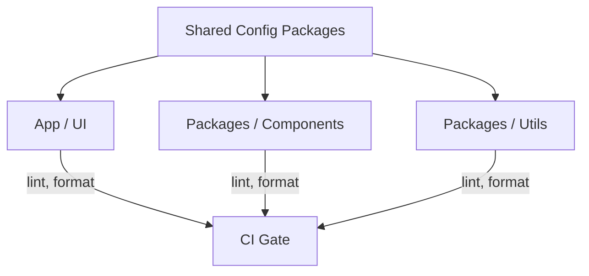

---
{}
---

> **⚠️ ARCHITECTURE UPDATE (2025-11-02):**
> **This SPEC is DEPRECATED** - The ESLint/Prettier/TypeScript frontend linting described here is no longer the direction.
> **Current Direction:** FastAPI + Jinja2 templates. Linting/formatting standards are for Python (pylint, black, mypy) and Jinja2 template validation, not ESLint/TypeScript.
> **See:**
> - `docs/FRONTEND_ARCHITECTURE_DECISION.md` (customer UI)
> - `docs/ADMIN_UI_FASTAPI_ANALYSIS.md` (admin UI)
> - SPEC-005 (Admin Dashboard)
> - SPEC-146 (Customer UI)
> - Quality Verification Stories (US#664, US#665) for Python/Jinja2 linting
>
> **Status:** This SPEC is kept for historical reference but should not be used for new development.

---

# SPEC-106: Frontend Linting & Formatting Standard
**Status:** ⚠️ **DEPRECATED**
**Owner:** Medhasys / Ninaivalaigal FE Guild
**Last Updated:** November 2, 2025 (deprecated)

> **Scope:** Establish a single source of truth for ESLint, Prettier, TypeScript, and import/order across all FE packages (apps & libs). Applies to Next.js UI, component libraries, and any FE utilities.
> **Non-Goals:** Backend Python linting (see SPEC-052), infra repos.

<!--
Template Hints:
- Replace "Rationale" and "Decisions" with concrete PR links once implemented.
- Keep the "How We Rollout" checklist up to date during adoption.
-->

## 1. Problem (DEPRECATED - Next.js Context)

~~Inconsistent lint/format rules create noisy diffs, PR friction, and CI instability across packages.~~ **DEPRECATED**

**Current Problem:** Python code quality and Jinja2 template validation standards needed.

## 2. Goals (DEPRECATED)

- ~~One config, many consumers.~~ **DEPRECATED**
- ~~Deterministic formatting in CI.~~ **Still valid (but for Python)**
- ~~Zero-config project bootstrap.~~ **Still valid (but for Python/FastAPI)**

**Current Goals:**
- Python linting standards (pylint, black, mypy)
- Jinja2 template validation
- Pre-commit hooks for Python formatting
- CI/CD gates for Python code quality

## 3. Decisions (DEPRECATED)

- ~~**ESLint:** shareable config `@ninaivalaigal/eslint-config`~~ **DEPRECATED**
- ~~**Prettier:** shareable config `@ninaivalaigal/prettier-config`~~ **DEPRECATED (use black for Python)**
- ~~**TSConfig:** `@ninaivalaigal/tsconfig`~~ **DEPRECATED (use mypy for Python)**
- ~~**Import Sorting:** `eslint-plugin-import`~~ **DEPRECATED (use isort for Python)**
- ~~**CI:** `pnpm lint` and `pnpm format:check` gates~~ **DEPRECATED**

**Current Decisions:**
- **Python Linting:** pylint for code quality
- **Python Formatting:** black for code formatting
- **Type Checking:** mypy for Python type checking
- **Import Sorting:** isort for Python import organization
- **Jinja2 Validation:** Custom template validation scripts
- **CI:** `pytest`, `black --check`, `pylint`, `mypy` gates
- **Pre-commit:** Husky + pre-commit hooks for Python

## 4. Reference Implementation (DEPRECATED - Next.js Monorepo)

~~```
/tooling
  /eslint-config
    index.cjs
  /prettier-config
    index.cjs
  /tsconfig
    base.json
    next.json
/apps
  /ui
  /admin
/packages
  /components
  /utils
```~~ **DEPRECATED**

**Current Implementation (FastAPI Templating):**
```
/tooling
  /python-linting
    pylintrc
    mypy.ini
    black.toml
    isort.cfg
  /jinja2-validation
    template_validator.py
/services
  /core-api
    pyproject.toml  # black, pylint, mypy config
    .pre-commit-config.yaml
/templates
  /admin
  /customer
```

## 5. Rollout Plan (DEPRECATED)

~~- Week 1: publish shareable configs; migrate `/apps/ui`.~~ **DEPRECATED**
~~- Week 2: migrate `/packages/components` + fix violations.~~ **DEPRECATED**
~~- Week 3: repo-wide adoption; enforce in CI.~~ **DEPRECATED**

**Current Rollout:**
- Python linting/formatting tools (pylint, black, mypy) - See US#664
- Jinja2 template validation - See US#665
- Pre-commit hooks for Python formatting
- CI/CD integration for Python code quality

## 6. Mermaid: Config Consumption Flow


## 7. Commands (DEPRECATED)

~~- `pnpm -w add -D @ninaivalaigal/eslint-config @ninaivalaigal/prettier-config @ninaivalaigal/tsconfig`~~ **DEPRECATED**
~~- `pnpm lint` / `pnpm format` / `pnpm format:check`~~ **DEPRECATED**

**Current Commands:**
- `black .` - Format Python code
- `black --check .` - Check Python formatting
- `pylint services/core-api` - Lint Python code
- `mypy services/core-api` - Type check Python code
- `isort .` - Sort Python imports
- `python scripts/validate_jinja2_templates.py` - Validate Jinja2 templates
- `pre-commit run --all-files` - Run all pre-commit hooks

## 8. Risks & Mitigations (DEPRECATED)

~~- **Noise on first run:** batch PRs per package.~~ **DEPRECATED**
~~- **IDE drift:** commit `.vscode/settings.json` for Prettier on save.~~ **DEPRECATED**

**Current Risks & Mitigations:**
- Python formatting drift: Use black with pre-commit hooks
- Type checking: Use mypy with strict mode
- IDE integration: Configure VS Code for Python formatting (black)

## 9. Acceptance Criteria (DEPRECATED)

~~- One-click bootstrap in new package.~~ **DEPRECATED**
~~- CI passes with identical results locally and in runners.~~ **Still valid (but for Python)**

**Current Acceptance Criteria:**
- Python code quality tools configured (pylint, black, mypy)
- Jinja2 template validation working
- Pre-commit hooks enforce formatting
- CI/CD gates for Python code quality
- See Quality Verification Stories (US#664, US#665) for implementation

---

## ✅ What's Still Valid from SPEC-106

The concept of linting/formatting standards is still valid, but for Python/Jinja2:

1. **Code Quality Standards** - Still needed, but for Python (pylint, black, mypy)
2. **Template Validation** - New requirement for Jinja2 templates
3. **CI/CD Integration** - Still valid for Python linting gates
4. **Pre-commit Hooks** - Still valid for Python formatting

**Current Implementation:**
- See Quality Verification Stories (US#664: Python Code Quality Tools, US#665: Jinja2 Template Validation)
- Python linting/formatting replaces ESLint/Prettier/TypeScript
- Jinja2 template validation replaces frontend component linting

---

*Last Updated: November 2, 2025 (deprecated)*
*Original: October 11, 2025*
