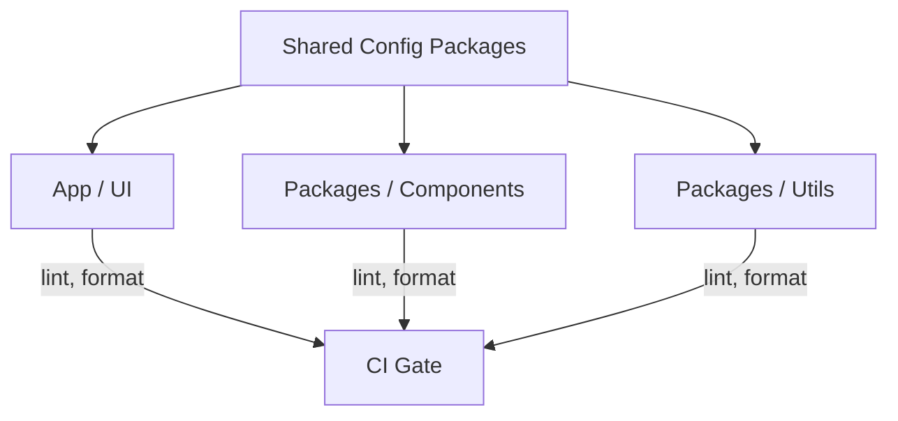

# SPEC-106: Frontend Linting & Formatting Standard
**Status:** Draft
**Owner:** Medhasys / Ninaivalaigal FE Guild
**Last Updated:** 2025-10-11

> **Scope:** Establish a single source of truth for ESLint, Prettier, TypeScript, and import/order across all FE packages (apps & libs). Applies to Next.js UI, component libraries, and any FE utilities.
> **Non-Goals:** Backend Python linting (see SPEC-052), infra repos.

<!--
Template Hints:
- Replace "Rationale" and "Decisions" with concrete PR links once implemented.
- Keep the "How We Rollout" checklist up to date during adoption.
-->

## 1. Problem
Inconsistent lint/format rules create noisy diffs, PR friction, and CI instability across packages.

## 2. Goals
- One config, many consumers.
- Deterministic formatting in CI.
- Zero-config project bootstrap.

## 3. Decisions
- **ESLint:** shareable config `@ninaivalaigal/eslint-config` (repo: `/tooling/eslint-config`).
- **Prettier:** shareable config `@ninaivalaigal/prettier-config` + `.prettierignore` baseline.
- **TSConfig:** `@ninaivalaigal/tsconfig` for app/lib/node targets.
- **Import Sorting:** `eslint-plugin-import` with `import/order` + path aliases.
- **CI:** `pnpm lint` and `pnpm format:check` gates; autofix on pre-commit via Husky.

## 4. Reference Implementation (Monorepo)
```
/tooling
  /eslint-config
    index.cjs
  /prettier-config
    index.cjs
  /tsconfig
    base.json
    next.json
/apps
  /ui
  /admin
/packages
  /components
  /utils
```

## 5. Rollout Plan
- Week 1: publish shareable configs; migrate `/apps/ui`.
- Week 2: migrate `/packages/components` + fix violations.
- Week 3: repo-wide adoption; enforce in CI.

## 6. Mermaid: Config Consumption Flow


## 7. Commands
- `pnpm -w add -D @ninaivalaigal/eslint-config @ninaivalaigal/prettier-config @ninaivalaigal/tsconfig`
- `pnpm lint` / `pnpm format` / `pnpm format:check`

## 8. Risks & Mitigations
- **Noise on first run:** batch PRs per package.
- **IDE drift:** commit `.vscode/settings.json` for Prettier on save.

## 9. Acceptance Criteria
- One-click bootstrap in new package.
- CI passes with identical results locally and in runners.
