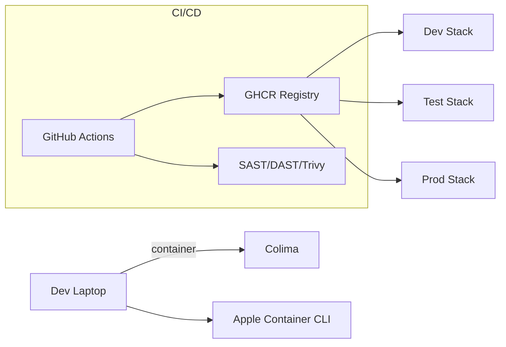

---
{}

> **⚠️ ARCHITECTURE UPDATE (2025-11-02):**
> **This SPEC has been updated** - References to Next.js/Node UI have been removed.
> **Current Direction:** FastAPI serves both API and UI templates (Jinja2) directly. No separate Node.js process needed.
> **See:**
> - `docs/FRONTEND_ARCHITECTURE_DECISION.md` (customer UI)
> - `docs/ADMIN_UI_FASTAPI_ANALYSIS.md` (admin UI)
> - SPEC-005 (Admin Dashboard)
> - SPEC-146 (Customer UI)

---

# SPEC-107: Unified Runtime Parity & Deployment Standard
**Status:** Active
**Owner:** Platform Engineering
**Last Updated:** November 2, 2025 (updated for FastAPI templating)

> **Scope:** Ensure dev/test/prod parity for Python (FastAPI) services serving both API and UI templates; standardize process managers and network layout.
> **Note:** For TRUE PARITY, use **gunicorn + uvicorn workers** in ALL environments (dev/test/prod). Only worker count and reload settings differ by environment. UI templates are served directly by FastAPI (no separate Node.js process).

## 1. Problem
Environment drift causes "works on my machine" and divergent debugging paths.

## 2. Standard
- **Images:** Multi-arch (linux/amd64, linux/arm64) base images pinned by digest.
- **Process managers:**
  - **Python FastAPI (API + UI) - UNIFORM ACROSS ALL ENVIRONMENTS:**
    - **All Environments:** `gunicorn main:app -k uvicorn.workers.UvicornWorker -c gunicorn.conf.py`
    - **Worker Count by Environment:**
      - **Dev:** 1 worker, `reload=True` (for hot reload during development)
      - **Test:** 1 worker, `reload=False` (mirrors prod but single worker for stability)
      - **Prod:** 4 workers (or `CPU_COUNT * 2 + 1`), `reload=False`
    - **Configuration:** `gunicorn.conf.py` reads `ENV` environment variable to set workers and reload
  - **Reverse Proxy:** nginx or Traefik (optional, for SSL termination and load balancing)
- **Env naming:** `ninaivalaigal-{{env}}-{{service}}` (e.g., `ninaivalaigal-dev-api`).
- **Networking:** Single overlay network per stack: `{{env}}-ninaivalaigal-net`.
- **UI Serving:** FastAPI serves Jinja2 templates directly (no separate build step or Node.js process).

## 3. Deployment Topology (Mermaid)

## 4. Health & Start Commands
- **FastAPI (API + UI) - ALL ENVIRONMENTS:** `gunicorn main:app -k uvicorn.workers.UvicornWorker -c gunicorn.conf.py`
  - **gunicorn.conf.py** automatically adjusts workers and reload based on `ENV` environment variable
- **Health Check:** `curl -f http://localhost:13390/health || exit 1`

## 5. Acceptance
- Same image & env files run unchanged across dev/test/prod.
- One Makefile switch to choose runtime: `RUNTIME={docker|colima|apple}`.

## 6. Implementation Stories

The following Taiga stories have been created to implement SPEC-107:

- **US#675**: Implement gunicorn.conf.py with environment-based configuration
- **US#676**: Update all FastAPI services to use gunicorn in all environments
- **US#677**: Enforce container naming convention (ninaivalaigal-{{env}}-{{service}})
- **US#678**: Enforce network naming convention ({{env}}-ninaivalaigal-net)
- **US#679**: Update Dockerfiles to use gunicorn for all environments
- **US#680**: Update Docker Compose files for runtime parity
- **US#681**: Verify dev/test/prod runtime parity
- **US#682**: Update Makefile for runtime selection (RUNTIME={docker|colima|apple})

All stories are tagged with `spec-107` and assigned to Developer F (ID: 11).
