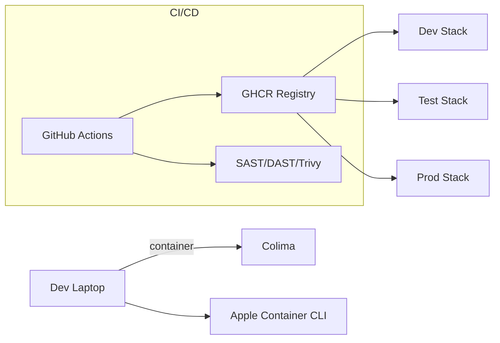

---
{}
---

# SPEC-107: Unified Runtime Parity & Deployment Standard
**Status:** Draft
**Owner:** Platform Engineering
**Last Updated:** 2025-10-11

> **Scope:** Ensure dev/test/prod parity for Node (Next.js) and Python (FastAPI) services; standardize process managers and network layout.
> **Note:** For Python web, use **uvicorn** in dev, **gunicorn + uvicorn workers** in prod.

## 1. Problem
Environment drift causes "works on my machine" and divergent debugging paths.

## 2. Standard
- **Images:** Multi-arch (linux/amd64, linux/arm64) base images pinned by digest.
- **Process managers:**
  - Python API: `gunicorn -k uvicorn.workers.UvicornWorker` in prod.
  - Node UI: `next start` behind reverse proxy (nginx or Traefik).
- **Env naming:** `ninaivalaigal-{{env}}-{{service}}` (e.g., `ninaivalaigal-dev-api`).
- **Networking:** Single overlay network per stack: `{{env}}-ninaivalaigal-net`.

## 3. Deployment Topology (Mermaid)

## 4. Health & Start Commands
- **API Prod:** `gunicorn app.main:app -w 4 -k uvicorn.workers.UvicornWorker --bind 0.0.0.0:8000`
- **UI Prod:** `next build && next start -p 3000`

## 5. Acceptance
- Same image & env files run unchanged across dev/test/prod.
- One Makefile switch to choose runtime: `RUNTIME={docker|colima|apple}`.
