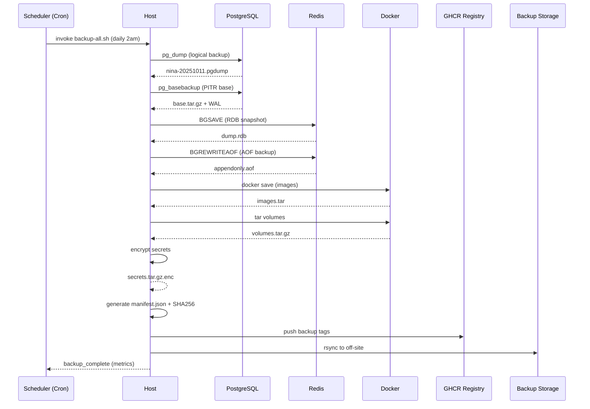
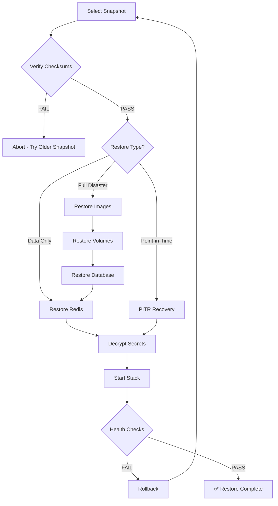

---
{}
---


# SPEC-108: Image Backup & Disaster Recovery (Enhanced)
**Status:** ⚠️ **In Progress** (Specification Complete, Implementation Pending)
**Owner:** Platform SRE
**Last Updated:** November 4, 2025 (status corrected - implementation incomplete)

> **Scope:** Automate comprehensive backups of all `ninaivalaigal-dev-*` images, critical volumes, databases, and configurations with integrity verification and proven 1-click restore.

---

## 1. Objectives
- **Nightly automated backups** with retention tiers (7 daily, 4 weekly, 3 monthly)
- **Offline zip export** for emergency restore without network
- **Point-in-time recovery (PITR)** for PostgreSQL
- **Proven restore drills** with monthly validation
- **3-2-1 backup rule**: 3 copies, 2 media types, 1 off-site

---

## 2. Backup Categories & Strategy

### 2.1 Container Images
**Strategy:** Mirror to GHCR + local tarballs

```bash
# Export all ninaivalaigal images
docker save $(docker images --filter "reference=*/ninaivalaigal-*" -q) \
  -o ninaivalaigal-images-$(date +%Y%m%d).tar

# Push to GHCR as backup tags
docker buildx imagetools inspect ghcr.io/medhasys/ninaivalaigal-api:latest \
  | docker tag - ghcr.io/medhasys/ninaivalaigal-api:backup-$(date +%Y%m%d)
```

**Manifest Generation:**
```json
{
  "backup_date": "2025-10-11T00:00:00Z",
  "images": [
    {
      "name": "ninaivalaigal-dev-api",
      "sha256": "abc123...",
      "size_mb": 512,
      "build_date": "2025-10-10"
    }
  ],
  "verification": "checksums_valid"
}
```

---

### 2.2 PostgreSQL Database (Critical Enhancement)

#### A. Logical Backups (pg_dump)
**Daily full dumps** with compression:

```bash
# Full database dump
pg_dump -U nina -h localhost -p 5432 nina \
  --format=custom \
  --compress=9 \
  --file=/backups/nina-$(date +%Y%m%d-%H%M%S).pgdump

# Schema-specific backup (graph intelligence)
pg_dump -U nina -h localhost -p 5432 nina \
  --schema=ninaivalaigal_intelligence \
  --format=custom \
  --file=/backups/nina-graph-$(date +%Y%m%d).pgdump
```

#### B. Point-in-Time Recovery (PITR)
**Continuous WAL archiving** for disaster recovery:

**postgresql.conf additions:**
```ini
# Enable WAL archiving for PITR
wal_level = replica
archive_mode = on
archive_command = 'cp %p /backups/wal_archive/%f'
archive_timeout = 300  # Force WAL switch every 5 minutes

# Retention
max_wal_size = 4GB
min_wal_size = 80MB
```

**Base backup script:**
```bash
#!/bin/bash
# /scripts/backup/pg-basebackup.sh

BACKUP_DIR="/backups/pg_basebackup/$(date +%Y%m%d-%H%M%S)"
mkdir -p "$BACKUP_DIR"

pg_basebackup -U nina -h localhost -p 5432 \
  --pgdata="$BACKUP_DIR" \
  --format=tar \
  --gzip \
  --checkpoint=fast \
  --label="ninaivalaigal_base_$(date +%Y%m%d)" \
  --progress \
  --verbose

# Create recovery metadata
cat > "$BACKUP_DIR/backup_label.json" <<EOF
{
  "backup_date": "$(date -Iseconds)",
  "database": "nina",
  "wal_position": "$(psql -U nina -d nina -t -c 'SELECT pg_current_wal_lsn()')",
  "restore_command": "cp /backups/wal_archive/%f %p"
}
EOF

echo "✅ Base backup complete: $BACKUP_DIR"
```

**PITR Restore Process:**
```bash
# 1. Stop PostgreSQL
docker stop ninaivalaigal-dev-db

# 2. Restore base backup
tar -xzf /backups/pg_basebackup/latest/base.tar.gz -C /var/lib/postgresql/data

# 3. Create recovery.signal
touch /var/lib/postgresql/data/recovery.signal

# 4. Configure recovery
cat > /var/lib/postgresql/data/postgresql.auto.conf <<EOF
restore_command = 'cp /backups/wal_archive/%f %p'
recovery_target_time = '2025-10-10 23:59:00'  # Point-in-time target
recovery_target_action = 'promote'
EOF

# 5. Start PostgreSQL (auto-recovery)
docker start ninaivalaigal-dev-db
```

---

### 2.3 Redis Persistence (New Section)

#### A. RDB Snapshots (Point-in-time)
**redis.conf:**
```conf
# Automatic RDB snapshots
save 900 1      # After 900s if at least 1 key changed
save 300 10     # After 300s if at least 10 keys changed
save 60 10000   # After 60s if at least 10000 keys changed

# Snapshot file
dbfilename ninaivalaigal-redis-dump.rdb
dir /data

# Compression
rdbcompression yes
rdbchecksum yes
```

**Manual snapshot:**
```bash
# Trigger immediate snapshot
docker exec ninaivalaigal-dev-redis redis-cli BGSAVE

# Copy snapshot
docker cp ninaivalaigal-dev-redis:/data/ninaivalaigal-redis-dump.rdb \
  /backups/redis/dump-$(date +%Y%m%d-%H%M%S).rdb
```

#### B. AOF (Append-Only File) for Durability
**redis.conf:**
```conf
# Enable AOF
appendonly yes
appendfilename "ninaivalaigal-redis.aof"

# Sync strategy (balance performance vs durability)
appendfsync everysec  # Good balance

# AOF rewrite (compression)
auto-aof-rewrite-percentage 100
auto-aof-rewrite-min-size 64mb
```

**Backup strategy:**
```bash
# Backup AOF file
docker exec ninaivalaigal-dev-redis redis-cli BGREWRITEAOF
sleep 5
docker cp ninaivalaigal-dev-redis:/data/ninaivalaigal-redis.aof \
  /backups/redis/aof-$(date +%Y%m%d-%H%M%S).aof
```

---

### 2.4 Apache AGE Graph Data (Special Consideration)

**Graph export via Cypher:**
```bash
# Export graph structure
docker exec ninaivalaigal-dev-db psql -U nina -d nina -c "
  SELECT * FROM cypher('ninaivalaigal_intelligence', \$\$
    MATCH (n)
    RETURN n
  \$\$) AS (node agtype);
" > /backups/graph/nodes-$(date +%Y%m%d).cypher

# Export edges
docker exec ninaivalaigal-dev-db psql -U nina -d nina -c "
  SELECT * FROM cypher('ninaivalaigal_intelligence', \$\$
    MATCH ()-[r]->()
    RETURN r
  \$\$) AS (edge agtype);
" > /backups/graph/edges-$(date +%Y%m%d).cypher
```

**Note:** Apache AGE data is also captured in PostgreSQL backups (pg_dump includes graph tables).

---

### 2.5 Application Volumes

**Volume snapshot via tar:**
```bash
#!/bin/bash
# Backup specific volume
VOLUME_NAME="ninaivalaigal-dev-api-data"
BACKUP_FILE="/backups/volumes/${VOLUME_NAME}-$(date +%Y%m%d).tar.gz"

docker run --rm \
  -v ${VOLUME_NAME}:/data:ro \
  -v /backups/volumes:/backup \
  busybox tar czf /backup/$(basename $BACKUP_FILE) -C /data .

echo "✅ Volume backup: $BACKUP_FILE"
```

---

### 2.6 Secrets & Configuration (Encrypted)

**KMS-encrypted config backup:**
```bash
#!/bin/bash
# Backup encrypted secrets
SECRETS_DIR="/Users/swami/WorkSpace/ninaivalaigal/.env"
BACKUP_FILE="/backups/secrets/env-$(date +%Y%m%d).tar.gz.enc"

# Encrypt with GPG (or AWS KMS, etc.)
tar czf - $SECRETS_DIR | gpg --encrypt --recipient ops@medhasys.com > $BACKUP_FILE

echo "✅ Encrypted secrets backup: $BACKUP_FILE"
```

---

## 3. Comprehensive Backup Flow



---

## 4. Restore Flow



---

## 5. Retention Policy

| Backup Type | Retention | Storage | Frequency |
|-------------|-----------|---------|-----------|
| **Container Images** | 7 daily, 4 weekly, 3 monthly | GHCR + Local | Daily |
| **PostgreSQL (pg_dump)** | 7 daily, 4 weekly, 3 monthly | Local + S3 | Daily |
| **PostgreSQL (PITR WAL)** | 14 days rolling | Local | Continuous |
| **Redis RDB** | 7 daily | Local | Daily |
| **Redis AOF** | 3 days | Local | Daily |
| **Apache AGE Graph** | 7 daily | Local | Daily |
| **Volumes** | 7 daily | Local | Daily |
| **Encrypted Secrets** | 30 days | Encrypted S3 | Weekly |

**Retention Script:**
```bash
#!/bin/bash
# Clean up old backups based on retention policy
find /backups/postgres -name "*.pgdump" -mtime +7 -delete  # Keep 7 days
find /backups/wal_archive -name "*.wal" -mtime +14 -delete # Keep 14 days PITR
find /backups/redis -name "*.rdb" -mtime +7 -delete
```

---

## 6. Makefile Commands

```makefile
# Comprehensive backup
backup-dev:
	@echo "🔄 Starting comprehensive backup..."
	@./scripts/backup/backup-all.sh dev
	@echo "✅ Backup complete: /backups/ninaivalaigal-dev-$(date +%Y%m%d).zip"

# Restore from snapshot
restore-dev:
	@echo "⚠️  WARNING: This will replace current dev environment"
	@read -p "Enter snapshot name: " SNAPSHOT && \
	./scripts/backup/restore-all.sh dev $$SNAPSHOT

# Test PITR
test-pitr:
	@./scripts/backup/test-pitr-restore.sh

# Verify backup integrity
verify-backup:
	@./scripts/backup/verify-checksums.sh $(SNAPSHOT)

# Restore drill (monthly test)
restore-drill:
	@./scripts/backup/monthly-restore-drill.sh
```

---

## 7. Acceptance Criteria

✅ **Backup**:
- [ ] `make backup-dev` produces complete backup with manifest + checksums
- [ ] PostgreSQL pg_dump successful (< 5min for dev DB)
- [ ] WAL archiving continuous (no gaps)
- [ ] Redis RDB + AOF snapshots successful
- [ ] All backups encrypted at rest
- [ ] Backup copied to off-site storage (S3/NAS)

✅ **Restore**:
- [ ] `make restore-dev SNAPSHOT=...` fully restores and passes health
- [ ] PITR recovery to arbitrary timestamp successful
- [ ] Restore time < 15min for dev environment
- [ ] All services start and pass health checks
- [ ] Data integrity verified (sample queries return expected results)

✅ **Operational**:
- [ ] Monthly restore drills documented and passing
- [ ] Backup monitoring alerts (failures notify within 5min)
- [ ] Retention policy enforced automatically
- [ ] Off-site backups replicated successfully

---

## 8. Security Considerations

### Encryption
- **At Rest**: All backups encrypted with GPG/KMS
- **In Transit**: HTTPS/TLS for off-site replication
- **Keys**: Backup encryption keys stored in secure vault (not with backups)

### Access Control
- Backup directories: `700` permissions, owned by `backup` user
- Restore operations: Require 2FA for production
- Audit logging: All backup/restore operations logged

---

## 9. Monitoring & Alerts

**Prometheus Metrics:**
```yaml
# /etc/prometheus/backup-exporter.yml
- job_name: 'backup_health'
  static_configs:
    - targets: ['localhost:9101']
  metrics_path: '/metrics'
```

**Metrics Exported:**
- `backup_duration_seconds{type="postgres|redis|images"}`
- `backup_size_bytes{type="postgres|redis|images"}`
- `backup_success{type="postgres|redis|images"}` (0/1)
- `backup_age_seconds` (time since last successful backup)

**Alerts:**
```yaml
- alert: BackupFailed
  expr: backup_success == 0
  for: 5m
  annotations:
    summary: "Backup failed for {{ $labels.type }}"

- alert: BackupTooOld
  expr: backup_age_seconds > 86400  # 24 hours
  annotations:
    summary: "No successful backup in 24h"
```

---

## 10. Disaster Recovery Runbook

### Scenario 1: Complete Data Loss (Dev Environment)
1. ✅ Select most recent backup from `/backups/` or S3
2. ✅ Verify checksums: `make verify-backup SNAPSHOT=20251011`
3. ✅ Restore: `make restore-dev SNAPSHOT=20251011`
4. ✅ Validate: Run smoke tests
5. ✅ Document: Record RTO (Recovery Time Objective) achieved

**Target RTO**: < 30 minutes

### Scenario 2: Accidental Data Deletion (Need PITR)
1. ✅ Identify exact timestamp of deletion
2. ✅ Run PITR restore: `./scripts/backup/pitr-restore.sh "2025-10-11 14:30:00"`
3. ✅ Verify: Check that deleted data is restored
4. ✅ Promote: Bring database online

**Target RPO**: < 5 minutes (WAL archive interval)

---

## 11. Implementation Checklist

- [ ] Install backup scripts in `/scripts/backup/`
- [ ] Configure PostgreSQL WAL archiving
- [ ] Configure Redis RDB + AOF persistence
- [ ] Set up cron jobs for automated backups
- [ ] Configure S3/NAS for off-site replication
- [ ] Set up backup monitoring and alerts
- [ ] Document restore procedures
- [ ] **Conduct first restore drill**
- [ ] Schedule monthly restore drills
- [ ] Update runbooks with actual RTO/RPO metrics

---

## 12. References

- PostgreSQL PITR: https://www.postgresql.org/docs/15/continuous-archiving.html
- Redis Persistence: https://redis.io/docs/management/persistence/
- 3-2-1 Backup Rule: https://www.backblaze.com/blog/the-3-2-1-backup-strategy/
- Apache AGE Backup: https://age.apache.org/

---

**Enhancements Added (Oct 11, 2025):**
- ✅ PostgreSQL PITR with WAL archiving (specification)
- ✅ Redis RDB + AOF persistence strategy (specification)
- ✅ Apache AGE graph export procedures (specification)
- ✅ Encrypted secrets backup (specification)
- ✅ Off-site replication (3-2-1 rule) (specification)
- ✅ Comprehensive monitoring and alerting (specification)
- ✅ Disaster recovery runbook with RTO/RPO targets (specification)

**Implementation Status (Nov 4, 2025):**
- ⚠️ **Implementation Incomplete** - Validation showed missing implementation items
- ✅ Basic backup scripts exist (`backup-db.sh`, `restore-db.sh`)
- ❌ Missing: `/scripts/backup/` directory structure
- ❌ Missing: PostgreSQL WAL archiving configuration
- ❌ Missing: Redis RDB/AOF persistence scripts
- ❌ Missing: Comprehensive `backup-all.sh` script
- ❌ Missing: PITR restore scripts
- ❌ Missing: Automated cron jobs
- ❌ Missing: Off-site replication
- ❌ Missing: Backup monitoring/alerts
- ❌ Missing: Restore drills

**Implementation Stories Created (Nov 4, 2025):**
- **US#683**: Install backup scripts in /scripts/backup/ directory
- **US#684**: Configure PostgreSQL WAL archiving for PITR
- **US#685**: Create pg_basebackup.sh script for PITR base backups
- **US#686**: Configure Redis RDB + AOF persistence
- **US#687**: Create comprehensive backup-all.sh script
- **US#688**: Set up cron jobs for automated backups
- **US#689**: Configure S3/NAS for off-site replication
- **US#690**: Set up backup monitoring and alerts
- **US#691**: Create comprehensive restore-all.sh script
- **US#692**: Conduct first restore drill and document RTO/RPO

All stories assigned to Developer C and tagged with `spec-108`.
