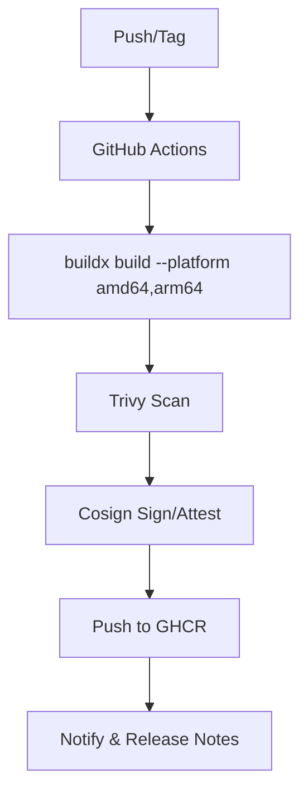

# SPEC-110: Release Workflow — Multi-Arch Build & Publish to GHCR
**Status:** Draft
**Owner:** CI/CD Engineering
**Last Updated:** 2025-10-11

> **Goal:** Build, scan, sign, and publish multi-arch images to GHCR using GitHub Actions with deterministic tags.

## 1. Pipeline Stages
1. Checkout & QEMU setup
2. Buildx multi-arch build (amd64 + arm64)
3. Trivy scan (fail on HIGH/CRITICAL)
4. Cosign sign & attest (SBOM via syft)
5. Push to GHCR with tags from SPEC-109

## 2. Mermaid: GH Actions Overview

## 3. Required Secrets
- `GHCR_PAT` (packages:write, packages:read, repo:read)
- `COSIGN_KEY` or keyless fulcio
- `ACTIONS_DEPLOY_KEY` (optional for docs)

## 4. Acceptance
- `:latest` only on protected branch; PRs produce `:dev` + `:sha-*` tags.
- Release notes include image digests per arch.
