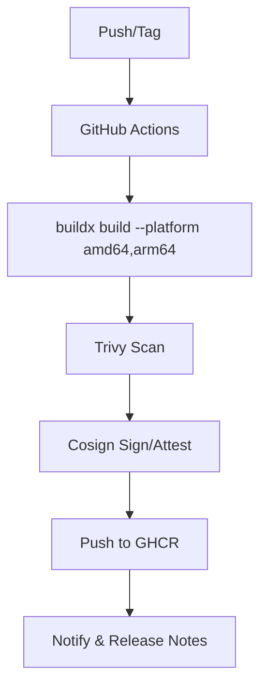

# SPEC-110: Release Workflow — Multi-Arch Build & Publish to GHCR
**Status:** ⚠️ **In Progress** (Partially Implemented)
**Owner:** CI/CD Engineering
**Last Updated:** November 4, 2025 (validation and stories created)

> **Goal:** Build, scan, sign, and publish multi-arch images to GHCR using GitHub Actions with deterministic tags.

## 1. Pipeline Stages
1. Checkout & QEMU setup
2. Buildx multi-arch build (amd64 + arm64)
3. Trivy scan (fail on HIGH/CRITICAL)
4. Cosign sign & attest (SBOM via syft)
5. Push to GHCR with tags from SPEC-109

## 2. Mermaid: GH Actions Overview

## 3. Required Secrets
- `GHCR_PAT` (packages:write, packages:read, repo:read)
- `COSIGN_KEY` or keyless fulcio
- `ACTIONS_DEPLOY_KEY` (optional for docs)

## 4. Acceptance
- `:latest` only on protected branch; PRs produce `:dev` + `:sha-*` tags.
- Release notes include image digests per arch.

## 5. Implementation Status

**Partially Implemented (Nov 4, 2025):**
- ✅ Checkout & QEMU setup - **WORKING**
- ✅ Buildx multi-arch build (amd64 + arm64) - **WORKING**
- ✅ Push to GHCR - **WORKING**
- ✅ Release notes generation - **WORKING**
- ❌ Trivy scan (fail on HIGH/CRITICAL) - **MISSING**
- ❌ Cosign sign & attest (SBOM via syft) - **MISSING**
- ⚠️ Tags from SPEC-109 - **PARTIAL** (using ref_name, not full SPEC-109 tags)

**Note:** Workflow exists at `.github/workflows/release-containers.yml` but missing security scanning and signing.

## 6. Implementation Stories

The following Taiga stories have been created to complete SPEC-110 implementation:

- **US#700**: Add Trivy security scanning to release workflow
- **US#701**: Add Cosign signing and SBOM attestation to release workflow
- **US#702**: Update release workflow to use SPEC-109 tagging conventions
- **US#703**: Enhance release notes with image digests per architecture

All stories are tagged with `spec-110` and assigned to Developer C (ID: 8).
