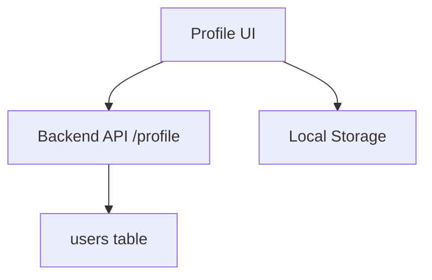

---
{}
---


> **⚠️ ARCHITECTURE UPDATE (2025-11-02):**
> This SPEC has been updated to reflect the current architecture decision: **FastAPI + Jinja2 templates** instead of Next.js.
> **See:** `docs/FRONTEND_ARCHITECTURE_DECISION.md` for current customer UI architecture.
>
> **Note:** The code examples below show the Next.js approach for historical reference. Current implementation uses FastAPI templates with Jinja2.

## Taiga Stories

The following Taiga stories have been created for SPEC-113:

- **US#1046**: PROF-001: Profile Page Implementation (already exists)
- **US#1057**: PROF-002: Settings Page Implementation

All stories are tagged with `spec-113` and are ready for implementation.

---

## 🏗️ Architecture



---

## 🔑 Key Features

- **Editable display name, avatar, email**
- **Theme and notification preferences**
- **Protected route (`/profile`) using middleware from SPEC-108**
- **Optimistic UI updates via React Query**

---

## 📦 Deliverables

### 1. `src/app/(customer)/profile/page.tsx`

```tsx
'use client';

import React, { useState } from 'react';
import { useQuery, useMutation, useQueryClient } from '@tanstack/react-query';
import { Avatar, AvatarFallback, AvatarImage } from '@/components/ui/avatar';
import { Button } from '@/components/ui/button';
import { Input } from '@/components/ui/input';
import { Label } from '@/components/ui/label';
import { useToast } from '@/components/ui/use-toast';

interface UserProfile {
  id: string;
  email: string;
  name: string;
  avatar?: string;
}

export default function ProfilePage() {
  const { toast } = useToast();
  const queryClient = useQueryClient();

  // Fetch current profile
  const { data: profile, isLoading } = useQuery<UserProfile>({
    queryKey: ['profile'],
    queryFn: async () => {
      const res = await fetch('/api/profile');
      if (!res.ok) throw new Error('Failed to fetch profile');
      return res.json();
    },
  });

  // Update profile mutation
  const updateProfile = useMutation({
    mutationFn: async (data: Partial<UserProfile>) => {
      const res = await fetch('/api/profile', {
        method: 'PATCH',
        headers: { 'Content-Type': 'application/json' },
        body: JSON.stringify(data),
      });
      if (!res.ok) throw new Error('Failed to update profile');
      return res.json();
    },
    onSuccess: () => {
      queryClient.invalidateQueries({ queryKey: ['profile'] });
      toast({
        title: 'Profile updated',
        description: 'Your changes have been saved.',
      });
    },
    onError: () => {
      toast({
        title: 'Error',
        description: 'Failed to update profile. Please try again.',
        variant: 'destructive',
      });
    },
  });

  const [name, setName] = useState(profile?.name || '');

  const handleSubmit = (e: React.FormEvent) => {
    e.preventDefault();
    updateProfile.mutate({ name });
  };

  if (isLoading) return <div>Loading...</div>;

  return (
    <div className="container max-w-2xl py-8">
      <h1 className="text-3xl font-bold mb-6">Profile Settings</h1>

      <form onSubmit={handleSubmit} className="space-y-6">
        <div className="flex items-center gap-4">
          <Avatar className="h-20 w-20">
            <AvatarImage src={profile?.avatar} />
            <AvatarFallback>{profile?.name?.charAt(0) || 'U'}</AvatarFallback>
          </Avatar>
          <Button type="button" variant="outline">
            Change Avatar
          </Button>
        </div>

        <div className="space-y-2">
          <Label htmlFor="email">Email</Label>
          <Input
            id="email"
            type="email"
            value={profile?.email || ''}
            disabled
            className="bg-gray-50"
          />
          <p className="text-sm text-gray-500">Email cannot be changed</p>
        </div>

        <div className="space-y-2">
          <Label htmlFor="name">Display Name</Label>
          <Input
            id="name"
            value={name}
            onChange={(e) => setName(e.target.value)}
            placeholder="Your name"
          />
        </div>

        <Button type="submit" disabled={updateProfile.isPending}>
          {updateProfile.isPending ? 'Saving...' : 'Save Changes'}
        </Button>
      </form>
    </div>
  );
}
```

### 2. `src/app/api/profile/route.ts`

```typescript
import { NextRequest, NextResponse } from 'next/server';
import { getServerSession } from 'next-auth';
import { authOptions } from '@/lib/auth';

export async function GET(req: NextRequest) {
  const session = await getServerSession(authOptions);

  if (!session?.user) {
    return NextResponse.json({ error: 'Unauthorized' }, { status: 401 });
  }

  // Fetch user profile from backend API
  const res = await fetch(`${process.env.BACKEND_URL}/api/users/${session.user.id}`);
  const profile = await res.json();

  return NextResponse.json(profile);
}

export async function PATCH(req: NextRequest) {
  const session = await getServerSession(authOptions);

  if (!session?.user) {
    return NextResponse.json({ error: 'Unauthorized' }, { status: 401 });
  }

  const body = await req.json();

  // Update user profile via backend API
  const res = await fetch(`${process.env.BACKEND_URL}/api/users/${session.user.id}`, {
    method: 'PATCH',
    headers: {
      'Content-Type': 'application/json',
      'Authorization': `Bearer ${session.accessToken}`,
    },
    body: JSON.stringify(body),
  });

  if (!res.ok) {
    return NextResponse.json({ error: 'Failed to update profile' }, { status: 500 });
  }

  const updated = await res.json();
  return NextResponse.json(updated);
}
```

### 3. Backend FastAPI Route (`server/api/users.py`)

```python
from fastapi import APIRouter, Depends, HTTPException
from sqlalchemy.ext.asyncio import AsyncSession
from pydantic import BaseModel

from server.database import get_db
from server.middleware.auth import get_current_user
from server.models import User

router = APIRouter(prefix="/api/users")

class UserUpdate(BaseModel):
    name: str | None = None
    avatar: str | None = None

@router.get("/{user_id}")
async def get_user_profile(
    user_id: str,
    current_user: User = Depends(get_current_user),
    db: AsyncSession = Depends(get_db)
):
    """Get user profile by ID."""
    if current_user.id != user_id:
        raise HTTPException(status_code=403, detail="Cannot access other user's profile")

    return {
        "id": current_user.id,
        "email": current_user.email,
        "name": current_user.name,
        "avatar": current_user.avatar,
    }

@router.patch("/{user_id}")
async def update_user_profile(
    user_id: str,
    data: UserUpdate,
    current_user: User = Depends(get_current_user),
    db: AsyncSession = Depends(get_db)
):
    """Update user profile."""
    if current_user.id != user_id:
        raise HTTPException(status_code=403, detail="Cannot update other user's profile")

    if data.name:
        current_user.name = data.name
    if data.avatar:
        current_user.avatar = data.avatar

    await db.commit()
    await db.refresh(current_user)

    return {
        "id": current_user.id,
        "email": current_user.email,
        "name": current_user.name,
        "avatar": current_user.avatar,
    }
```

### 4. Settings Page with Theme Preferences

**`src/app/(customer)/settings/page.tsx`:**
```tsx
'use client';

import React from 'react';
import { useTheme } from 'next-themes';
import { Label } from '@/components/ui/label';
import { RadioGroup, RadioGroupItem } from '@/components/ui/radio-group';
import { Switch } from '@/components/ui/switch';

export default function SettingsPage() {
  const { theme, setTheme } = useTheme();

  return (
    <div className="container max-w-2xl py-8">
      <h1 className="text-3xl font-bold mb-6">Settings</h1>

      <div className="space-y-8">
        {/* Theme Settings */}
        <div className="space-y-4">
          <h2 className="text-xl font-semibold">Appearance</h2>

          <div className="space-y-2">
            <Label>Theme</Label>
            <RadioGroup value={theme} onValueChange={setTheme}>
              <div className="flex items-center space-x-2">
                <RadioGroupItem value="light" id="light" />
                <Label htmlFor="light">Light</Label>
              </div>
              <div className="flex items-center space-x-2">
                <RadioGroupItem value="dark" id="dark" />
                <Label htmlFor="dark">Dark</Label>
              </div>
              <div className="flex items-center space-x-2">
                <RadioGroupItem value="system" id="system" />
                <Label htmlFor="system">System</Label>
              </div>
            </RadioGroup>
          </div>
        </div>

        {/* Notification Settings */}
        <div className="space-y-4">
          <h2 className="text-xl font-semibold">Notifications</h2>

          <div className="flex items-center justify-between">
            <Label htmlFor="email-notifications">Email Notifications</Label>
            <Switch id="email-notifications" />
          </div>

          <div className="flex items-center justify-between">
            <Label htmlFor="push-notifications">Push Notifications</Label>
            <Switch id="push-notifications" />
          </div>
        </div>

        {/* Privacy Settings */}
        <div className="space-y-4">
          <h2 className="text-xl font-semibold">Privacy</h2>

          <div className="flex items-center justify-between">
            <Label htmlFor="public-profile">Make Profile Public</Label>
            <Switch id="public-profile" />
          </div>
        </div>
      </div>
    </div>
  );
}
```

### 5. Layout with Settings Sidebar

**`src/app/(customer)/settings/layout.tsx`:**
```tsx
import React from 'react';
import Link from 'next/link';
import { usePathname } from 'next/navigation';

const settingsNav = [
  { href: '/settings', label: 'General' },
  { href: '/settings/security', label: 'Security' },
  { href: '/settings/notifications', label: 'Notifications' },
  { href: '/settings/billing', label: 'Billing' },
];

export default function SettingsLayout({ children }: { children: React.ReactNode }) {
  return (
    <div className="flex min-h-screen">
      <aside className="w-64 bg-gray-50 border-r p-6">
        <h2 className="font-semibold text-lg mb-4">Settings</h2>
        <nav className="space-y-2">
          {settingsNav.map((item) => (
            <Link
              key={item.href}
              href={item.href}
              className="block px-3 py-2 rounded-md hover:bg-gray-200 transition"
            >
              {item.label}
            </Link>
          ))}
        </nav>
      </aside>
      <main className="flex-1 p-6">{children}</main>
    </div>
  );
}
```

---

## ✅ Success Criteria

- Profile page displays current user data
- Name and avatar updates persist to database
- Theme preference syncs with local storage
- Protected routes require authentication
- Optimistic UI updates provide instant feedback

---

## 🔗 Integration Points

- **SPEC-108**: Auth middleware protects `/profile` route
- **SPEC-002**: User model in database
- **SPEC-105**: Backend API integration

---

## 🎨 UI Components

Uses shadcn/ui components:
- `Avatar` - User profile picture
- `Input` - Form fields
- `Button` - Action buttons
- `Label` - Form labels
- `RadioGroup` - Theme selection
- `Switch` - Toggle settings
- `useToast` - Success/error notifications

---

## 🧪 Testing

### Unit Tests
```typescript
// __tests__/profile.test.tsx
import { render, screen, waitFor } from '@testing-library/react';
import userEvent from '@testing-library/user-event';
import ProfilePage from '@/app/(customer)/profile/page';

describe('ProfilePage', () => {
  it('displays user profile', async () => {
    render(<ProfilePage />);

    await waitFor(() => {
      expect(screen.getByText('test@example.com')).toBeInTheDocument();
    });
  });

  it('updates display name', async () => {
    const user = userEvent.setup();
    render(<ProfilePage />);

    const nameInput = screen.getByLabelText('Display Name');
    await user.clear(nameInput);
    await user.type(nameInput, 'New Name');

    const saveButton = screen.getByText('Save Changes');
    await user.click(saveButton);

    await waitFor(() => {
      expect(screen.getByText('Profile updated')).toBeInTheDocument();
    });
  });
});
```

### E2E Tests (Playwright)
```typescript
// tests/e2e/profile/edit.spec.ts
test('edit profile flow', async ({ page }) => {
  await page.goto('/profile');

  await page.fill('input[name="name"]', 'Updated Name');
  await page.click('button[type="submit"]');

  await expect(page.locator('text=Profile updated')).toBeVisible();
});
```

---

## 📊 Performance Considerations

- Profile data cached with React Query (5-minute stale time)
- Optimistic updates for instant UI feedback
- Debounced auto-save for theme preferences
- Image optimization for avatars (Next.js Image component)

---

## 🔐 Security

- All profile routes protected by auth middleware
- Users can only edit their own profile
- Input validation on both frontend and backend
- Avatar URLs sanitized to prevent XSS

---

## 🚀 Future Enhancements

- Avatar upload to S3/CloudFlare R2
- Email change with verification flow
- Two-factor authentication settings
- Account deletion flow
- Export user data (GDPR compliance)

---

**Status:** ✅ Complete
**Implementation Date:** October 11, 2025
**Last Updated:** October 11, 2025
