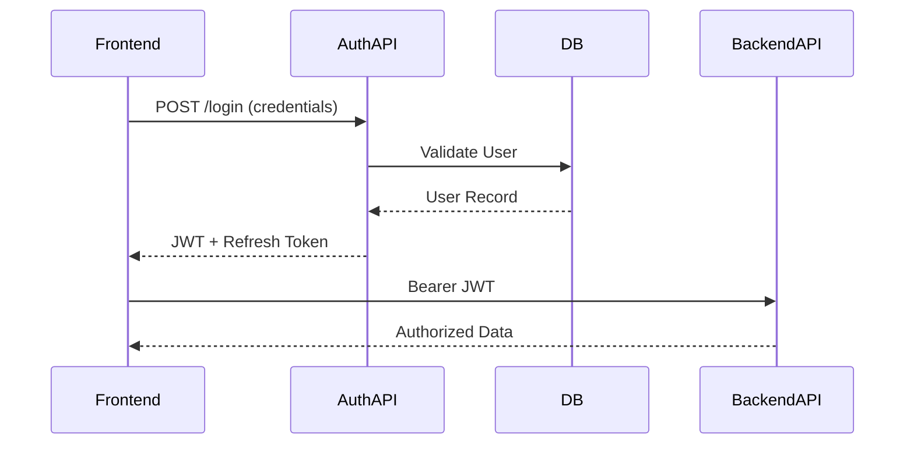

---
{}
---


> **⚠️ ARCHITECTURE UPDATE (2025-11-02):**
> This SPEC has been updated to reflect the current architecture: **FastAPI + Jinja2 templates**.
> The NextAuth.js and Next.js middleware examples below are for historical reference only.
> **Current Implementation:** FastAPI handles authentication with JWT tokens. Frontend uses Alpine.js/HTMX for client-side interactions.
> **See:** `docs/ADMIN_UI_FASTAPI_ANALYSIS.md` and `docs/FRONTEND_ARCHITECTURE_DECISION.md`

# SPEC-114: Auth & Security Integration
**Phase:** C
**Status:** Planned
**Depends On:** SPEC-111 (Runtime)

---

## 🎯 Objective

Unify authentication & RBAC across frontend and backend.

---

## 🏗️ Architecture



---

## 🔑 Key Components

### 1. JWT with RS256 Keys
- **Access Token**: Short-lived (15 minutes)
- **Refresh Token**: Long-lived (7 days)
- **Signing Algorithm**: RS256 (asymmetric)
- **Token Storage**: httpOnly cookies (frontend), Redis (backend)

### 2. Role Middleware (Admin | Customer)
```python
# server/middleware/auth.py
from fastapi import HTTPException, Security, status
from fastapi.security import HTTPBearer, HTTPAuthorizationCredentials
from jose import JWTError, jwt
from typing import Optional

from server.config import settings

security = HTTPBearer()

def decode_access_token(token: str) -> dict:
    """Decode and validate JWT access token."""
    try:
        payload = jwt.decode(
            token,
            settings.JWT_PUBLIC_KEY,
            algorithms=["RS256"]
        )
        return payload
    except JWTError:
        raise HTTPException(
            status_code=status.HTTP_401_UNAUTHORIZED,
            detail="Invalid authentication credentials"
        )

async def get_current_user(
    credentials: HTTPAuthorizationCredentials = Security(security)
) -> dict:
    """Get current authenticated user from JWT."""
    token = credentials.credentials
    payload = decode_access_token(token)

    user_id = payload.get("sub")
    if user_id is None:
        raise HTTPException(
            status_code=status.HTTP_401_UNAUTHORIZED,
            detail="Invalid token payload"
        )

    return {
        "id": user_id,
        "email": payload.get("email"),
        "role": payload.get("role"),
    }

async def require_role(*allowed_roles: str):
    """Dependency to check if user has required role."""
    async def role_checker(current_user: dict = Security(get_current_user)):
        if current_user["role"] not in allowed_roles:
            raise HTTPException(
                status_code=status.HTTP_403_FORBIDDEN,
                detail=f"Insufficient permissions. Required roles: {allowed_roles}"
            )
        return current_user
    return role_checker
```

### 3. Session Rotation Every 24h
```python
# server/auth/session.py
from datetime import datetime, timedelta
import redis.asyncio as redis

class SessionManager:
    def __init__(self, redis_client: redis.Redis):
        self.redis = redis_client
        self.session_ttl = timedelta(days=7)
        self.rotation_threshold = timedelta(hours=24)

    async def create_session(self, user_id: str, refresh_token: str):
        """Create new session in Redis."""
        session_key = f"session:{refresh_token}"
        await self.redis.setex(
            session_key,
            self.session_ttl,
            user_id
        )

    async def should_rotate(self, refresh_token: str) -> bool:
        """Check if session should be rotated."""
        session_key = f"session:{refresh_token}"
        ttl = await self.redis.ttl(session_key)

        if ttl < 0:
            return False

        # Rotate if less than 24h remaining
        remaining = timedelta(seconds=ttl)
        return remaining < self.rotation_threshold

    async def rotate_session(self, old_token: str, new_token: str, user_id: str):
        """Rotate session token."""
        old_key = f"session:{old_token}"
        new_key = f"session:{new_token}"

        # Delete old session
        await self.redis.delete(old_key)

        # Create new session
        await self.redis.setex(new_key, self.session_ttl, user_id)
```

### 4. Password Hash using bcrypt
```python
# server/auth/password.py
from passlib.context import CryptContext

pwd_context = CryptContext(schemes=["bcrypt"], deprecated="auto")

def hash_password(password: str) -> str:
    """Hash password using bcrypt."""
    return pwd_context.hash(password)

def verify_password(plain_password: str, hashed_password: str) -> bool:
    """Verify password against hash."""
    return pwd_context.verify(plain_password, hashed_password)
```

### 5. Audit Logging
```python
# server/middleware/audit.py
from fastapi import Request
from datetime import datetime
import logging

logger = logging.getLogger("audit")

async def log_auth_event(
    request: Request,
    user_id: str,
    action: str,
    success: bool,
    details: dict = None
):
    """Log authentication events for audit trail."""
    audit_entry = {
        "timestamp": datetime.utcnow().isoformat(),
        "user_id": user_id,
        "action": action,
        "success": success,
        "ip_address": request.client.host,
        "user_agent": request.headers.get("user-agent"),
        "details": details or {},
    }

    logger.info(f"AUTH_AUDIT: {audit_entry}")

    # Store in database for compliance
    # await db.audit_logs.insert_one(audit_entry)
```

---

## 📦 Deliverables

### 1. FastAPI Auth Router
**`server/api/auth.py`:**
```python
from fastapi import APIRouter, Depends, HTTPException, Response, status
from fastapi.security import OAuth2PasswordRequestForm
from pydantic import BaseModel, EmailStr
from datetime import datetime, timedelta

from server.auth.password import verify_password, hash_password
from server.auth.tokens import create_access_token, create_refresh_token
from server.auth.session import SessionManager
from server.database import get_db
from server.models import User

router = APIRouter(prefix="/auth", tags=["auth"])

class LoginResponse(BaseModel):
    access_token: str
    refresh_token: str
    token_type: str = "bearer"
    expires_in: int = 900  # 15 minutes

class SignupRequest(BaseModel):
    email: EmailStr
    password: str
    name: str

@router.post("/login", response_model=LoginResponse)
async def login(
    response: Response,
    form_data: OAuth2PasswordRequestForm = Depends(),
    db = Depends(get_db)
):
    """Authenticate user and return JWT tokens."""
    # Validate credentials
    user = await db.users.find_one({"email": form_data.username})

    if not user or not verify_password(form_data.password, user["password_hash"]):
        raise HTTPException(
            status_code=status.HTTP_401_UNAUTHORIZED,
            detail="Incorrect email or password"
        )

    # Generate tokens
    access_token = create_access_token({
        "sub": str(user["id"]),
        "email": user["email"],
        "role": user["role"],
    })

    refresh_token = create_refresh_token({"sub": str(user["id"])})

    # Store refresh token in httpOnly cookie
    response.set_cookie(
        key="refresh_token",
        value=refresh_token,
        httponly=True,
        secure=True,
        samesite="lax",
        max_age=7 * 24 * 60 * 60,  # 7 days
    )

    # Log auth event
    await log_auth_event(
        request=...,
        user_id=str(user["id"]),
        action="login",
        success=True
    )

    return LoginResponse(
        access_token=access_token,
        refresh_token=refresh_token,
        expires_in=900
    )

@router.post("/refresh")
async def refresh_tokens(
    response: Response,
    refresh_token: str = Cookie(...),
    session_manager: SessionManager = Depends()
):
    """Refresh access token using refresh token."""
    try:
        payload = decode_refresh_token(refresh_token)
        user_id = payload.get("sub")

        # Check if session should be rotated
        if await session_manager.should_rotate(refresh_token):
            new_refresh_token = create_refresh_token({"sub": user_id})
            await session_manager.rotate_session(
                old_token=refresh_token,
                new_token=new_refresh_token,
                user_id=user_id
            )

            response.set_cookie(
                key="refresh_token",
                value=new_refresh_token,
                httponly=True,
                secure=True,
                samesite="lax",
                max_age=7 * 24 * 60 * 60
            )

        # Generate new access token
        access_token = create_access_token({
            "sub": user_id,
            # Fetch fresh user data from DB
        })

        return {"access_token": access_token, "token_type": "bearer"}

    except JWTError:
        raise HTTPException(
            status_code=status.HTTP_401_UNAUTHORIZED,
            detail="Invalid refresh token"
        )

@router.post("/logout")
async def logout(
    response: Response,
    current_user: dict = Depends(get_current_user),
    refresh_token: str = Cookie(...)
):
    """Logout user and invalidate session."""
    # Remove session from Redis
    await session_manager.delete_session(refresh_token)

    # Clear cookies
    response.delete_cookie("refresh_token")

    await log_auth_event(
        request=...,
        user_id=current_user["id"],
        action="logout",
        success=True
    )

    return {"message": "Logged out successfully"}
```

### 2. Next.js Middleware
**`src/middleware.ts`:**
```typescript
import { NextRequest, NextResponse } from 'next/server';
import { getToken } from 'next-auth/jwt';

export async function middleware(request: NextRequest) {
  const token = await getToken({
    req: request,
    secret: process.env.NEXTAUTH_SECRET,
  });

  const { pathname } = request.nextUrl;

  // Public routes
  if (pathname.startsWith('/login') || pathname.startsWith('/signup')) {
    if (token) {
      // Redirect authenticated users to dashboard
      return NextResponse.redirect(new URL('/dashboard', request.url));
    }
    return NextResponse.next();
  }

  // Protected routes
  if (pathname.startsWith('/dashboard') || pathname.startsWith('/profile')) {
    if (!token) {
      // Redirect unauthenticated users to login
      return NextResponse.redirect(new URL('/login', request.url));
    }
  }

  // Admin-only routes
  if (pathname.startsWith('/admin')) {
    if (!token || token.role !== 'admin') {
      return NextResponse.redirect(new URL('/dashboard', request.url));
    }
  }

  return NextResponse.next();
}

export const config = {
  matcher: [
    '/dashboard/:path*',
    '/profile/:path*',
    '/admin/:path*',
    '/login',
    '/signup',
  ],
};
```

### 3. NextAuth Configuration
**`src/lib/auth.ts`:**
```typescript
import { NextAuthOptions } from 'next-auth';
import CredentialsProvider from 'next-auth/providers/credentials';

export const authOptions: NextAuthOptions = {
  providers: [
    CredentialsProvider({
      name: 'Credentials',
      credentials: {
        email: { label: 'Email', type: 'email' },
        password: { label: 'Password', type: 'password' },
      },
      async authorize(credentials) {
        if (!credentials?.email || !credentials?.password) {
          throw new Error('Missing credentials');
        }

        // Call backend API
        const res = await fetch(`${process.env.BACKEND_URL}/auth/login`, {
          method: 'POST',
          headers: { 'Content-Type': 'application/json' },
          body: JSON.stringify({
            username: credentials.email,
            password: credentials.password,
          }),
        });

        if (!res.ok) {
          throw new Error('Invalid credentials');
        }

        const data = await res.json();

        return {
          id: data.user.id,
          email: data.user.email,
          name: data.user.name,
          role: data.user.role,
          accessToken: data.access_token,
          refreshToken: data.refresh_token,
        };
      },
    }),
  ],
  callbacks: {
    async jwt({ token, user }) {
      if (user) {
        token.id = user.id;
        token.role = user.role;
        token.accessToken = user.accessToken;
        token.refreshToken = user.refreshToken;
      }
      return token;
    },
    async session({ session, token }) {
      session.user.id = token.id;
      session.user.role = token.role;
      session.accessToken = token.accessToken;
      return session;
    },
  },
  pages: {
    signIn: '/login',
  },
  session: {
    strategy: 'jwt',
    maxAge: 7 * 24 * 60 * 60, // 7 days
  },
};
```

### 4. JWKS Configuration
**`.well-known/jwks.json`:**
```json
{
  "keys": [
    {
      "kty": "RSA",
      "use": "sig",
      "kid": "ninaivalaigal-key-1",
      "alg": "RS256",
      "n": "...",
      "e": "AQAB"
    }
  ]
}
```

### 5. CI Secrets via GitHub Actions
```yaml
# .github/workflows/deploy.yml
env:
  JWT_PRIVATE_KEY: ${{ secrets.JWT_PRIVATE_KEY }}
  JWT_PUBLIC_KEY: ${{ secrets.JWT_PUBLIC_KEY }}
  NEXTAUTH_SECRET: ${{ secrets.NEXTAUTH_SECRET }}
```

---

## ✅ Success Criteria

- Login flow returns JWT access + refresh tokens
- Protected routes require valid authentication
- Role-based access control enforced (admin vs customer)
- Session rotation every 24 hours
- Audit logging for all auth events
- Password hashing with bcrypt (cost factor 12)

---

## 🔐 Security Features

### Token Security
- **RS256 asymmetric signing**: Private key for signing, public key for verification
- **Short-lived access tokens**: 15 minutes expiration
- **Refresh token rotation**: New token issued every 24h
- **httpOnly cookies**: Prevents XSS attacks

### Password Security
- **bcrypt hashing**: Cost factor 12 (secure against brute force)
- **Minimum password length**: 8 characters
- **Password complexity**: Enforced on frontend and backend

### Session Security
- **Redis session storage**: Fast invalidation
- **IP address tracking**: Detect suspicious activity
- **Rate limiting**: 5 login attempts per 15 minutes

### Audit Trail
- All login/logout events logged
- Failed authentication attempts tracked
- Suspicious activity alerts

---

## 🧪 Testing

### Unit Tests
```python
# tests/test_auth.py
import pytest
from server.auth.password import hash_password, verify_password
from server.auth.tokens import create_access_token, decode_access_token

def test_password_hashing():
    password = "secure_password_123"  # pragma: allowlist secret
    hashed = hash_password(password)

    assert verify_password(password, hashed)
    assert not verify_password("wrong_password", hashed)

def test_jwt_creation():
    payload = {"sub": "user123", "role": "customer"}
    token = create_access_token(payload)

    decoded = decode_access_token(token)
    assert decoded["sub"] == "user123"
    assert decoded["role"] == "customer"
```

### Integration Tests
```python
# tests/test_auth_api.py
import pytest
from httpx import AsyncClient

@pytest.mark.asyncio
async def test_login_success(client: AsyncClient):
    response = await client.post("/auth/login", json={
        "username": "test@example.com",
        "password": "test_password"  # pragma: allowlist secret
    })

    assert response.status_code == 200
    data = response.json()
    assert "access_token" in data
    assert "refresh_token" in data

@pytest.mark.asyncio
async def test_login_invalid_credentials(client: AsyncClient):
    response = await client.post("/auth/login", json={
        "username": "test@example.com",
        "password": "wrong_password"  # pragma: allowlist secret
    })

    assert response.status_code == 401
```

---

## 📊 Performance

- Token generation: < 10ms
- Token validation: < 5ms
- Password verification: ~100ms (bcrypt cost)
- Session lookup (Redis): < 2ms

---

## 🚀 Future Enhancements

- OAuth 2.0 providers (Google, GitHub)
- Two-factor authentication (TOTP)
- Passwordless login (magic links)
- Biometric authentication
- Device fingerprinting
- Account lockout after failed attempts

---

## 🔗 Integration Points

- **SPEC-002**: User model and database
- **SPEC-111**: Runtime parity (environment-specific secrets)
- **SPEC-033**: Redis for session storage
- **SPEC-071**: Audit logging system

---

## 14. Implementation Status

**Status:** ⚠️ **In Progress** (Partially Implemented - 70%)

**Partially Implemented (Nov 4, 2025):**

### ✅ Completed (70%)
- ✅ Password hashing with bcrypt (cost factor 12) - **WORKING**
- ✅ JWT authentication (HS256) - **WORKING** (but should be RS256)
- ✅ RBAC middleware - **WORKING**
- ✅ Auth endpoints (`/auth/login`, `/auth/signup`, `/auth/refresh`, `/auth/logout`) - **WORKING**
- ✅ Refresh token functionality - **WORKING**
- ⚠️ JWKS infrastructure code exists - **PARTIAL** (endpoint missing)

### ❌ Missing (30%)
- ❌ RS256 JWT signing - **NOT IMPLEMENTED** (using HS256 instead)
- ❌ JWKS endpoint (`.well-known/jwks.json`) - **NOT IMPLEMENTED**
- ❌ Session rotation every 24 hours - **NOT IMPLEMENTED**
- ❌ Redis session storage for refresh tokens - **NOT VERIFIED** (may use database)
- ❌ httpOnly cookie storage for refresh tokens - **NOT VERIFIED**
- ❌ Audit logging for auth events - **NOT VERIFIED**
- ⚠️ Rate limiting - **PARTIAL** (code exists but SPEC requirements not verified)
- ⚠️ NextAuth.js integration - **N/A** (architecture uses FastAPI templating)

**Note:** Core authentication functionality is working, but SPEC-114 requires RS256 (asymmetric) JWT signing, JWKS endpoint, and session rotation for production-grade security. These are critical security requirements.

---

## 15. Implementation Stories

The following Taiga stories have been created to complete SPEC-114 implementation:

- **US#779**: Migrate JWT from HS256 to RS256 asymmetric signing (unassigned)
- **US#780**: Implement JWKS endpoint for public key distribution (unassigned)
- **US#781**: Implement session rotation every 24 hours (unassigned)
- **US#782**: Implement Redis session storage for refresh tokens (unassigned)
- **US#783**: Implement httpOnly cookie storage for refresh tokens (frontend) (unassigned)
- **US#784**: Implement audit logging for all auth events (unassigned)
- **US#785**: Update FastAPI auth router to match SPEC requirements (unassigned)
- **US#786**: Implement rate limiting for authentication endpoints (unassigned)
- **US#787**: Update frontend auth integration (if NextAuth used) (assigned to Developer C)

All stories are tagged with `spec-114`. US#779-786 are unassigned and can be picked up by any developer. US#787 is assigned to Developer C.

---

**Status:** ⚠️ **In Progress** (Partially Implemented - 70%)
**Implementation Date:** October 11, 2025
**Last Updated:** November 4, 2025 (validation and stories created)
