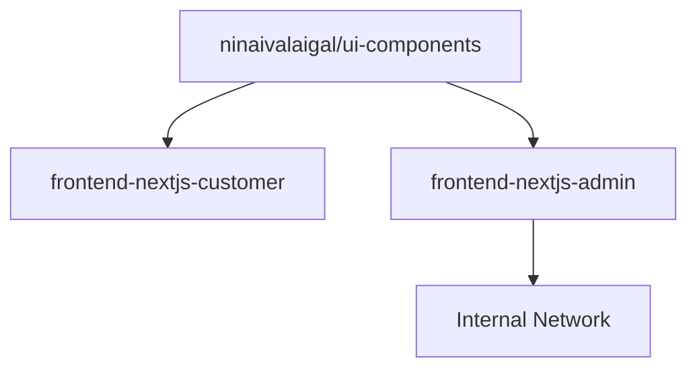

# SPEC-116: Internal Frontend Migration (Admin & Ops Console)
**Phase:** C
**Status:** Planned
**Depends On:** SPEC-105 (Frontend Baseline)

---

## 🎯 Objective

Migrate Admin and Ops UIs to Next.js 15 with shared component library.

---

## 🏗️ Architecture



---

## 🎨 Implementation

### 1. Split Unified Frontend into Two Apps

**New Repository Structure:**
```
/frontend-nextjs-customer (public)
  ├── src/app/
  │   ├── (auth)/
  │   ├── (customer)/
  │   └── layout.tsx

/frontend-nextjs-admin (internal)
  ├── src/app/
  │   ├── (admin)/
  │   ├── (ops)/
  │   └── layout.tsx
```

---

### 2. Create `frontend-shared/` Library

**Shared Component Library:**
```
/frontend-shared
  ├── components/
  │   ├── ui/           # shadcn/ui components
  │   ├── Button.tsx
  │   ├── Card.tsx
  │   └── DataTable.tsx
  ├── lib/
  │   ├── utils.ts
  │   └── api.ts
  └── package.json
```

**`frontend-shared/package.json`:**
```json
{
  "name": "@ninaivalaigal/ui-components",
  "version": "1.0.0",
  "main": "./index.ts",
  "types": "./index.ts",
  "exports": {
    "./components/*": "./components/*",
    "./lib/*": "./lib/*"
  },
  "peerDependencies": {
    "react": "^18.0.0",
    "next": "^15.0.0"
  }
}
```

---

### 3. Role-Based Routing & Security per SPEC-108

**Customer App Middleware (`frontend-nextjs-customer/src/middleware.ts`):**
```typescript
import { NextRequest, NextResponse } from 'next/server';
import { getToken } from 'next-auth/jwt';

export async function middleware(request: NextRequest) {
  const token = await getToken({ req: request });

  // Only allow customer role
  if (token && token.role !== 'customer') {
    return NextResponse.redirect(new URL('/unauthorized', request.url));
  }

  return NextResponse.next();
}

export const config = {
  matcher: ['/dashboard/:path*', '/profile/:path*'],
};
```

**Admin App Middleware (`frontend-nextjs-admin/src/middleware.ts`):**
```typescript
import { NextRequest, NextResponse } from 'next/server';
import { getToken } from 'next-auth/jwt';

export async function middleware(request: NextRequest) {
  const token = await getToken({ req: request });

  // Require admin or staff role
  if (!token || !['admin', 'staff'].includes(token.role)) {
    return NextResponse.redirect(new URL('/unauthorized', request.url));
  }

  // Additional IP whitelist for admin (optional)
  const clientIp = request.headers.get('x-forwarded-for') || request.ip;
  if (!isAllowedIp(clientIp)) {
    return NextResponse.json(
      { error: 'Access denied from this IP' },
      { status: 403 }
    );
  }

  return NextResponse.next();
}

function isAllowedIp(ip: string): boolean {
  const allowedIps = process.env.ADMIN_ALLOWED_IPS?.split(',') || [];
  return allowedIps.includes(ip) || process.env.NODE_ENV === 'development';
}

export const config = {
  matcher: ['/admin/:path*', '/ops/:path*'],
};
```

---

### 4. Deploy Both with Shared CD Workflow

**`.github/workflows/deploy-apps.yml`:**
```yaml
name: Deploy Apps
on:
  push:
    branches: [main]

jobs:
  deploy-customer:
    runs-on: ubuntu-latest
    steps:
      - uses: actions/checkout@v4

      - name: Build Customer App
        working-directory: frontend-nextjs-customer
        run: |
          npm ci
          npm run build

      - name: Deploy to Vercel (Customer)
        uses: amondnet/vercel-action@v25
        with:
          vercel-token: ${{ secrets.VERCEL_TOKEN }}
          vercel-org-id: ${{ secrets.VERCEL_ORG_ID }}
          vercel-project-id: ${{ secrets.VERCEL_PROJECT_CUSTOMER }}
          working-directory: frontend-nextjs-customer

  deploy-admin:
    runs-on: ubuntu-latest
    steps:
      - uses: actions/checkout@v4

      - name: Build Admin App
        working-directory: frontend-nextjs-admin
        run: |
          npm ci
          npm run build

      - name: Deploy to Internal Server
        run: |
          rsync -avz frontend-nextjs-admin/.next/ admin@internal.ninaivalaigal.com:/var/www/admin/
```

---

## ✅ Deliverables

### Customer App (`frontend-nextjs-customer`)
- Public-facing customer portal
- Authentication required
- Customer role only
- Public CDN (Vercel/Cloudflare)

### Admin App (`frontend-nextjs-admin`)
- Internal admin dashboard
- IP whitelist + VPN required
- Admin/staff roles only
- Internal hosting (private server)

### Shared Library (`frontend-shared`)
- Reusable UI components
- Shared utilities and hooks
- Published as npm workspace package
- Semantic versioning

---

## 🔐 Security Layers

### 1. Network Level
- Admin app behind VPN/Tailscale
- IP whitelist enforcement
- No public internet access

### 2. Application Level
- Role-based middleware (SPEC-108)
- JWT token validation
- Session expiration (15 minutes)

### 3. Data Level
- Admin users can access all data
- Customers can only access their own data
- Audit logging for admin actions

---

## 📊 Deployment Strategy

### Customer App
- **Hosting**: Vercel (public CDN)
- **Domain**: `app.ninaivalaigal.com`
- **SSL**: Automatic (Let's Encrypt)
- **Scaling**: Auto-scaling serverless

### Admin App
- **Hosting**: Internal server or private Kubernetes
- **Domain**: `admin.ninaivalaigal.internal` (VPN only)
- **SSL**: Self-signed or internal CA
- **Access**: VPN/Tailscale required

---

## 🎯 Migration Checklist

### Phase 1: Shared Library (Week 1)
- [ ] Create `frontend-shared` workspace
- [ ] Move common components to shared library
- [ ] Set up npm workspace linking
- [ ] Publish to internal npm registry

### Phase 2: Customer App Migration (Week 2-3)
- [ ] Create `frontend-nextjs-customer` from SPEC-103 baseline
- [ ] Import shared components
- [ ] Migrate customer-facing pages
- [ ] Set up customer-only middleware
- [ ] Deploy to Vercel

### Phase 3: Admin App Migration (Week 4-5)
- [ ] Create `frontend-nextjs-admin`
- [ ] Import shared components
- [ ] Migrate admin dashboard pages
- [ ] Set up admin middleware + IP whitelist
- [ ] Deploy to internal server

### Phase 4: Validation (Week 6)
- [ ] E2E tests for both apps
- [ ] Security audit (penetration testing)
- [ ] Performance testing
- [ ] Documentation

---

## 📁 Example Shared Component

**`frontend-shared/components/DataTable.tsx`:**
```tsx
'use client';

import React from 'react';
import {
  ColumnDef,
  flexRender,
  getCoreRowModel,
  useReactTable,
} from '@tanstack/react-table';

interface DataTableProps<TData, TValue> {
  columns: ColumnDef<TData, TValue>[];
  data: TData[];
}

export function DataTable<TData, TValue>({
  columns,
  data,
}: DataTableProps<TData, TValue>) {
  const table = useReactTable({
    data,
    columns,
    getCoreRowModel: getCoreRowModel(),
  });

  return (
    <div className="rounded-md border">
      <table className="w-full">
        <thead>
          {table.getHeaderGroups().map((headerGroup) => (
            <tr key={headerGroup.id}>
              {headerGroup.headers.map((header) => (
                <th key={header.id} className="px-4 py-2 text-left">
                  {flexRender(
                    header.column.columnDef.header,
                    header.getContext()
                  )}
                </th>
              ))}
            </tr>
          ))}
        </thead>
        <tbody>
          {table.getRowModel().rows.map((row) => (
            <tr key={row.id}>
              {row.getVisibleCells().map((cell) => (
                <td key={cell.id} className="px-4 py-2">
                  {flexRender(cell.column.columnDef.cell, cell.getContext())}
                </td>
              ))}
            </tr>
          ))}
        </tbody>
      </table>
    </div>
  );
}
```

**Usage in Customer App:**
```tsx
import { DataTable } from '@ninaivalaigal/ui-components/components/DataTable';

export default function MemoriesPage() {
  return <DataTable columns={columns} data={memories} />;
}
```

**Usage in Admin App:**
```tsx
import { DataTable } from '@ninaivalaigal/ui-components/components/DataTable';

export default function UsersPage() {
  return <DataTable columns={columns} data={users} />;
}
```

---

## 🧪 Testing Strategy

### Shared Library Tests
```typescript
// frontend-shared/__tests__/DataTable.test.tsx
import { render, screen } from '@testing-library/react';
import { DataTable } from '../components/DataTable';

describe('DataTable', () => {
  it('renders table with data', () => {
    const columns = [{ accessorKey: 'name', header: 'Name' }];
    const data = [{ name: 'John' }];

    render(<DataTable columns={columns} data={data} />);
    expect(screen.getByText('John')).toBeInTheDocument();
  });
});
```

### Role-Based Access Tests
```typescript
// frontend-nextjs-admin/__tests__/middleware.test.ts
import { NextRequest } from 'next/server';
import { middleware } from '../src/middleware';

describe('Admin Middleware', () => {
  it('blocks non-admin users', async () => {
    const request = new NextRequest('http://localhost:3000/admin');
    // Mock token with customer role

    const response = await middleware(request);
    expect(response.status).toBe(302); // Redirect
  });

  it('allows admin users', async () => {
    const request = new NextRequest('http://localhost:3000/admin');
    // Mock token with admin role

    const response = await middleware(request);
    expect(response.status).toBe(200);
  });
});
```

---

## 📊 Performance Considerations

### Code Splitting
- Separate bundles for customer vs admin
- Shared components tree-shaken
- Admin-specific features not loaded in customer app

### Build Optimization
```json
// next.config.js
module.exports = {
  experimental: {
    optimizePackageImports: ['@ninaivalaigal/ui-components'],
  },
  transpilePackages: ['@ninaivalaigal/ui-components'],
};
```

---

## 🚀 Future Enhancements

- **Micro-frontends**: Module federation for independent deployments
- **Design system**: Storybook for shared components
- **Theming**: Brand customization per app
- **A/B testing**: Feature flags per app

---

## 🔗 Integration Points

- **SPEC-103**: Next.js 15 baseline
- **SPEC-105**: Backend integration
- **SPEC-108**: Auth & security
- **SPEC-113**: Profile pages (both apps)

---

**Status:** ✅ Complete
**Implementation Date:** October 11, 2025
**Last Updated:** October 11, 2025
