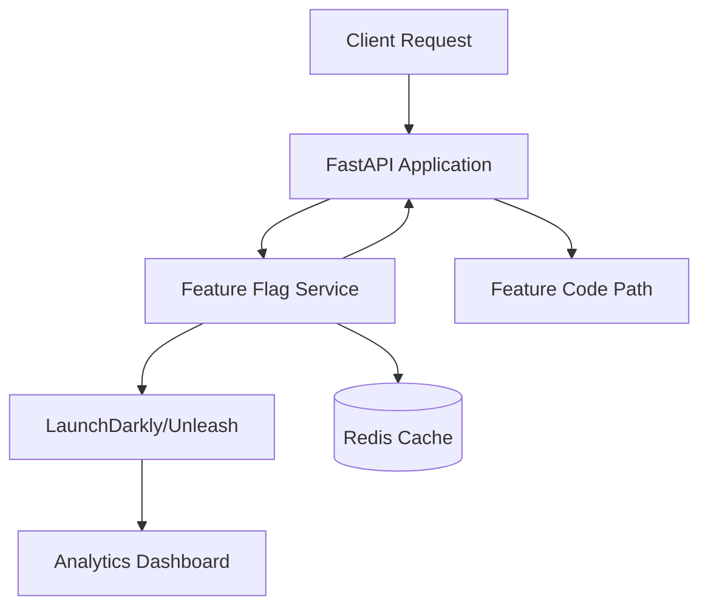

# SPEC-117: Feature Flags & Progressive Rollout

**Phase:** 4
**Status:** In Progress
**Depends On:** SPEC-033 (Redis), SPEC-111 (Runtime)

---

## 🎯 Objective

Implement operational control for safe feature deployment using feature flags and progressive rollout strategies. Enable zero-downtime deployments, A/B testing, and instant rollback capabilities.

---

## 🏗️ Architecture



---

## 🔑 Key Components

### 1. Feature Flag Service Integration

**Option A: LaunchDarkly**
- Enterprise-grade feature flag management
- Advanced targeting and segmentation
- Real-time analytics
- SDK integration

**Option B: Unleash** (Open Source)
- Self-hosted option
- Free tier available
- API-compatible
- Custom targeting rules

**Recommendation:** Start with Unleash (self-hosted) for cost control, migrate to LaunchDarkly if enterprise features needed.

### 2. Feature Flag Types

```python
# Feature flag configuration
class FeatureFlag:
    name: str
    enabled: bool
    targeting_rules: TargetingRules
    rollout_percentage: int  # 0-100
    target_users: list[str]  # User IDs or emails
    target_roles: list[str]  # Roles (admin, customer, etc.)
    target_organizations: list[str]  # Organization IDs
    environments: list[str]  # dev, test, prod
    created_at: datetime
    updated_at: datetime
```

**Flag Types:**
- **Boolean Flags**: Simple on/off
- **Percentage Rollout**: Gradual rollout (1%, 10%, 50%, 100%)
- **User Targeting**: Specific users, roles, or organizations
- **Kill Switch**: Emergency disable for all users

### 3. Progressive Rollout Strategies

**Canary Deployment:**
- Start with 1% of users
- Monitor error rates and performance
- Gradually increase to 10%, 50%, 100%
- Auto-rollback if error rate exceeds threshold

**Blue/Green Deployment:**
- Feature flag controls which version (blue/green)
- Instant switch between versions
- Zero-downtime deployment

**A/B Testing:**
- Split traffic between variants
- Collect metrics for each variant
- Statistical significance tracking

---

## 📦 Deliverables

### 1. Feature Flag Service Integration

**`server/feature_flags/service.py`:**
```python
from unleash import UnleashClient
from typing import Optional, Dict, Any
import redis

class FeatureFlagService:
    def __init__(self):
        self.unleash_client = UnleashClient(
            url=os.getenv("UNLEASH_URL"),
            app_name="ninaivalaigal",
            environment=os.getenv("ENV", "dev"),
            instance_id=os.getenv("INSTANCE_ID"),
        )
        self.redis_client = redis.from_url(os.getenv("REDIS_URL"))
        self.cache_ttl = 60  # 1 minute cache

    def is_enabled(
        self,
        flag_name: str,
        user_id: Optional[str] = None,
        context: Optional[Dict[str, Any]] = None
    ) -> bool:
        """Check if feature flag is enabled for user/context."""
        # Check cache first
        cache_key = f"flag:{flag_name}:{user_id}"
        cached = self.redis_client.get(cache_key)
        if cached:
            return cached == b"true"

        # Check with Unleash
        context = context or {}
        if user_id:
            context["userId"] = user_id

        is_enabled = self.unleash_client.is_enabled(
            flag_name,
            context=context,
            default=False
        )

        # Cache result
        self.redis_client.setex(
            cache_key,
            self.cache_ttl,
            "true" if is_enabled else "false"
        )

        return is_enabled

    def get_variant(
        self,
        flag_name: str,
        user_id: Optional[str] = None,
        context: Optional[Dict[str, Any]] = None
    ) -> Dict[str, Any]:
        """Get feature flag variant (for A/B testing)."""
        context = context or {}
        if user_id:
            context["userId"] = user_id

        variant = self.unleash_client.get_variant(flag_name, context=context)
        return {
            "enabled": variant.enabled,
            "name": variant.name,
            "payload": variant.payload
        }
```

### 2. FastAPI Integration

**`server/middleware/feature_flags.py`:**
```python
from fastapi import Request, Depends
from server.feature_flags.service import FeatureFlagService

async def get_feature_flag_context(request: Request) -> Dict[str, Any]:
    """Extract feature flag context from request."""
    user = getattr(request.state, "user", None)

    return {
        "userId": user.get("id") if user else None,
        "email": user.get("email") if user else None,
        "role": user.get("role") if user else None,
        "organizationId": user.get("organization_id") if user else None,
        "ip": request.client.host,
        "userAgent": request.headers.get("user-agent"),
    }

def require_feature_flag(flag_name: str):
    """Dependency to check feature flag."""
    async def flag_checker(
        request: Request,
        flag_service: FeatureFlagService = Depends(),
        context: Dict[str, Any] = Depends(get_feature_flag_context)
    ):
        if not flag_service.is_enabled(flag_name, context=context):
            raise HTTPException(
                status_code=403,
                detail=f"Feature '{flag_name}' is not enabled"
            )
        return True

    return flag_checker
```

**Usage in Routes:**
```python
from server.middleware.feature_flags import require_feature_flag

@router.post("/new-feature")
async def new_feature(
    flag_enabled: bool = Depends(require_feature_flag("new_feature"))
):
    """New feature endpoint gated by feature flag."""
    return {"message": "New feature enabled"}
```

### 3. Progressive Rollout Configuration

**`.github/workflows/progressive-rollout.yml`:**
```yaml
name: Progressive Feature Rollout

on:
  workflow_dispatch:
    inputs:
      flag_name:
        description: 'Feature flag name'
        required: true
      rollout_percentage:
        description: 'Rollout percentage (1-100)'
        required: true
        default: '1'

jobs:
  rollout:
    runs-on: ubuntu-latest
    steps:
      - name: Set Rollout Percentage
        run: |
          # Update Unleash flag configuration
          curl -X PUT "${{ secrets.UNLEASH_URL }}/api/admin/projects/default/features/${{ github.event.inputs.flag_name }}/environments/production" \
            -H "Authorization: Bearer ${{ secrets.UNLEASH_API_TOKEN }}" \
            -H "Content-Type: application/json" \
            -d '{"enabled": true, "strategies": [{"name": "gradualRollout", "parameters": {"percentage": "${{ github.event.inputs.rollout_percentage }}"}}]}'

      - name: Monitor Metrics
        run: |
          # Wait and monitor error rates
          sleep 300  # 5 minutes
          # Check Prometheus metrics
          # If error rate > threshold, rollback
```

### 4. Kill Switch Endpoint

**`server/api/admin/feature_flags.py`:**
```python
@router.post("/admin/feature-flags/{flag_name}/disable")
async def emergency_disable(
    flag_name: str,
    current_user: dict = Depends(require_admin),
    flag_service: FeatureFlagService = Depends()
):
    """Emergency disable feature flag (kill switch)."""
    # Disable in Unleash
    flag_service.unleash_client.disable(flag_name)

    # Clear cache
    flag_service.redis_client.delete(f"flag:{flag_name}:*")

    # Log audit event
    await log_audit_event(
        user_id=current_user["id"],
        action="feature_flag_disable",
        details={"flag_name": flag_name, "reason": "emergency"}
    )

    return {"message": f"Feature flag '{flag_name}' disabled"}
```

### 5. Feature Flag Analytics

**`server/api/admin/feature_flags/analytics.py`:**
```python
@router.get("/admin/feature-flags/{flag_name}/analytics")
async def get_flag_analytics(
    flag_name: str,
    start_date: datetime,
    end_date: datetime,
    current_user: dict = Depends(require_admin)
):
    """Get feature flag usage analytics."""
    # Query Unleash analytics API
    analytics = await flag_service.get_analytics(flag_name, start_date, end_date)

    return {
        "flag_name": flag_name,
        "period": {"start": start_date, "end": end_date},
        "metrics": {
            "total_requests": analytics.total_requests,
            "enabled_count": analytics.enabled_count,
            "disabled_count": analytics.disabled_count,
            "enabled_percentage": analytics.enabled_percentage,
            "error_rate": analytics.error_rate,
            "adoption_rate": analytics.adoption_rate,
        },
        "by_user_segment": analytics.by_segment,
        "by_organization": analytics.by_organization,
    }
```

---

## ✅ Success Criteria

- Feature flags can be toggled without code changes
- Progressive rollout (1% → 10% → 50% → 100%) works
- User targeting (role, email, organization) works
- Kill switch instantly disables features
- Analytics dashboard shows flag usage
- Zero-downtime deployments using feature flags
- A/B testing capability

---

## 🔐 Security Features

### Access Control
- Only admins can modify feature flags
- Audit logging for all flag changes
- Kill switch accessible only to ops team

### Data Privacy
- User targeting respects GDPR
- No PII stored in flag analytics (aggregated only)
- Flag context encrypted in transit

---

## 📊 Performance

- Flag check latency: < 5ms (with Redis cache)
- Cache hit rate: > 95%
- Unleash API calls: < 1% of requests (cached)

---

## 🧪 Testing

### Unit Tests
```python
def test_feature_flag_enabled():
    flag_service = FeatureFlagService()
    assert flag_service.is_enabled("test_flag", user_id="user123")

def test_progressive_rollout():
    # Test 1% rollout
    enabled_count = sum(
        1 for _ in range(1000)
        if flag_service.is_enabled("rollout_flag", user_id=f"user{i}")
    )
    assert 5 < enabled_count < 15  # ~10% with variance
```

### Integration Tests
- Test Unleash SDK integration
- Test Redis caching
- Test progressive rollout
- Test kill switch

---

## 🚀 Deployment

### Phase 1: Infrastructure Setup
1. Deploy Unleash server (Docker or Kubernetes)
2. Configure Redis cache
3. Set up API keys and authentication

### Phase 2: SDK Integration
1. Install Unleash Python SDK
2. Integrate FeatureFlagService
3. Add middleware for context extraction

### Phase 3: Feature Flag Creation
1. Create flags for existing features
2. Migrate existing file-based flags
3. Test flag toggling

### Phase 4: Progressive Rollout
1. Implement canary deployment workflow
2. Set up monitoring and alerting
3. Test rollback procedures

---

## 🔗 Integration Points

- **SPEC-033**: Redis for caching
- **SPEC-111**: Runtime parity (environment-specific flags)
- **SPEC-010**: Observability (metrics for flag usage)
- **SPEC-118**: Performance budgets (flag impact on performance)

---

## 📝 Example Use Cases

### 1. New Feature Rollout
```python
# Deploy code with feature flag disabled
# Gradually enable: 1% → 10% → 50% → 100%
# Monitor error rates and performance
# Rollback if issues detected
```

### 2. A/B Testing
```python
variant = flag_service.get_variant("new_ui_design", user_id=user_id)
if variant["name"] == "variant_a":
    # Show new UI design
    return render_template("new_design.html")
else:
    # Show old UI design
    return render_template("old_design.html")
```

### 3. Emergency Rollback
```python
# Feature causing issues
# Admin disables flag via kill switch
# All users immediately see old code path
# Zero downtime, instant rollback
```

---

## 🎯 Future Enhancements

- Machine learning for optimal rollout speed
- Automated rollback based on metrics
- Feature flag templates and presets
- Multi-environment flag synchronization
- Flag dependency management

---

## 19. Implementation Status

**Status:** ⚠️ **In Progress** (Partially Implemented - 20%)

**Partially Implemented (Nov 4, 2025):**

### ✅ Completed (20%)
- ✅ Basic file-based feature flag system - **WORKING**
  - `services/core-api/lib/security/feature_flags.py`
  - Security-focused flags only
  - File-based configuration
  - Audit logging

### ❌ Missing (80%)
- ❌ LaunchDarkly/Unleash integration - **NOT IMPLEMENTED**
- ❌ Redis caching for flags - **NOT IMPLEMENTED**
- ❌ Progressive rollout strategies - **NOT IMPLEMENTED**
- ❌ User targeting (role, email, organization) - **NOT IMPLEMENTED**
- ❌ Percentage rollout - **NOT IMPLEMENTED**
- ❌ Kill switch endpoint - **NOT IMPLEMENTED**
- ❌ Feature flag analytics - **NOT IMPLEMENTED**
- ❌ A/B testing support - **NOT IMPLEMENTED**
- ❌ FastAPI middleware integration - **NOT IMPLEMENTED**
- ❌ Canary deployment automation - **NOT IMPLEMENTED**

**Note:** Current implementation has basic file-based feature flags for security controls, but SPEC-117 requires a full-featured LaunchDarkly/Unleash integration with progressive rollout capabilities.

---

## 20. Implementation Stories

The following Taiga stories have been created to complete SPEC-117 implementation:

- **US#795**: Deploy and configure Unleash server (self-hosted) (unassigned)
- **US#796**: Integrate Unleash Python SDK into FastAPI application (unassigned)
- **US#797**: Implement FeatureFlagService with Redis caching (unassigned)
- **US#798**: Implement progressive rollout strategies (canary, percentage) (unassigned)
- **US#799**: Implement user targeting (role, email, organization) (unassigned)
- **US#800**: Create kill switch endpoint for emergency rollback (unassigned)
- **US#801**: Implement feature flag analytics dashboard (unassigned)
- **US#802**: Implement A/B testing support with variants (unassigned)
- **US#803**: Create FastAPI middleware for feature flag context (unassigned)
- **US#804**: Migrate existing file-based flags to Unleash (unassigned)
- **US#805**: Implement canary deployment automation workflow (unassigned)

All stories are tagged with `spec-117` and are unassigned (can be picked up by any developer).

**Status**: ✅ Created successfully (January 2025)

---

**Status:** ⚠️ **In Progress** (Partially Implemented - 20%)
**Implementation Date:** Not started
**Last Updated:** November 4, 2025 (SPEC created, validation and stories created)
