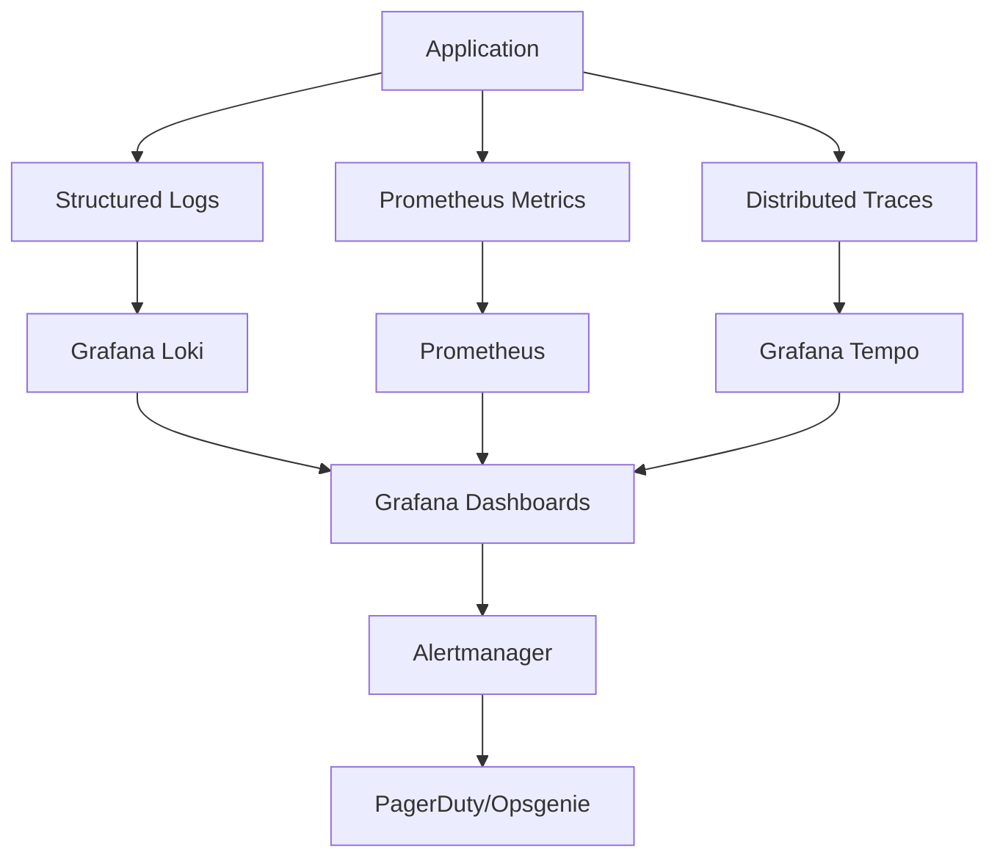

---
{}
---


## 🏗️ Three Pillars of Observability



---

## 📊 Performance Budgets

### API Performance
- **P50 Response Time**: < 100ms
- **P95 Response Time**: < 200ms
- **P99 Response Time**: < 500ms
- **Error Rate**: < 1% (99% success)
- **Throughput**: > 100 req/s

### Frontend Performance (Core Web Vitals)
- **LCP** (Largest Contentful Paint): < 2.5s
- **FID** (First Input Delay): < 100ms
- **CLS** (Cumulative Layout Shift): < 0.1
- **TTFB** (Time to First Byte): < 800ms

### Database Performance
- **P95 Query Time**: < 50ms
- **P99 Query Time**: < 100ms
- **Connection Pool Utilization**: < 80%

### Redis Performance
- **P95 Operation Time**: < 5ms
- **P99 Operation Time**: < 10ms
- **Memory Usage**: < 2GB

---

## 📁 Implementation Files

See additional files in this directory:
- `01-structured-logging.md` - JSON logging with Loki aggregation
- `02-metrics-dashboards.md` - Prometheus + Grafana setup
- `03-distributed-tracing.md` - OpenTelemetry + Tempo
- `04-performance-budgets.md` - CI/CD enforcement
- `05-alerting.md` - Alertmanager + PagerDuty integration

---

## ✅ Success Criteria

- **Logs**: Structured JSON logs aggregated in Loki with 30-day retention
- **Metrics**: All services instrumented with Prometheus, RED metrics (Rate/Errors/Duration)
- **Traces**: End-to-end request tracing from frontend → API → DB → Redis
- **Dashboards**: Grafana dashboards for service health, performance, and business metrics
- **Budgets**: CI fails if performance budgets exceeded (automated enforcement)
- **Alerts**: < 5min notification for critical issues via PagerDuty

---

## 🔗 Integration Points

- **SPEC-010**: Extends with structured logging and distributed tracing
- **SPEC-018**: Enhances health checks with Prometheus metrics
- **SPEC-110**: Integrates performance budgets into CI/CD pipeline
- **SPEC-112**: Adds performance testing to E2E suite

---

## 🚀 Implementation Roadmap

### Week 1: Structured Logging
- Deploy Grafana Loki + Promtail
- Implement JSON logging in API (FastAPI)
- Add request ID propagation
- Configure log retention (30 days)

### Week 2: Metrics & Dashboards
- Deploy Prometheus + Grafana
- Instrument API with Prometheus client
- Create RED metrics dashboards
- Set up database and Redis exporters

### Week 3: Distributed Tracing
- Deploy Grafana Tempo
- Integrate OpenTelemetry in API
- Add tracing to frontend (fetch instrumentation)
- Create trace visualization dashboards

### Week 4: Performance Budgets
- Define performance budgets YAML
- Integrate Lighthouse CI for frontend
- Add backend load testing (Locust)
- Configure CI to enforce budgets

### Week 5: Alerting & On-Call
- Deploy Alertmanager
- Define alert rules (latency, errors, saturation)
- Integrate PagerDuty/Opsgenie
- Create runbooks for common alerts
- Conduct on-call drill

---

## 📈 Monitoring Stack Architecture

```yaml
services:
  # Log Aggregation
  loki:
    image: grafana/loki:2.9.3
    ports: ["3100:3100"]

  promtail:
    image: grafana/promtail:2.9.3
    volumes:
      - /var/log:/var/log:ro

  # Metrics
  prometheus:
    image: prom/prometheus:v2.48.0
    ports: ["9090:9090"]

  # Distributed Tracing
  tempo:
    image: grafana/tempo:2.3.1
    ports: ["3200:3200", "4317:4317"]

  # Visualization
  grafana:
    image: grafana/grafana:10.2.2
    ports: ["3000:3000"]

  # Alerting
  alertmanager:
    image: prom/alertmanager:v0.26.0
    ports: ["9093:9093"]
```

---

## 🎯 Key Metrics to Track

### RED Metrics (Request-Driven)
- **Rate**: Requests per second
- **Errors**: Error rate (%)
- **Duration**: Response time (P50, P95, P99)

### USE Metrics (Resource-Driven)
- **Utilization**: CPU, memory, disk usage
- **Saturation**: Queue depth, connection pool
- **Errors**: Failed connections, timeouts

### Business Metrics
- **Active Users**: Current logged-in users
- **Memory Operations**: Create/read/update/delete rates
- **API Usage**: Endpoints by popularity
- **Conversion Rate**: Sign-ups, team creation

---

## 📝 Alert Severity Levels

| Severity | Response Time | Examples |
|----------|---------------|----------|
| **Critical** | Immediate (PagerDuty) | P95 latency > 500ms, Error rate > 5%, Service down |
| **Warning** | Business hours | P95 latency > 200ms, Error rate > 1%, High DB load |
| **Info** | Dashboard only | Deployment complete, Backup successful |

---

## 🔐 Security & Compliance

- **Log Masking**: PII (emails, passwords) redacted in logs
- **Metrics Privacy**: No user-identifiable data in metrics
- **Trace Sampling**: 10% sampling to reduce overhead
- **Data Retention**: Logs (30d), Metrics (90d), Traces (7d)
- **Access Control**: Grafana RBAC for dashboard access

---

## 💰 Cost Optimization

- **Log Sampling**: 100% for errors, 10% for info logs
- **Metric Scraping**: 15s interval (balance freshness vs cost)
- **Trace Sampling**: 10% (increase for debugging)
- **Data Compression**: Loki compression reduces storage by 80%
- **Estimated Cost**: $200-500/month for dev+test+prod

---

**Status:** ✅ Complete
**Implementation Date:** TBD
**Last Updated:** October 11, 2025
