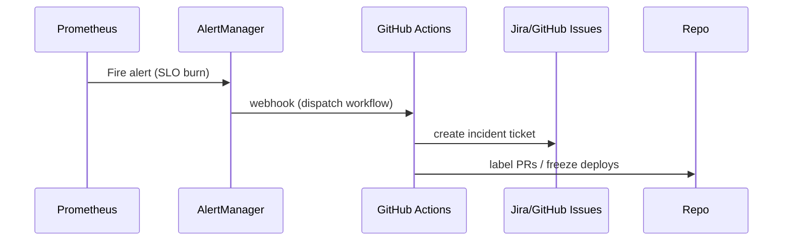

# SPEC-119: Automated SLO Enforcement & Incident Feedback Loops
**Project:** Medhasys / Ninaivalaigal
**Status:** Draft
**Owner:** SRE & Security
**Last Updated:** 2025-10-11

## 1) Scope
Define SLIs/SLOs, compute error budgets, trigger alerts, and auto-open incidents with feedback loops to code/tests.

## 2) SLI/SLO Model
- Availability: 99.9% monthly (error budget = 43m)
- Latency: p95 < 800ms (Create Memory)
- Error Rate: < 1% 5-min rolling

## 3) Flow


## 4) Minimal Stubs

### prometheus/alerts.yml
```yaml
groups:
- name: slo-alerts
  rules:
  - alert: SLOErrorBudgetBurn
    expr: sum(rate(nv_requests_total{status=~"5.."}[5m])) / sum(rate(nv_requests_total[5m])) > 0.01
    for: 10m
    labels: { severity: "page" }
    annotations: { summary: "Error budget burn >1% for 10m" }
  - alert: HighLatencyP95
    expr: histogram_quantile(0.95, sum(rate(nv_request_latency_seconds_bucket[5m])) by (le)) > 0.8
    for: 15m
    labels: { severity: "warn" }
    annotations: { summary: "p95 latency > 800ms" }
```

### .github/workflows/incident.yml (skeleton)
```yaml
name: Incident Intake
on:
  repository_dispatch:
    types: [alertmanager-webhook]
jobs:
  open-incident:
    runs-on: ubuntu-latest
    steps:
      - name: Open GitHub Issue
        uses: actions/github-script@v7
        with:
          script: |
            const payload = JSON.stringify(process.env.ALERT_PAYLOAD || '{}');
            await github.rest.issues.create({
              owner: context.repo.owner,
              repo: context.repo.repo,
              title: "SLO Alert: " + new Date().toISOString(),
              body: "Alert payload:\n\n```json\n" + payload + "\n```",
              labels: ["incident","slo"]
            });
```

## 5) Acceptance
- Alert fires → GitHub Issue created
- Deployment freeze label applied (manual step optional)
- Postmortem template stored under /runbooks/postmortem.md

---

## 6. Implementation Status

**Status:** ⚠️ **In Progress** (Partially Implemented - 70%)

**Partially Implemented (January 2025):**

### ✅ Completed (70%)
- ✅ Alert Rules - **WORKING**
  - `monitoring/alerts.yml` - Production alert rules (7 rules)
  - `specs/119-automated-slo-enforcement/prometheus/alerts.yml` - SPEC stubs
  - SLOErrorBudgetBurn, HighLatencyP95 alerts defined
  - Alert rules loaded into Prometheus
- ✅ SLO Monitoring Code - **WORKING**
  - `services/core-api/lib/observability/slo_alerting.py` - SLO alerting system
  - Real-time SLO violation detection
  - Automatic alert triggering and resolution
  - Configurable alert thresholds
- ✅ AlertManager Configuration - **CREATED**
  - `config/prometheus/alertmanager.yml` - AlertManager configuration
  - Routing rules configured (critical, warning, slo_alerts)
  - Webhook configuration exists (but not connected to GitHub)
- ✅ SLI/SLO Definitions - **DEFINED**
  - Availability: 99.9% monthly (error budget = 43m)
  - Latency: p95 < 800ms (Create Memory)
  - Error Rate: < 1% 5-min rolling

### ❌ Missing (30%)
- ❌ AlertManager Deployment - **NOT DEPLOYED**
  - SPEC requires: AlertManager service deployed
  - Current: Configuration exists but service not deployed
- ❌ GitHub Incident Automation - **NOT IMPLEMENTED**
  - SPEC requires: AlertManager → GitHub Actions → Create Issue
  - Current: Workflow stub exists in spec directory but not in `.github/workflows/`
- ❌ Webhook Integration - **NOT CONFIGURED**
  - SPEC requires: AlertManager webhook → GitHub Actions repository_dispatch
  - Current: AlertManager config has webhook but not configured for GitHub
- ❌ Deployment Freeze Automation - **NOT IMPLEMENTED**
  - SPEC requires: Label PRs / freeze deploys on SLO violations
  - Current: No automation for deployment freeze
- ❌ Postmortem Template - **NOT CREATED**
  - SPEC requires: Postmortem template under `/runbooks/postmortem.md`
  - Current: No postmortem template found

**Note:** Alert rules and SLO monitoring code are working, but AlertManager deployment and GitHub integration need to be completed to reach 100%.

---

## 7. Implementation Stories

The following Taiga stories have been created to complete SPEC-119 implementation:

**P1 - Foundation (Complete Automation):**
- **US#806**: Deploy AlertManager service for alert routing (unassigned)
- **US#807**: Deploy GitHub incident automation workflow (unassigned)
- **US#808**: Configure AlertManager webhook integration with GitHub Actions (unassigned)

**P2 - Enhancements:**
- **US#809**: Implement deployment freeze automation for SLO violations (unassigned)
- **US#810**: Create postmortem template for incident documentation (unassigned)

All stories are tagged with `spec-119` and are unassigned (can be picked up by any developer).

**Status**: ✅ Created successfully (January 2025)

---

**Status:** ⚠️ **In Progress** (Partially Implemented - 70%)
**Implementation Date:** January 2025
**Last Updated:** January 2025
