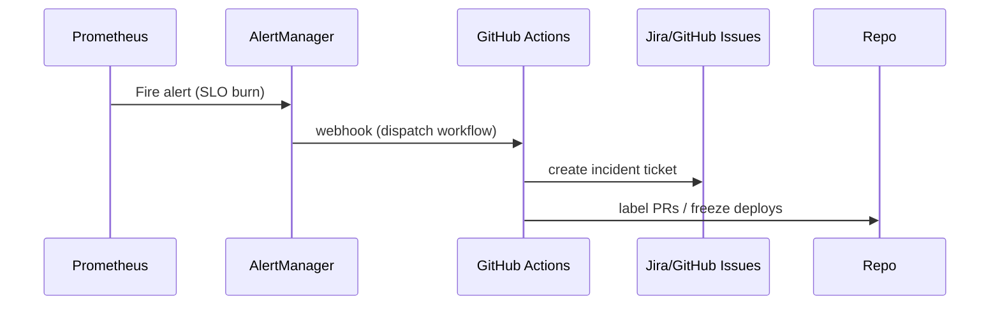

# SPEC-119: Automated SLO Enforcement & Incident Feedback Loops
**Project:** Medhasys / Ninaivalaigal
**Status:** Draft
**Owner:** SRE & Security
**Last Updated:** 2025-10-11

## 1) Scope
Define SLIs/SLOs, compute error budgets, trigger alerts, and auto-open incidents with feedback loops to code/tests.

## 2) SLI/SLO Model
- Availability: 99.9% monthly (error budget = 43m)
- Latency: p95 < 800ms (Create Memory)
- Error Rate: < 1% 5-min rolling

## 3) Flow


## 4) Minimal Stubs

### prometheus/alerts.yml
```yaml
groups:
- name: slo-alerts
  rules:
  - alert: SLOErrorBudgetBurn
    expr: sum(rate(nv_requests_total{status=~"5.."}[5m])) / sum(rate(nv_requests_total[5m])) > 0.01
    for: 10m
    labels: { severity: "page" }
    annotations: { summary: "Error budget burn >1% for 10m" }
  - alert: HighLatencyP95
    expr: histogram_quantile(0.95, sum(rate(nv_request_latency_seconds_bucket[5m])) by (le)) > 0.8
    for: 15m
    labels: { severity: "warn" }
    annotations: { summary: "p95 latency > 800ms" }
```

### .github/workflows/incident.yml (skeleton)
```yaml
name: Incident Intake
on:
  repository_dispatch:
    types: [alertmanager-webhook]
jobs:
  open-incident:
    runs-on: ubuntu-latest
    steps:
      - name: Open GitHub Issue
        uses: actions/github-script@v7
        with:
          script: |
            const payload = JSON.stringify(process.env.ALERT_PAYLOAD || '{}');
            await github.rest.issues.create({
              owner: context.repo.owner,
              repo: context.repo.repo,
              title: "SLO Alert: " + new Date().toISOString(),
              body: "Alert payload:\n\n```json\n" + payload + "\n```",
              labels: ["incident","slo"]
            });
```

## 5) Acceptance
- Alert fires → GitHub Issue created
- Deployment freeze label applied (manual step optional)
- Postmortem template stored under /runbooks/postmortem.md
