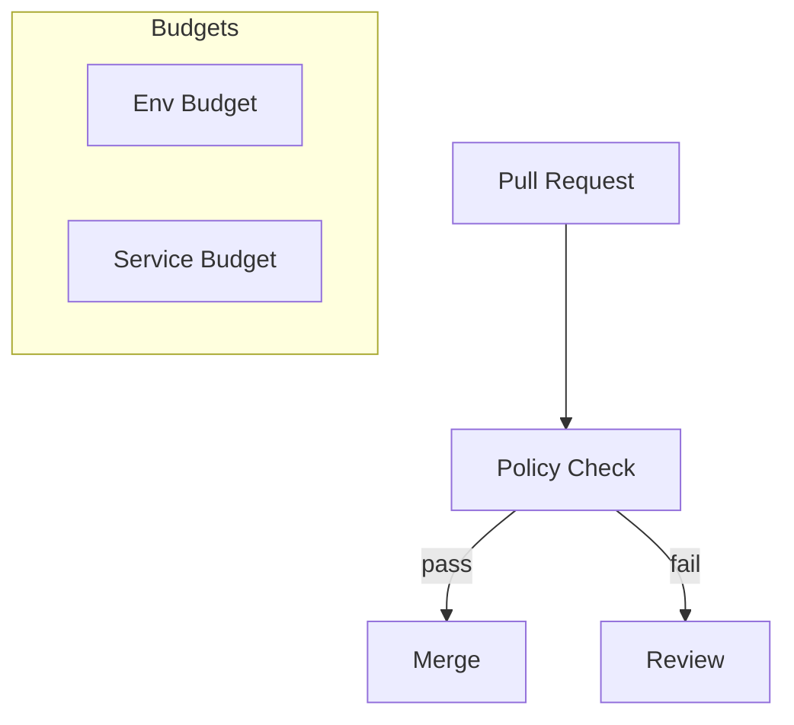

# SPEC-120: Cost Optimization & Resource Governance
**Project:** Medhasys / Ninaivalaigal
**Status:** Draft
**Owner:** FinOps/Platform
**Last Updated:** 2025-10-11

## 1) Objectives
- Track infra/application costs by env, service, team
- Enforce resource limits/requests and auto-review PRs that exceed budgets

## 2) Governance Model


## 3) Minimal Stubs

### k8s/pod-resources.yaml (example limits)
```yaml
apiVersion: v1
kind: Pod
metadata:
  name: nv-api
spec:
  containers:
  - name: api
    image: ghcr.io/medhasys/ninaivalaigal-api:dev
    resources:
      requests:
        cpu: "250m"
        memory: "256Mi"
      limits:
        cpu: "1"
        memory: "512Mi"
```

### .github/workflows/finops.yml (PR guard)
```yaml
name: FinOps Guard
on:
  pull_request:
    paths: ["**/*.yaml","**/*.yml"]
jobs:
  check:
    runs-on: ubuntu-latest
    steps:
      - uses: actions/checkout@v4
      - name: Fail if memory limit > 1Gi
        run: |
          if grep -R "memory: \"[2-9][0-9]*Gi\"" -n .; then
            echo "Memory limit too high"; exit 1; fi
```

### cost/exporter_stub.py
```py
def export_cost(events):
    total = sum(e.get("usd", 0.0) for e in events)
    by_service = {}
    for e in events:
        by_service[e["service"]] = by_service.get(e["service"], 0) + e.get("usd",0)
    print({"total_usd": total, "by_service": by_service})
```

## 4) Per-Service Cost Analysis & Dashboards

### Prometheus Metrics for Cost Tracking

Expose cost-related metrics to enable per-service cost visibility:

```python
# server/observability/cost_metrics.py
from prometheus_client import Counter, Histogram, Gauge

# CPU time as cost proxy (CPU seconds consumed)
service_cpu_seconds = Counter('service_cpu_seconds_total', 'CPU time consumed', ['service', 'runtime'])

# Database query cost (milliseconds)
db_query_cost = Histogram('db_query_cost_milliseconds', 'DB query cost', ['service', 'query_type'])

# Container restarts (reliability metric affecting cost)
container_restarts = Counter('container_restarts_total', 'Container restart count', ['service', 'reason'])

# Cost reduction vs baseline (for SPEC-099 ROI validation)
cost_reduction_pct = Gauge('infrastructure_cost_reduction_percent', 'Cost reduction vs baseline', ['service', 'baseline_date'])
```

### Cost Analyzer Dashboard (Grafana)

**Infrastructure Cost Dashboard:**
- CPU time by service (cost proxy) - tracks CPU seconds consumed per service/runtime
- Database query cost - tracks query execution time and cost
- Container restarts - reliability metric affecting infrastructure costs
- Cost reduction vs baseline - tracks SPEC-099 ROI cost savings
- Per-service cost breakdown - total cost allocation by service
- Cost trends over time - historical cost analysis
- Cost comparison: Python vs Rust services - SPEC-099 ROI validation

**Purpose**: Provide visibility into per-service infrastructure costs to enable cost optimization and validate SPEC-099 ROI claims.

**Integration with SPEC-099 ROI:**
- Track 30-60% infrastructure cost reduction target
- Monitor cost per request/service
- Validate ROI payback period (<12 months target)

## 5) Acceptance
- All services define requests/limits
- PRs touching resources run the FinOps guard
- Weekly cost summary generated by exporter stub
- Per-service cost metrics exposed via Prometheus
- Cost analyzer dashboard operational in Grafana

---

## 6. Implementation Status

**Status:** ⚠️ **In Progress** (Partially Implemented - 50%)

**Partially Implemented (January 2025):**

### ✅ Completed (50%)
- ✅ Resource Limits Example - **CREATED**
  - `k8s/pod-resources.yaml` - Example resource limits (250m CPU, 256Mi memory)
  - Some deployment files have limits (api-server, etc.)
- ✅ Cost Exporter Stub - **CREATED**
  - `cost/exporter_stub.py` - Cost tracking stub (not integrated)
- ✅ FinOps Workflow Stub - **CREATED**
  - `.github/workflows/finops.yml` - PR guard stub (not deployed)

### ❌ Missing (50%)
- ❌ FinOps Guard Workflow Deployment - **NOT DEPLOYED**
  - SPEC requires: PRs touching resources run the FinOps guard
  - Current: Workflow stub exists but not in `.github/workflows/`
- ❌ Resource Limits on All Services - **PARTIAL**
  - SPEC requires: All services define requests/limits
  - Current: Some services have limits, but not all verified
- ❌ Cost Metrics (Prometheus) - **NOT IMPLEMENTED**
  - SPEC requires: Per-service cost metrics exposed via Prometheus
  - Current: No cost-specific metrics found
  - Need: `service_cpu_seconds_total`, `db_query_cost_milliseconds`, `container_restarts_total`, `infrastructure_cost_reduction_percent`
- ❌ Cost Analyzer Dashboard - **NOT IMPLEMENTED**
  - SPEC requires: Cost analyzer dashboard operational in Grafana
  - Current: No cost dashboard found
- ❌ Weekly Cost Summary - **NOT IMPLEMENTED**
  - SPEC requires: Weekly cost summary generated by exporter stub
  - Current: Exporter stub exists but not integrated
- ❌ Budget Overage Alerts - **NOT IMPLEMENTED**
  - SPEC requires: Budget overage alerts configured
  - Current: No budget alerts found

**Note:** Resource limits exist in some deployments, but FinOps guard, cost metrics, cost dashboard, and weekly cost summary need to be completed to reach 100%.

---

## 7. Implementation Stories

The following Taiga stories have been created to complete SPEC-120 implementation:

**P1 - Foundation (Complete Governance):**
- **US#811**: Deploy FinOps guard workflow for resource limit enforcement (unassigned)
- **US#812**: Verify and add resource limits to all services (unassigned)
- **US#813**: Implement Prometheus cost metrics for per-service cost tracking (unassigned)

**P2 - Enhancements:**
- **US#814**: Create cost analyzer dashboard in Grafana (unassigned)
- **US#815**: Implement weekly cost summary automation (unassigned)
- **US#816**: Implement budget overage alerts (unassigned)

All stories are tagged with `spec-120` and are unassigned (can be picked up by any developer).

**Status**: ✅ Created successfully (January 2025)

---

**Status:** ⚠️ **In Progress** (Partially Implemented - 50%)
**Implementation Date:** January 2025
**Last Updated:** January 2025
