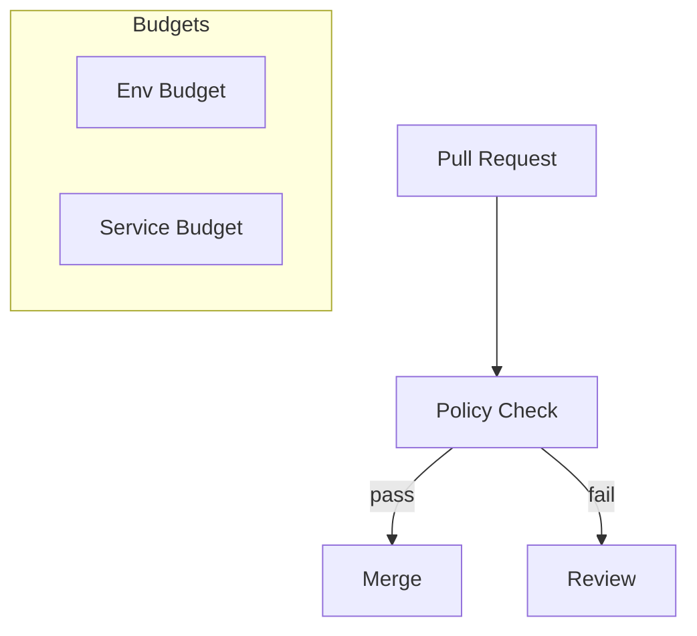

# SPEC-120: Cost Optimization & Resource Governance
**Project:** Medhasys / Ninaivalaigal
**Status:** Draft
**Owner:** FinOps/Platform
**Last Updated:** 2025-10-11

## 1) Objectives
- Track infra/application costs by env, service, team
- Enforce resource limits/requests and auto-review PRs that exceed budgets

## 2) Governance Model


## 3) Minimal Stubs

### k8s/pod-resources.yaml (example limits)
```yaml
apiVersion: v1
kind: Pod
metadata:
  name: nv-api
spec:
  containers:
  - name: api
    image: ghcr.io/medhasys/ninaivalaigal-api:dev
    resources:
      requests:
        cpu: "250m"
        memory: "256Mi"
      limits:
        cpu: "1"
        memory: "512Mi"
```

### .github/workflows/finops.yml (PR guard)
```yaml
name: FinOps Guard
on:
  pull_request:
    paths: ["**/*.yaml","**/*.yml"]
jobs:
  check:
    runs-on: ubuntu-latest
    steps:
      - uses: actions/checkout@v4
      - name: Fail if memory limit > 1Gi
        run: |
          if grep -R "memory: \"[2-9][0-9]*Gi\"" -n .; then
            echo "Memory limit too high"; exit 1; fi
```

### cost/exporter_stub.py
```py
def export_cost(events):
    total = sum(e.get("usd", 0.0) for e in events)
    by_service = {}
    for e in events:
        by_service[e["service"]] = by_service.get(e["service"], 0) + e.get("usd",0)
    print({"total_usd": total, "by_service": by_service})
```

## 4) Acceptance
- All services define requests/limits
- PRs touching resources run the FinOps guard
- Weekly cost summary generated by exporter stub
