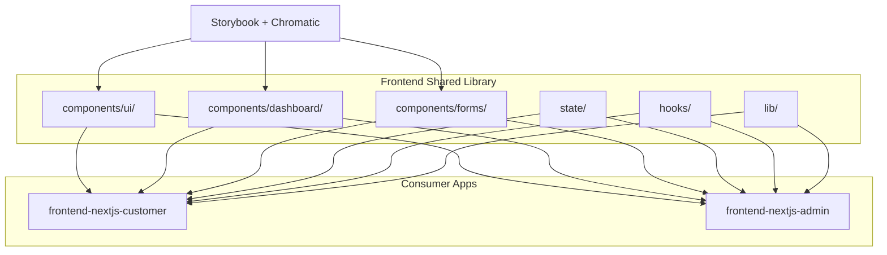

---
{}

> **⚠️ ARCHITECTURE UPDATE (2025-11-02):**
> **This SPEC is DEPRECATED** - The React component library approach described here is no longer needed.
> **Current Direction:** FastAPI + Jinja2 templates. Shared components are Jinja2 macros/partials, not React components.
> **See:** `docs/ADMIN_UI_FASTAPI_ANALYSIS.md` for template-based component reuse patterns.
---


## 2) Solution

Create `@ninaivalaigal/ui-components` as an npm workspace package with:
- **Atomic Design** component architecture (atoms → molecules → organisms)
- **Zustand** for lightweight global state (auth, theme, notifications)
- **Storybook + Chromatic** for component development + visual regression
- **TypeScript + Tailwind** with strict typing and theme tokens

---

## 3) Architecture



---

## 4) Implementation

### Directory Structure
```
frontend-shared/
├── components/
│   ├── ui/              # Atoms (Button, Input, Card)
│   ├── dashboard/       # Organisms (DashboardContainer, AIInsightPanel)
│   └── forms/           # Molecules (LoginForm, MemoryForm)
├── state/
│   ├── authStore.ts     # Zustand auth state
│   ├── themeStore.ts    # Dark/light theme
│   └── notificationStore.ts
├── hooks/
│   ├── useAuth.ts       # Auth hooks
│   ├── useApi.ts        # API call hooks
│   └── useDebounce.ts   # Utility hooks
├── lib/
│   ├── utils.ts         # cn(), formatters
│   ├── api.ts           # fetchApi client
│   └── schemas.ts       # Zod schemas
├── styles/
│   └── globals.css      # Tailwind base + theme tokens
├── .storybook/
│   ├── main.ts
│   └── preview.ts
├── package.json
└── tsconfig.json
```

### Key Files

See implementation stubs:
- `package.json` - npm workspace config
- `state/authStore.ts` - Zustand auth store
- `.storybook/main.ts` - Storybook config
- `components/ui/Button.tsx` - Example component

---

## 5) Success Criteria

- [ ] `@ninaivalaigal/ui-components` package created
- [ ] 15+ UI components extracted (Button, Card, Input, etc.)
- [ ] Zustand stores for auth, theme, notifications
- [ ] 5+ custom hooks (useAuth, useApi, useDebounce)
- [ ] Storybook running on `localhost:6006`
- [ ] Chromatic visual regression tests configured
- [ ] TypeScript compilation successful
- [ ] Both customer + admin apps import successfully
- [ ] Build time < 10s (Turbo cache enabled)

---

## 6) Dependencies

- **SPEC-103**: Next.js 15 baseline (source for component extraction)
- **SPEC-114**: Auth & Security (JWT, session management)
- **SPEC-124**: Turborepo (monorepo build orchestration)

---

## 7) Risks & Mitigations

| Risk | Impact | Mitigation |
|------|--------|------------|
| Version drift between apps | High | Strict semver, automated dependency updates |
| Breaking changes in shared lib | High | Comprehensive tests, canary deployments |
| Storybook build time | Medium | Turbo cache, incremental builds |

---

## 8) Testing Strategy

1. **Unit Tests**: Jest for hooks and utilities (80%+ coverage)
2. **Component Tests**: Storybook stories for all components
3. **Visual Regression**: Chromatic on every PR
4. **Integration**: Test imports in both customer + admin apps

---

## 9) Rollout Plan

**Week 1:**
- Create package structure
- Extract 15+ UI components
- Configure Storybook

**Week 2:**
- Add Zustand state stores
- Create custom hooks
- Configure Chromatic

**Week 3:**
- Integration testing with customer app
- Integration testing with admin app
- Documentation + examples

---

## 10) Monitoring

- **Build time**: Track via Turbo cache analytics
- **Bundle size**: Monitor with `@next/bundle-analyzer`
- **Component usage**: Track imports via dependency graph
- **Visual regressions**: Chromatic dashboard

---

## 11. Implementation Status

**Status:** ⚠️ **DEPRECATED** - Superseded by FastAPI templating approach

**Deprecation Date:** November 2, 2025

**Current Direction:** FastAPI + Jinja2 templates. Shared components are Jinja2 macros/partials, not React components.

**See:** `docs/ADMIN_UI_FASTAPI_ANALYSIS.md` for template-based component reuse patterns.

**Legacy Implementation:**
- `frontend-shared/` directory exists with working implementation
- 17 components, 3 hooks, 3 Zustand stores implemented
- Currently used by `frontend-nextjs-customer`
- **Status:** Legacy code - may need migration to Jinja2 templates

**Replacement SPECs:**
- **SPEC-005**: Admin Dashboard (FastAPI templating)
- **SPEC-146**: Customer UI (FastAPI templating)

**Note:** If migration work is needed for `frontend-shared/`, create separate stories (not tied to SPEC-121, which is deprecated).

---

**Status**: ⚠️ **DEPRECATED** - Superseded by FastAPI templating approach
**Implementation Date:** October 2025 (legacy implementation)
**Last Updated:** November 2, 2025 (deprecated)
