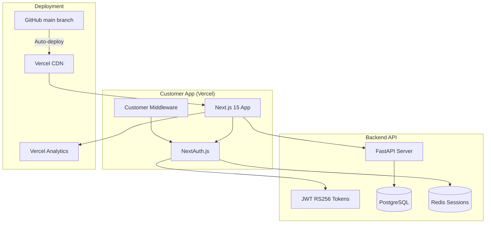

---
{}
---


## 2) Solution

Deploy `frontend-nextjs-customer` to **Vercel** with:
- Automatic deployments from `main` branch
- NextAuth.js integrated with backend JWT (RS256)
- Environment variable management (`.env.customer.local`)
- Vercel Analytics for performance tracking
- Lighthouse CI enforcement (Performance > 90, Accessibility = 100)

---

## 3) Architecture



---

## 4) Implementation

### Deployment Configuration

**`vercel.json`:**
```json
{
  "buildCommand": "npm run build",
  "outputDirectory": ".next",
  "framework": "nextjs",
  "regions": ["iad1"],
  "env": {
    "NEXTAUTH_URL": "@nextauth-url-customer",
    "NEXTAUTH_SECRET": "@nextauth-secret",
    "API_URL": "@api-url"
  },
  "headers": [
    {
      "source": "/(.*)",
      "headers": [
        {
          "key": "X-Frame-Options",
          "value": "DENY"
        },
        {
          "key": "X-Content-Type-Options",
          "value": "nosniff"
        },
        {
          "key": "Strict-Transport-Security",
          "value": "max-age=31536000; includeSubDomains"
        }
      ]
    }
  ]
}
```

### Authentication Configuration

**`src/app/api/auth/[...nextauth]/route.ts`:**
See implementation stub with:
- JWT RS256 validation
- Backend API integration
- Session synchronization with Redis
- Role-based access control

### Middleware

**`src/middleware.ts`:**
- Customer-only role enforcement
- Protected route matching
- Redirect to login if unauthenticated

---

## 5) Success Criteria

**Deployment:**
- [ ] Customer app deployed to Vercel (https://app.ninaivalaigal.com)
- [ ] Auto-deploy on push to `main` branch
- [ ] SSL certificate active (Let's Encrypt)
- [ ] Environment variables configured in Vercel dashboard

**Authentication:**
- [ ] Login flow works (NextAuth.js → Backend JWT)
- [ ] Session persists in Redis
- [ ] Logout clears session
- [ ] Protected routes redirect to /login

**Performance:**
- [ ] Lighthouse Performance score > 90
- [ ] Lighthouse Accessibility score = 100
- [ ] First Contentful Paint < 1.5s
- [ ] Time to Interactive < 3.0s

**Monitoring:**
- [ ] Vercel Analytics enabled
- [ ] Error tracking configured
- [ ] Real User Monitoring (RUM) active

---

## 6) Dependencies

- **SPEC-114**: Auth & Security (JWT RS256, session management)
- **SPEC-121**: Shared Library (UI components, hooks)
- **SPEC-124**: CI/CD Pipelines (automated deployments)

---

## 7) Environment Variables

**`.env.customer.local`:**
```bash
# NextAuth.js
NEXTAUTH_URL=http://localhost:3000
NEXTAUTH_SECRET=<generate-with-openssl-rand-base64-32>

# Backend API
API_URL=http://localhost:13390
API_TIMEOUT=10000

# Vercel Analytics
NEXT_PUBLIC_VERCEL_ANALYTICS_ID=<vercel-project-id>

# Feature Flags (SPEC-117)
NEXT_PUBLIC_FEATURE_FLAGS_URL=https://unleash.ninaivalaigal.com
```

**Vercel Dashboard Secrets:**
- `NEXTAUTH_SECRET` (shared with admin app)
- `API_URL` (production backend)
- `JWT_PUBLIC_KEY` (for RS256 verification)

---

## 8) Testing Strategy

**Pre-Deployment:**
1. Run Lighthouse CI locally (`npm run lighthouse`)
2. E2E tests with Playwright (`npm run test:e2e`)
3. Check bundle size (`npm run analyze`)

**Post-Deployment:**
1. Smoke test login flow (production)
2. Verify analytics tracking (Vercel dashboard)
3. Check performance metrics (Web Vitals)

---

## 9) Rollout Plan

**Week 1: Setup**
- Configure Vercel project
- Set environment variables
- Test auto-deploy from feature branch

**Week 2: Integration**
- Integrate NextAuth.js with backend
- Test JWT validation
- Configure session management

**Week 3: Optimization**
- Run Lighthouse CI
- Optimize bundle size
- Configure caching headers

**Week 4: Production**
- Deploy to production domain
- Monitor analytics and errors
- Document deployment process

---

## 10) Monitoring & Alerts

**Vercel Dashboard:**
- Deployment status (success/failure)
- Build duration (target < 2 minutes)
- Edge function logs

**Vercel Analytics:**
- Core Web Vitals (LCP, FID, CLS)
- Page views and user sessions
- Geographic distribution

**Alerts:**
- Deployment failures → Slack
- Performance budget violations → GitHub issue
- Error rate > 1% → PagerDuty

---

**Status**: Ready for implementation
**Next Steps**: Configure Vercel project and deploy staging environment
