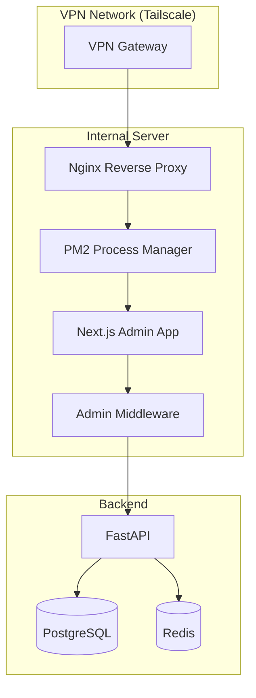

---
{}
---


> **⚠️ ARCHITECTURE UPDATE (2025-11-02):**
> **This SPEC is DEPRECATED** - The Next.js admin app deployment described here is no longer the direction.
> **Current Direction:** FastAPI + Jinja2 templates for admin UI (served directly by FastAPI).
> **See:** `docs/ADMIN_UI_FASTAPI_ANALYSIS.md` for the current admin UI architecture.

## 2) Solution (DEPRECATED - Next.js Approach)

Deploy `frontend-nextjs-admin` to **internal server** with:
- Nginx reverse proxy (SSL termination)
- PM2 process manager (auto-restart)
- IP whitelist middleware
- Admin/staff role enforcement
- Internal-only domain (admin.ninaivalaigal.internal)

---

## 3) Architecture



---

## 4) Implementation Files

- `nginx.conf` - Reverse proxy config with IP whitelist
- `ecosystem.config.js` - PM2 process config
- `.env.admin.example` - Environment variables
- `src/middleware.ts` - Admin+staff role enforcement + IP check

---

## 5) Success Criteria

- [ ] Admin app accessible only via VPN
- [ ] IP whitelist blocks unauthorized IPs
- [ ] Only admin/staff roles allowed
- [ ] PM2 auto-restarts on crash
- [ ] SSL certificate configured
- [ ] Nginx logs accessible
- [ ] Performance: p95 < 1s for all pages

---

## 6) Dependencies

- **SPEC-114**: Auth & Security (RBAC)
- **SPEC-121**: Shared Library
- **SPEC-124**: CI/CD Pipelines

---

## 7) Deployment

**Setup:**
```bash
# On internal server
npm run build
pm2 start ecosystem.config.js
pm2 save
pm2 startup
```

**Nginx:**
- Listen on port 443 (SSL)
- Proxy to localhost:3001
- IP whitelist in `nginx.conf`

---

## 8. Implementation Status

**Status:** ⚠️ **DEPRECATED** - Superseded by FastAPI templating approach

**Deprecation Date:** November 2, 2025

**Current Direction:** FastAPI + Jinja2 templates. Admin UI is served by FastAPI, not a separate Next.js app.

**See:** `docs/ADMIN_UI_FASTAPI_ANALYSIS.md` for the current admin UI architecture.

**Stub Files:**
- `nginx.conf` - Nginx reverse proxy configuration stub (not deployed)
- `ecosystem.config.js` - PM2 process manager configuration stub (not deployed)
- `frontend-nextjs-admin/` - Placeholder directory (initialized, not implemented)
- **Status:** Historical reference only - not for production use

**Replacement SPEC:**
- **SPEC-005**: Admin Dashboard (FastAPI templating)

**Note:** If migration work is needed, create separate stories (not tied to SPEC-123, which is deprecated).

---

**Status**: ⚠️ **DEPRECATED** - Superseded by FastAPI templating approach
**Implementation Date:** Stub files created (not deployed)
**Last Updated:** November 2, 2025 (deprecated)
