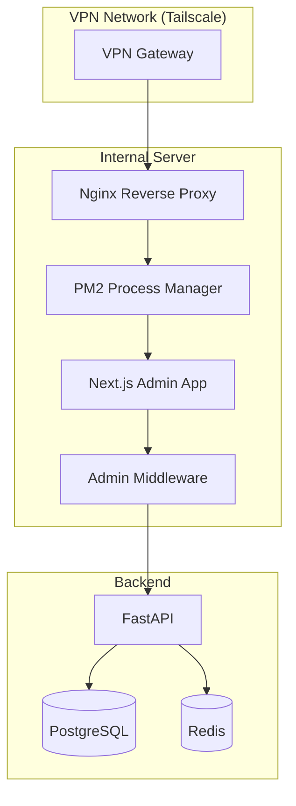

---
{}
---


## 2) Solution

Deploy `frontend-nextjs-admin` to **internal server** with:
- Nginx reverse proxy (SSL termination)
- PM2 process manager (auto-restart)
- IP whitelist middleware
- Admin/staff role enforcement
- Internal-only domain (admin.ninaivalaigal.internal)

---

## 3) Architecture



---

## 4) Implementation Files

- `nginx.conf` - Reverse proxy config with IP whitelist
- `ecosystem.config.js` - PM2 process config
- `.env.admin.example` - Environment variables
- `src/middleware.ts` - Admin+staff role enforcement + IP check

---

## 5) Success Criteria

- [ ] Admin app accessible only via VPN
- [ ] IP whitelist blocks unauthorized IPs
- [ ] Only admin/staff roles allowed
- [ ] PM2 auto-restarts on crash
- [ ] SSL certificate configured
- [ ] Nginx logs accessible
- [ ] Performance: p95 < 1s for all pages

---

## 6) Dependencies

- **SPEC-114**: Auth & Security (RBAC)
- **SPEC-121**: Shared Library
- **SPEC-124**: CI/CD Pipelines

---

## 7) Deployment

**Setup:**
```bash
# On internal server
npm run build
pm2 start ecosystem.config.js
pm2 save
pm2 startup
```

**Nginx:**
- Listen on port 443 (SSL)
- Proxy to localhost:3001
- IP whitelist in `nginx.conf`
